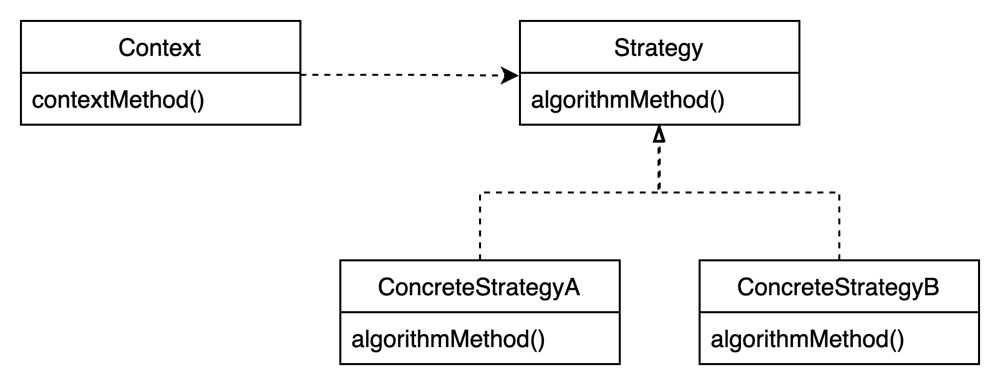

# 3장. 템플릿

---

# 3.1 다시 보는 초난감 DAO

### 3.1.1 예외 처리 기능을 갖춘 DAO

- DB 커넥션과 같이 제한적인 리소스를 공유해서 사용하는 서버에서는 반드시 예외처리를 해줘야 한다
예외가 발생했을 경우, 사용한 리소스를 반드시 반환해야 하기 때문이다
- 일반적으로 서버에서는 제한된 개수의 DB 커넥션을 만들어서 재사용 가능한 풀로 관리한다
오류가 날 때마다 미처 커넥션이 반환되지 못한다면, 커넥션 풀에 여유가 없어지고 리소스가 모자르다는 심각한 오류가 발생한다

**리소스 반환과 close()**

- `close()` : 보통 리소스를 반환한다는 의미로 이해하는 것이 좋다
- 주로 사용한 리소스를 풀로 다시 돌려주는 역할을 한다

**try/catch/finally**

- 어떤 상황에서도 가져온 리소스를 반환하도록 try/catch/finally을 사용한다

```java
public void deleteAll() throws SQLException {
    Connection c = null;
    PreparedStatement ps = null;

    **try** {
        c = dataSource.getConnection();
        ps = c.prepareStatement(...);
				:
				:
    **} catch (SQLException e) {**
        throw e;
    **} finally {**
        if(ps!=null) {
            try {
                ps.close();
            } catch (SQLException e) {
            }
        }
        if(c!=null) {
            try {
                c.close();
            } catch (SQLException e) {
            }
        }
    }
}
```

- close 방식
    - java 7 이전의 finally 방식
        
        ```java
        try {
        } catch(...) {
        } finally {
        }
        ```
        
    - java 7 try-with-resource 방식
        
        java 7에서 AutoCloseable 인터페이스와 try-with-resources가 등장했다
        
        ```java
        try (
                FileInputStream is = ...
                BufferedInputStream bis = ...
        ) {
        		:
        } catch (IOException e) {
            :
        }
        ```
        
        - AutoCloseable
            - java.lang 패키지에 있는 인터페이스
            - close 메소드 하나만 선언되어있다
            - try-with-resources 문으로 관리되는 객체일 때 close 메소드가 자동으로 호출된다
            - close 메소드 구현 시에는 구체적인 exception을 throw하고, close 동작이 전혀 실패할 리가 없다면 exception을 던지지 않도록 구현하는 것을 권고한다
            - 멱등성을 유지하자
            필수는 아니지만, AutoCloseable.close() 메소드를 최초 한 번 호출하고 다시 호출 했을 때 side effect가 발생하지 않도록 구현하는 것을 추천한다
    - java 9 이상의 향상된 try-with-resources 방식
        
        try 블록의 밖에서 선언된 객체를 참조할 수 있다
        
        [https://www.logicbig.com/tutorials/core-java-tutorial/java-9-changes/try-with-resource.html](https://www.logicbig.com/tutorials/core-java-tutorial/java-9-changes/try-with-resource.html)
        

---

# 변하는 것과 변하지 않는 것

### 3.2.1 JDBC try/catch/finally 코드의 문제점

> ***'폭탄 같은 코드'***
> 
- 만약 실수로 리소스를 반환하는 작업을 빼먹고 작업했다면, 커넥션이 반환되지 않고 계속 쌓여만 간다
- 또 완벽하게 작성했다 하더라도, 이런 복잡한 코드는 읽기도 복잡하고 유지보수하기 힘들다

### 3.2.2 분리와 재사용을 위한 디자인 패턴 적용

UserDao의 메소드 개선 작업에서 가장 먼저 해야 할 일 *'변하는 성격이 다른 것 찾아내기'*

```java
public void deleteAll() throws SQLException {
    Connection c = null;
    PreparedStatement ps = null;

    try {
        c = dataSource.getConnection();

				// 변하는 부분. 나머지는 변하지 않는다
        **ps = c.prepareStatement("delete from users");**

        ps.executeUpdate();
    } catch (SQLException e) {
        throw e;
    } finally {
        if(ps!=null) {
            try {
                ps.close();
            } catch (SQLException e) {
            }
        }
        if(c!=null) {
            try {
                c.close();
            } catch (SQLException e) {
            }
        }
    }
}
```

만약 `add()` 메소드라면 위 `deleteAll()` 메소드에서 강조된 부분만 아래 코드로 바꿔주면 된다

```java
ps = c.prepareStatement("INSERT INTO TB_USER(ID, NAME, PASSWORD) VALUES(?,?,?)");
ps.setString(1, user.getId());
ps.setString(2, user.getName());
ps.setString(3, user.getPassword());
ps.executeUpdate();
```

> ***템플릿 메소드 패턴 적용하기***
> 
- 템플릿 메소드 패턴은 상속을 통해 기능을 확장한다
- 변하지 않는 부분은 슈퍼클래스에 두고 변하는 부분은 추상 메소드로 정의해둬서 서브클래스에서 오버라이드하여 새롭게 정의해 쓰도록 한다

```java
public **abstract** class UserDao {
		:
		:
		**abstract protected PreparedStatement makeStatement(Connection c) throws SQLException;**
}
```

```java
public class UserDaoDeleteAll extends UserDao {
		protected PreparedStatement makeStatement(Connection c) throws SQLException {
				PreparedStatement ps = c.preparedStatement("delete from users");
				return ps;
		}
}
```

- 이제 UserDao 클래스의 기능을 확장하고 싶을 때마다 상속을 통해 자유롭게 확장할 수 있다
- 또한 확장 때문에 기존의 상위 DAO 클래스에 불필요한 변화는 생기지 않도록 할 수 있다

**템플릿 메소드 패턴을 적용해서 생기는 문제**

- DAO 로직마다 상속을 통해 새로운 클래스를 만들어야 한다
(UserDao의 JDBC 메소드가 4개라면 4개의 서브클래스가 필요)
- 확장구조가 이미 클래스를 설계하는 시점에서 고정되어버린다
UserDao와 그 서브클래스들이 이미 클래스 레벨에서 컴파일 시점에 이미 관계가 결정되어있다

> ***전략 패턴 적용하기***
> 
- 확장에 해당하는 '변하는 부분'을 별도의 클래스로 만들어 추상화된 인터페이스를 통해 의임한다
- 아래 그림에서, Context의 contextMethod()에서 일정한 구조를 가지고 동작하다가 특정 확장 기능은 Strategy 인터페이스를 통해 외부의 독립된 전략 클래스에 위임한다
    
    
    

```java
public interface StatementStrategy {
		PreparedStatement makePreparedStatement(Connection c) throws SQLException;
}
```

```java
public class DeleteAllStatement implements StatementStrategy {
		public PreparedStatement makePreparedStatement(Connection c) throws SQLException {
				PreparedStatement ps = c.preparedStatement("delete from users");
				return ps;
		}
}
```

- Context가 어떤 전략을 사용하게 할 것인가는 Context를 사용하는 앞단의 클라이언트가 결정하는 것이 맞다
- 클라이언트가 구체적인 전략중 하나를 선택하고 오브젝트로 만들어서 Context에 전달하면 Context는 전달받은 Strategy 구현 클래스의 오브젝트를 사용한다
    
  
    

```java
public void jdbcContextWithStatementStrategy(**StatementStrategy stmt**) throws SQLException {
    Connection c = null;
    PreparedStatement ps = null;

    try {
        c = dataSource.getConnection();

				**ps = stmt.makePreparedStatement(c);**

        ps.executeUpdate();
    } catch (SQLException e) {
        throw e;
    } finally {
        if(ps!=null) {
            try {
                ps.close();
            } catch (SQLException e) {
            }
        }
        if(c!=null) {
            try {
                c.close();
            } catch (SQLException e) {
            }
        }
    }
}
```

```java
public void deleteAll() throws SQLException {
		StatementStrategy st = new DeleteAllStatement(); // 전략 클래스의 오브젝트 생성
		jdbcContextWithStatementStrategy(st);  // 전략 오브젝트 전달하면서 컨텍스트 호출
}
```

- 마이크로 DI
    - DI의 가장 중요한 개념! *제 3자의 도움을 통해 두 오브젝트 사이의 유연한 관계가 설정되도록 만든다*
    위 개념만 따르면, 의존관계 주입은 다양한 형태로 적용할 수 있다
    - 일반적으로 DI는 의존관계에 있는 두 개의 오브젝트와 이 관계를 다이내믹하게 설정해주는 오브젝트 팩토리. 그리고 클라이언트 이렇게 4개의 오브젝트 사이에어 일어난다
    
    

    - 하지만 때로는, 클라이언트가 오브젝트 팩토리의 책임을 함께 지고 있을 수도 있고,
    클라이언트와 전략이 결합될수도 있고,
    심지어는 클라이언트와 DI 관계에 있는 두 개의 오브젝트가 모두 하나의 클래스 안에 담길 수도 있다
    - 이런 경우에는 DI가 매우 작은 단위의 코드와 메소드 사이에서 일어나기도 한다
    - 얼핏보면 DI같아 보이지는 않지만, 세밀하게 관찰해보면 작은 단위지만 엄연한 DI가 이뤄지고 있다
    - 이렇게 IOC 컨테이너의 도움 없이 코드 내에서 적용한 경우를 마이크로 DI(또는 수동 DI)라고 한다
    

---

# JDBC 전략 패턴의 최적화

### 전략 클래스의 추가 정보

add() 메소드에도 적용해보자

deleteAll()과는 달리 add()는 사용자 정보가 추가적으로 필요하다

```java
public class AddStatement implements StatementStrategy {
		User user;
		public AddStatement(User user) {
				this.user = user;
		}

		public PreparedStatement makePreparedStatement(Connection c) {
				...
				ps.setString(1, user.getId());
				ps.setString(2, user.getName());
				ps.setString(3, user.getPassword());
				...
		}
}
```

### 전략과 클라이언트의 동거

지금까지 구조의 문제 2가지

1. DAO 메소드마다 새로운 StatementStrategy 구현 클래스를 만들어야 한다
2. StatementStrategy에 전달할 부가정보가 있는 경우, 오브젝트를 전달받는 생성자와 이를 저장해둘 인스턴스 변수를 번거롭게 만들어야 한다

이 두가지 문제를 해결 할 수 있는 방법 ⇒ **로컬 클래스**

- 어차피 위의 DeleteAllStatement와 AddStatement는 UserDao의 메소드 로직에 강하게 결합되어 있는 상태이다
- UserDao 클래스 안에 내부 클래스로 정의하자

```java
public void add(final User user) throws SQLException {

    class AddStatement implements StatementStrategy {
        public PreparedStatement makePreparedStstement(Connection c) throws SQLException {
            PreparedStatement ps = c.prepareStatement("usert into users(id, name, password) values(?,?,?)");
            ps.setString(1, user.getId());
            ps.setString(2, user.getName());
            ps.setString(3, user.getPassword());
            return ps;
        }
    }
    StatementStrategy strategy = new AddStatement();

    jdbcContextWithStatementStrategy(strategy);
}
```

로컬클래스를 사용함으로써 앞서 말한 2가지 문제를 해결할 수 있다

이제 클래스 이름도 제거해보자 ⇒ **익명 내부 클래스**

```java
public void add(final User user) throws SQLException {
    jdbcContextWithStatementStrategy(new StatementStrategy() {
        public PreparedStatement makePreparedStstement(Connection c) throws SQLException {
            PreparedStatement ps = c.prepareStatement("INSERT INTO TB_USER(ID, NAME, PASSWORD) VALUES(?,?,?)");
            ps.setString(1, user.getId());
            ps.setString(2, user.getName());
            ps.setString(3, user.getPassword());
            return ps;
        }
    });
}
```

---

# 컨텍스트와 DI

### jdbcContext의 분리

`jdbcContextWithStatementStrategy()` 메소드는 사실 다른 DAO에서도 사용이 가능하다

따라서 클래스 밖으로 독립을 시켜서 모든 DAO가 사용할 수 있도록 해보자

**클래스 분리**

```java
public class JdbcContext {

    private DataSource dataSource;
    public void setDataSource(DataSource dataSource) { ... }

    public void **workWithStatementStrategy**(StatementStrategy strategy) throws SQLException { ... }
    public Object **workWithStatementStrategy**(StatementStrategy strategy, ResultSetStrategy resultSetStrategy) throws SQLException { ... }
}
```

```java
public class UserDao {

    ~~private DataSource dataSource;~~
    private JdbcContext jdbcContext;

    ~~public void setDataSource(DataSource dataSource) {
        this.dataSource = dataSource;
		}~~
		
		// DI되는 객체가 바뀐다
    public void setJdbcContext(JdbcContext jdbcContext) {
        this.jdbcContext = jdbcContext;
    }
```

**빈 의존관계 변경**

- UserDao는 구체클래스인 JdbcContext에 의존한다
- 스프링 DI는 기본적으로 인터페이스를 사이에 두고 의존 클래스를 바꿔서 사용한다
- 인터페이스를 사용하지 않은 이유
    - 하지만 JdbcContext 경우에는 그 자체로독립적인 JDBC 컨텍스트를 제공해주는 서비스 오브젝트로서 의미가 있을 뿐이고 구현 방법이 바뀔 가능성이 없기 때문에 인터페이스를 구현하도록 만들지 않았다
    - UserDao와 JdbcContext는 비록 클래스는 구분되어 있지만, 강한 응집도를 가지고 있다
    - UserDao가 JDBC 방식 대신 JPA나 하이버네이트같은 ORM을 사용해야 한다면 JdbcContext도 통째로 바뀌어야 한다
    - 이런 경우는 굳이 인터페이스를 두지 말고 강력한 결합을 가진 관계를 허용한다

클래스 의존관계


빈 오브젝트 관계


### JdbcContext의 특별한 DI

UserDao와 JdbcContext는 클래스 레벨에서 의존관계가 결정된다

비록 런타임 시에 DI 방식으로 외부에서 오브젝트를 주입해주는 방식을 사용하긴 했지만, 의존 오브젝트의 구현 클래스를 변경할 수는 없다

**스프링 빈으로 DI**

인터페이스를 사용해서 클래스를 자유롭게 변경할 수 있게 하지는 않았다

그럼에도 불구하고, JdbcContext를 UserDao와 DI구조로 만들어야 할 이유

1. JdbcContext은 싱글톤 빈이 되는 것이 이상적이다
    - JdbcContext는 그 자체로 변경되는 상태 정보를 가지고 있지 않다
    - 싱글톤으로 등록돼서 여러 오브젝트에서 공유해 사용되는 것이 이상적이다
2. JdbcContext는 DI를 통해 다른 빈에 의존하고 있다
    - 사실 메인인 이유
    - DataSource 오브젝트를 주입받도록 되어있는데 DI를 위해서는 주입받는 오브젝트도 스프링 빈으로 등록돼야 한다

**코드를 이용하는 수동 DI**

- JdbcContext를 스프링의 빈으로 등록해서 UserDao에 DI하는 대신 UserDao 내부에서 직접 DI를 적용하는 방법이다
- 이 방법은 싱글톤으로 만들려는 것은 포기해야 한다 (DAO마다 하나의 JdbcContext 오브젝트를 갖고 있게 하는 것)
- JdbcContext를 스프링 빈으로 등록하지 않으므로 DAO가 JdbcContext의 제어권을 갖는다
    
    
    

**스프링 빈으로 DI VS 코드를 이용하는 수동 DI**

스프링 빈으로 DI

- 장점 : 스프링 빈으로 DI한 방식은 오브젝트 사이의 실제 의존관계가 설정 파일에 명확하게 드러난다
- 단점 : DI의 근본적인 원칙에 부합하지 않는 구체적인 클래스와의 관계가 설정에 직접 노출된다

코드를 이용하는 수동 DI

- 장점 : 코드를 이용한 수동 DI는 JdbcContext를 내부에서 만들고 사용하면서 그 관계를 외부에는 드러내지 않는다는 장점
- 단점 : JdbcContext를 여러 오브젝트가 사용하더라도 싱글톤으로 만들 수 없으며 DI 작업을 위한 부가적인 코드가 필요하다

---

# 템플릿과 콜백

### 템플릿/콜백의 동작 원리


- DI 방식의 전략패턴 구조
- 클라이언트가 템플릿 메소드를 호출하면서 콜백 오브젝트를 전달하고 있다 → 메소드 레벨에서 일어나는 DI
(클라이언트와 콜백이 강하게 결합되어있음)
- 클라이언트가 템플릿의 기능을 호출한 것과 동시에, 템플릿이 사용할 콜백 인터페이스를 구현한 오브젝트를 메소드를 통해 주입해주는 DI 작업이 동시에 일어난다
- 템플릿/콜백은 전략 패턴과 수동 DI를 결합한 독특한 형태
- 템플릿/콜백은 전략 패턴과 달리 콜백은 보통 단일 메소드 인터페이스를 사용한다
- 하나의 템플릿에서 여러 가지 종류의 전략을 사용한다면 하나 이상의 콜백 오브젝트를 사용할수도 있지만
일반적으로는 템플릿의 작업 흐름 중 특정 기능을 위해 한번 호출되는 경우가 일반적이다

### 편리한 콜백의 재사용

템플릿/콜백 방식의 아쉬운 점

- DAO 메소드에서 매번 익명 내부클래스를 사용하기 때문에 상대적으로 코드를 작성하고 읽기가 불편하다

```java
public void deleteAll() throws SQLException {
    jdbcContext.workWithStatementStrategy(new StatementStrategy() {
        public PreparedStatement makePreparedStstement(Connection c) throws SQLException {
            PreparedStatement ps = c.prepareStatement(**"delete from users"**); **// 변하는 SQL 문장**
            return ps;
        }
    });
}
```

**자주 바뀌지 않는 부분 분리하기**

- 중복될 가능성이 있는 자주 바뀌지 않는 부분을 분리하자
- 단순 SQL을 필요로 하는 콜백이라면 나머지 코드는 매번 동일할 것이다
- SQL문장만 파라미터로 받아서 바꿀수 있도록 변경한다

```java
public void deleteAll() throws SQLException {
		this.jdbcContext.executeSql("delete from sers");
}
```

```java
public class JdbcContext {
		:
		private void executeSql(final String query) throws SQLException {
				this.jdbcContext.workWithStatementStrategy(
						new StatementStrategy() {
								public PreparedStatement makePreparedStatement(Connection c) throws SQLException {
										return c.prepareStatement(query);
								}
						}
				);
		}
}
```

- 결국 JdbcContext 안에 클라이언트와 템플릿, 콜백이 모두 함께 공존하면서 동작하는 구조가 됐다
- 하나의 목적을 위해 서로 긴밀하게 연관되어 동작하는 응집력이 강한 코드들이기 때문에 한 군데 모여있는게 유리하다

---

# 스프링의 JdbcTemplate

- 스프링은 JDBC를 이용하는 DAO에서 사용할 수 있도록 준비된 다양한 템플릿과 콜백을 제공한다
- 거의 모든 종류의 JDBC 코드에 사용 가능한 템플릿과 콜백을 제공할 뿐만 아니라, 자주 사용되는 패턴을 가진 콜백은 다시 템플릿에 결합시켜서 간단한 메소드 호출만으로 사용이 가능하도록 만들어져있다

**JdbcTemplate**

- 스프링이 제공하는 JDBC 코드용 기본 템플릿
- springframework.jdbc.core 패키지의 중심 클래스
- jdbc 사용을 단순화하고 common error를 피하는데 도움을 준다
- core JDBC 워크플로우를 실행한다
- SQL 쿼리 또는 업데이트를 실행해서 ResultSet에 대한 반복을 시작하고 JDBC 예외를 포착하고 org.springframework.dao 패키지에 정의되어있는 보다 일반적인 exception으로 변환한다

**DataAccessException**

- 대부분의 execute, query, update, .. 메소드들 모두 DataAccessException을 던진다
- 런타임 예외에 속하는 클래스
- JdbcTemplate 템플릿과 콜백 안에서 발생하는 모든 SQLException을 DataAccessException으로 포장해서 던져준다
- DBMS에 따라서 에러코드가 다를텐데 스프링에서는 벤더마다 서로 다른 에러 코드를 common하게 감싸서 일관성을 보장해준다
- 드라이버나 DB 메타정보를 참고해서 DB 종류를 확인해서 DB별로 미리 준비된 매핑 정보를 참고해서 적절한 예외 클래스를 선택한다
따라서 DB가 달라져도 같은 종류의 에러라면 동일한 예외를 받을 수 있다

**statment 종류**

- statement
    - 일반적인 sql 쿼리를 실행하는데 사용된다
    - 매개변수를 전달할 수도 없고 실행할 때마다 컴파일을 하게된다
    따라서 성능적인 면에서 안좋을 수 밖에 없고, 유연하지 못하다
    - 대부분의 statement 구문은 DDL문(create, alter, drop …)에서 주로 사용된다
    - 장점 : string형태로 sql을 작성하기 때문에 sql 작성이 다른 인터페이스보다 편하고 직관적인 장점이 있다
- preparedStatement
    - 이름에서 알 수 있듯이 '준비된' statement이다 (컴파일된 statement)
    - preparedStatement는 statement를 확장한다
    - 미리 컴파일이 되어 준비하고 있기 때문에 statement에 비해 성능상으로 우위에 있다
    - 매개변수 전달이 필요한 sql 작성이나, for loop 등으로 여러번 sql을 실행하는 경우에 주로 사용한다
- callableStatement
    - 미리 작성해둔 프로시저를 실행하는데 사용한다
    - CallableStatement는 PreparedStatement를 확장한다
    - CallableStatement를 사용할때는? 매개변수 자리에 프로시져에서 사용하는 매개변수와, 가져올 값에 대한 셋팅을 동시에 해준다
    - 프로시져 실행에 필요한 매개변수는 setString, setInt 등으로 해주고, 프로시져 응답으로 받을 값들에 대한 데이터 타입을 registerOutputParameter으로 모두 지정해주어야 한다
    - CallableStatement 역시 미리 컴파일되어 DB에 저장되어 있기 때문에 성능상으로 이점이 있다.

**concrete methods**

- `queryForObject()`
- `queryForInt()`
- `query()`
- `queryForList()`
- `queryForMap()`
- `queryForRowSet()`
- `queryForStream()`
- `update()`
- `batchUpdate()`
- :
