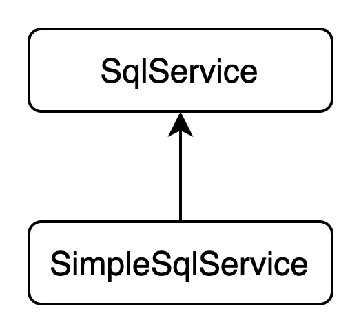
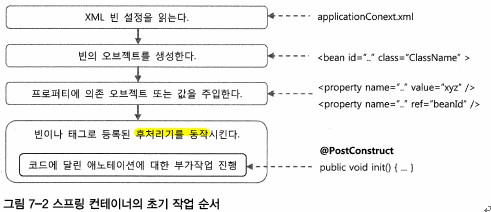
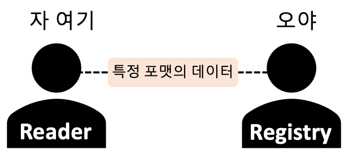
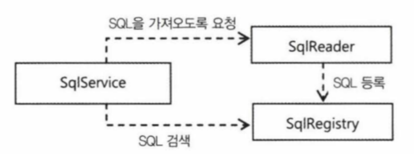
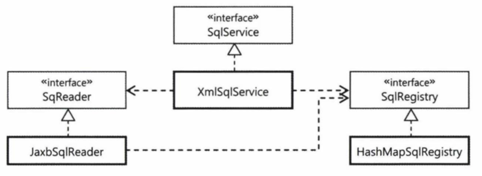
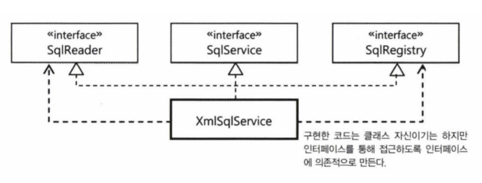
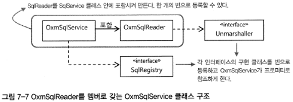

# 07. 스프링 핵심 기술의 응용

- 스프링이 가장 가치를 두고 적극적으로 활용하는 것은 결국 자바 언어가 기반을 두고 있는 객체 지향 기술이다
- 스프링의 모든 기술은 결국 객체지향적인 언어의 장점을 적극적으로 활용해서 코드를 작성하도록 도와준다

스프링의 개발 철학과 추구하는 가치를 따라가자

# SQL과 DAO의 분리

---

**개선점**

*"SQL을 DAO에서 분리하자"*

- SQL 변경이 필요한 상황이 발생하면 SQL을 담고 있는 DAO코드가 수정될 수밖에 없다
- SQL을 적절히 분리해 DAO 코드와 다른 파일이나 위치에 두고 관리할 수 있다면 좋을 것이다

### XML 설정을 이용한 분리

- 가장 손쉽게 생각해볼수있는 SQL 분리 방법은 SQL을 스프링의 XML 설정파일로 빼내는 것이다
- 이제 SQL은 코드의 수정 없이 XML 설정을 바꾸는 것만으로도 자유롭게 수정이 가능하다

```java
public class UserDaoJdbc implements UserDao {
		:
    private Map<String, String> sqlMap;

    public void setSqlMap(Map<String, String> sqlMap) {
        this.sqlMap = sqlMap;
    }
		:
}
```

```java
public void add(final User user) {
    jdbcTemplate.update(**sqlMap.get("add")**, ...);
}
```

```java
<bean id="userDao" class="dao.UserDaoJdbc">
		:
    <property name="sqlMap">
        <map>
            <entry key="add" value="INSERT INTO USERS(ID, NAME, PASSWORD, LEVEL, LOGIN, RECOMMEND, EMAIL) VALUES(?,?,?,?,?,?,?)" />
            <entry key="update" value="UPDATE USERS SET NAME=?, PASSWORD=?, LEVEL=?, LOGIN=?, RECOMMEND=?, EMAIL=? WHERE ID=?" />
            <entry key="delete" value="DELETE FROM USERS" />
            <entry key="count" value="SELECT COUNT(*) FROM USERS" />
            <entry key="get" value="SELECT * FROM USERS WHERE ID=?" />
            <entry key="getAll" value="SELECT * FROM USERS ORDER BY ID ASC" />
        </map>
    </property>
</bean>
```

- 설정 파일 안에 SQL을 두고 이를 DI해서 DAO가 사용하게 하면,
손쉽게 SQL을 코드에서 분리해낼 수 있다

### SQL 제공 서비스

- SQL과 DI 설정정보가 섞여 있으면 보기에도 지저분하고 관리하기에도 좋지 않다
- SQL을 따로 분리해둬야 독립적으로 SQL 문의 리뷰나 SQL 튜닝 작업을 수행하기도 편하다
- DAO가 사용할 SQL을 제공해주는 기능을 독립시키자
→ 독립적인 SQL 제공 서비스를 만들자!

**SQL 서비스 인터페이스**

- DAO가 사용할 SQL 서비스의 기능 : SQL에 대한 키 값을 전달하면 그에 해당하는 SQL을 돌려주기
- DAO는 적절한 키를 제공해주고 그에 대한 SQL을 돌려받기만 하면 된다

```java
public interface SqlService {
    String getSql(String key) throws SqlRetrievalFailureException;
}
```

```java
public class UserDaoJdbc implements UserDao {
		:
    **private SqlService sqlService;

    public void setSqlService(SqlService sqlService) {
        this.sqlService = sqlService;
    }**
		:
}
```

- UserDao를 포함한 모든 DAO는 SQL을 어디에 저장해두고 가져오는지에 대해 전혀 신경쓸 필요가 없다
- 구체적인 구현 방법과 기술에 상관없이 SqlService 인터페이스 타입의 빈을 DI받아서 필요한 SQL을 가져다 쓰면 된다



```java
public class SimpleSqlService implements SqlService {

    private Map<String, String> sqlMap;

    public void setSqlMap(Map<String, String> sqlMap) {
        this.sqlMap = sqlMap;
    }

    public String getSql(String key) throws SqlRetrievalFailureException {
        String sql = sqlMap.get(key);
        if(sql==null)
            throw new SqlRetrievalFailureException(key + "에 대한 Sql을 찾을 수 없습니다.");
        return sql;
    }
}
```

```java
<bean id="sqlService" class="service.SqlServiceImpl">
    <property name="sqlMap">
        <map>
            <entry key="userAdd" value="INSERT INTO USERS(ID, NAME, PASSWORD, LEVEL, LOGIN, RECOMMEND, EMAIL) VALUES(?,?,?,?,?,?,?)" />
            <entry key="userUpdate" value="UPDATE USERS SET NAME=?, PASSWORD=?, LEVEL=?, LOGIN=?, RECOMMEND=?, EMAIL=? WHERE ID=?" />
            <entry key="userDelete" value="DELETE FROM USERS" />
            <entry key="userCount" value="SELECT COUNT(*) FROM USERS" />
            <entry key="userGet" value="SELECT * FROM USERS WHERE ID=?" />
            <entry key="userGetAll" value="SELECT * FROM USERS ORDER BY ID ASC" />
        </map>
    </property>
</bean>
```

# 인터페이스의 분리와 자기참조 빈

---

### XML 파일 매핑

- 스프링의 XML 설정파일에서 <bean> 태그 안에 SQL 정보를 넣어두고 활용하는 건 좋은 방법이 아니다
- 그보단, SQL을 저장해두는 전용 포맷을 가진독립적인 파일을 이용하는 편이 바람직하다
- JAXB
    - XML에 담긴 정보를 파일에서 읽어오는 간단한 방법
    - 장점 : XML 문서 정보를 거의 동일한 구조의 오브젝트로 직접 매핑해준다
    - 키와 SQL 정보를 담은 <sql> 태그를 가진 XML 문서를 사용한다
    - 스프링 설정의 <map>, <entry> 태그보다 <sqlmap>, <sql> 태그가 의미가 더욱 명확하게 드러난다

### XML 파일을 이용하는 SQL 서비스

- 언제 JAXB를 사용해 XML문서를 가져와야 할까?
- DAO가 SQL을 요청할 때마다 XML파일을 읽는다? → 비효율적
- XML파일은 되도록 한번만 읽어서 읽은 내용을 어딘가에 저장해두고 DAO에서 요청이 올 때 사용해야 한다
- 처음 SQL을 읽어드리는 건 어디서 해야 할까?
    - 생성자
        - 생성자에서 XML로 된 SQL 문서를 읽고 변환된 sql 오브젝트들을 맵으로 옮겨서 저장한다
        - 후에, DAO의 요청에 따라 SQL을 찾아서 전달한다
        
        ```java
        public class XmlSqlService implements SqlService {
        
            private Map<String, String> sqlMap = new HashMap<String, String>();
        
            public XmlSqlService() {
                try {
                    JAXBContext jaxbContext = JAXBContext.newInstance(Sqlmap.class);
        
                    Unmarshaller unmarshaller = jaxbContext.createUnmarshaller();
                    InputStream is = getClass().getResourceAsStream("/sqlmap.xml");
                    Sqlmap sqlmap = (Sqlmap) unmarshaller.unmarshal(is);
        
                    for(SqlType sql : sqlmap.getSql()) {
                        sqlMap.put(sql.getKey(), sql.getValue());
                    }
                } catch (JAXBException e) {
                    throw new RuntimeException(e);
                }
            }
        
            public String getSql(String key) throws SqlRetrievalFailureException {
                String sql = sqlMap.get(key);
                if(sql==null)
                    throw new SqlRetrievalFailureException(key + "를 이용해서 SQL을 찾을 수 없습니다.");
                return sql;
            }
        }
        ```
        
        **생성자 방식의 단점**
        
        - 오브젝트를 생성하는 중에 생성자에서 발생하는 다루는 예외는 다루기 힘들다
        - 상속하기 불편하다
    - 빈 후처리기
        - XmlSqlService는 오브젝트는 빈이므로 제어권이 스프링에 있다
        ⇒ 초기화도 스프링에 맡길수밖에 없다
        - 빈 오브젝트를 생성하고 DI 작업을 수행해서 프로퍼티를 모두 주입해준 뒤에 미리 지정한 초기화 메소드를 호출해주는 기능을 갖고 있다 → 빈 후처리기
        
        ```java
        <context:annotation-config/>
        ```
        
        ```java
        public class XmlSqlService implements SqlService {
        		:
        		public void setSqlmapFile(String sqlmapFile) {
        		    this.sqlmapFile = sqlmapFile;
        		}
        		
        		@PostConstruct
        		public void loadSql() {
        		    try {
        		        JAXBContext jaxbContext = JAXBContext.newInstance(Sqlmap.class);
        		
        		        Unmarshaller unmarshaller = jaxbContext.createUnmarshaller();
        		        InputStream is = getClass().getResourceAsStream("/sqlmap.xml");
        		        InputStream is = getClass().getResourceAsStream(sqlmapFile);
        		        Sqlmap sqlmap = (Sqlmap) unmarshaller.unmarshal(is);
        		
        		        for(SqlType sql : sqlmap.getSql()) {
        		            sqlMap.put(sql.getKey(), sql.getValue());
        		        }
        		    } catch (JAXBException e) {
        		        throw new RuntimeException(e);
        		    }
        		}
        		:
        }
        ```
        
        - @PostConstruct 어노테이션은 빈 오브젝트가 생성되고 의존 오브젝트와 설정 값을 넣어주는 DI 작업까지 마친 후에 호출된다
        
        
        

### 변화를 위한 준비: 인터페이스 분리

SQL을 가져오는 방법에 있어서는 특정 기술에 고정되어 있다

- XML 대신 다른 포맷의 파일에서 SQL을 읽어오게 하려면 어떻게 해야 할까?
- 가져온 SQL 정보를 HaspMap 타입 컬렉션이 아닌 다른 방식으로 저장해두고 이를 검색해서 가져오려면 어떻게 해야 할까?

→ 이 두 가지 기술의 변화는 모두 XmlSqlService의 코드를 직접 수정해야 한다

**책임에 따른 인터페이스 정의**

독립적으로 변경 가능한 책임을 뽑아보자

1. SQL 정보를 외부의 리소스로부터 읽어온다
SQL이 담겨있는 리소스가 어떤 것이든 상관없이 애플리케이션에서 활용 가능하도록 메모리에서 읽어들이는 것을 하나의 책임으로 생각해볼 수 있다
2. 읽어온 SQL을 보관해두고 있다가 필요할 때 제공해주는 것이다
이 SQL에 대한 어플리케이션 내의 저장소를 제공한다

→ SqlService를 구현해서 DAO에 서비스를 제공해주는 오브젝트가 이 두 가지 책임을 가진 오브젝트와 협력해서 동작하도록 만들어야 한다


- DAO 관점에서는 SqlService라는 인터페이스를 구현한 오브젝트에만 의존하고 있으므로 달라질 것은 없다
- 대신 SqlService의 구현 클래스가 변경 가능한 책임을 가진 SqlReader와 SqlRegistry 두 가지 타입의 오브젝트를 사용하도록 만든다
- SqlReader가 읽어오는 Sql정보는 SqlRegistry에 전달돼서 등록되게 해야 한다
- SQL을 SqlReader에서 SqlRegistry로 전달하는 과정과 전달되는 형식을 어떻게 해야할까?
- 방법 1. “우리 OOO로 주고받자”
    
    
    
    - SqlReader와 SqlRegistry 이 두 개의 오브젝트 사이에서 복잡한 정보를 전달하기 위해서
    전달 과정 중에 일정한 포맷으로 변환하도록 강제하고 있다
- 방법 2. “니가 와”
    
    
    
    ```java
    public interface SqlRegistry {
        void registerSql(String key, String sql);
        String findSql(String key) throws SqlNotFoundException;
    }
    ```
    
    ```java
    public interface SqlReader {
        void read(SqlRegistry sqlRegistry);
    }
    ```
    
    ```java
    sqlRegistry.registerSql(sql.getKey(), sql.getValue());
    ```
    
    - SqlReader에게 SqlRegistry 전략을 제공해주면서 이를 이용해 Sql정보를 SqlRegistry에 저장하라고 요청한다
    - 특정 포맷으로 변환한 SQL 정보를 주고받을 필요 없이 SqlReader가 직접 SqlRegistry에 SQL 정보를 등록할 수 있다
    - SqlReader와 SqlRegistry는 각자의 구현 방식을 독립적으로 유지하면서 꼭 필요한 관계만 가지고 협력해서 일을 할 수 있는 구조가 된다
    
    
    
    - SqlReader가 SqlRegistry와 의존관계를 가지고 작업을 진행하도록 만들었을 때의 구조다
    - 여기서 SqlReader가 사용할 SqlRegistry 오브젝트를 제공해주는 건 SqlService의 코드가 담당한다

### 디폴트 의존관계

```java
public class BaseSqlService implements SqlService {

    protected SqlReader sqlReader;
    protected SqlRegistry sqlRegistry;

    public void setSqlReader(SqlReader sqlReader) {
        this.sqlReader = sqlReader;
    }

    public void setSqlRegistry(SqlRegistry sqlRegistry) {
        this.sqlRegistry = sqlRegistry;
    }

    @PostConstruct
    public void loadSql() {
        this.sqlReader.read(this.sqlRegistry);
    }

    public String getSql(String key) throws SqlRetrievalFailureException {
        try {
            return this.sqlRegistry.findSql(key);
        } catch (SqlNotFoundException e) {
            throw new SqlRetrievalFailureException(e);
        }
    }
}
```

👆SqlRegistry와 SqlReader를 이용하는 가장 간단한 SqlService 구현 클래스

```java
public class HashMapSqlRegistry implements SqlRegistry { ... }
public class JaxbXmlSqlReader implements SqlReader { ... }
```

```java
<bean name="sqlReader" class="sql.JaxbXmlSqlReader">
    <property name="sqlmapFile" value="/sqlmap.xml"/>
</bean>

<bean name="sqlRegistry" class="sql.HashMapSqlRegistry"/>

<bean id="sqlService" class="sql.BaseSqlService">
    <property name="sqlReader" ref="sqlReader"/>
    <property name="sqlRegistry" ref="sqlRegistry" />
</bean>
```

- 장점 : 유연하다
- 단점 : 3개의 빈을 등록해줘야 한다

‘디폴트 의존관계’ : 외부에서 DI 받지 않는 경우 기본적으로 자동적용되는 의존관계

```java
public class DefaultSqlService extends BaseSqlService {

    public DefaultSqlService() {
        setSqlReader(new JaxbXmlSqlReader());
        setSqlRegistry(new HashMapSqlRegistry());
    }

}
```

```java
<bean id="sqlService" class="sql.DefaultSqlService" />
```

- DI를 사용한다고 해서 항상 모든 프로퍼티 값을 설정에 넣고, 모든 의존 오브젝트를 빈으로 일일이 지정할 필요는 없다
- 먼저 BaseSqlService와 같이 의존 오브젝트를 DI해줌으로써 기능의 일부를 자유롭게 확장해줄 수 있는 기반을 만들어둬야 하지만,
자주 사용되는 의존 오브젝트는 미리 지정한 디폴트 의존 오브젝트를 설정 없이도 사용할 수 있게 만들 수 있다

### 자기 참조 빈



세 개의 인터페이스를 하나의 클래스가 구현하도록 해보자



```java
public class XmlSqlService implements SqlService, **SqlRegistry, SqlReader**
```

- SqlReader의 구현코드에서 SqlRegistry 구현코드로 내부 정보에 접근해서도 안되고 반대 역시 마찬가지다
- 사실 자기 자신이겠지만, 마치 다른 오브젝트라고 생각하고 인터페이스에 정의된 메소드를 통해서만 사용해야 한다
- 클래스는 하나 뿐이고 빈도 하나만 등록할 것이지만, 마치 세 개의 빈이 등록된 것처럼 주입받도록 해야 한다

```java
<bean id="sqlService" class="service.XmlSqlService">
    <property name="sqlmapFile" value="/sqlmap.xml"/>
    <property name="sqlReader" ref="sqlService"/>
    <property name="sqlRegistry" ref="sqlService" />
</bean>
```

- 자기 자신을 참조하는 빈은 사실 흔히 쓰이는 방법은 아니다
- 자기 참조 빈을 만들어보는 것은, 책임과 관심사가 복잡하게 얽혀 있어서 확장이 힘들고 변경에 취약한 구조의 클래스를 유연한 구조로 만들려고 할 때 시도해볼 수 있는 방법이다

# 서비스 추상화 적용

---

JAXB 외에도 다양한 실전에서 자주 사용되는 XML과 자바오브젝트 매핑 기술이 있다 (Castor XML, JiBX, XmlBeans, Xstream)

**OXM**

- 이렇게 XML과 자바 오브젝트를 매핑해서 상호 변환해주는 기술

**서비스 추상화**

- 로우레벨의 구체적인 기술과 API에 종속되지 않고 추상화된 레이어와 API를 제공해서 구현 기술에 독립적인 코드를 작성할 수 있게 해준다

### OXM 서비스 추상화 적용

- 스프링의 OXM 추상화 기능을 이용해보자 → OxmSqlService
- SqlReader와 SqlRegistry라는 두 개의 전략을 활용하는 구조는 유지하되,
SqlReader 구현 오브젝트에 대한 의존관계를 고정시켜버린다



- SqlReader 타입의 의존 오브젝트를 사용하되 이를 스태틱 멤버 클래스로 내장하여,
의존 오브젝트를 자신만이 사용하도록 독점하는 구조
- 내장된 SqlReader 구현을 외부에서 사용하지 못하도록 제한하고 스스로 최적화된 구조로 만들어둔다
- 밖에서 볼 때는 하나의 오브젝트로 보이지만, 내부에서는 의존관계를 가진 두 개의 오브젝트가 깔끔하게 결합돼서 사용된다
- OxmlSqlService와 OxmSqlReader는 구조적으로는 강하게 결합되어 있지만 논리적으로는 명확하게 분리도있는 구조
- OxmSqlReader는 private 멤버 클래스이므로 외부에서 접근하거나 사용할 수 없다
- 또한 OxmSqlService는 이를 final로 선언하고 직접 오브젝트를 생성하기 때문에 OxmSqlReader를 DI하거나 변경할 수 없다

⇒ 이렇게 두 개의 클래스를 강하게 결합하고 더 이상의 확장이나 변경을 제한을 두는 이유는 무엇일까?

**강결합의 이유**

- OXM을 이용하는 서비스 구조로 최적화시키기 위해서..
- 가능한 한 분리하고 유연하게 확장할 수 있게 만드는 것도 중요하지만,
실제로 적용하는 입장에서 SqlService를 사용하기 위해 많은 빈을 등록하는게 부담이 될 수 있다
- 하나의 클래스로 만들어두기 때문에 빈의 등록과 설정은 단순해지고 쉽게 사용할 수 있다

```java
public class OxmSqlService implements SqlService {

    private final OxmSqlReader reader = new OxmSqlReader();
    private SqlRegistry sqlRegistry = new HashMapSqlRegistry();

    public void setUnmarshaller(Unmarshaller unmarshaller) {
        reader.setUnmarshaller(unmarshaller);
    }

    public void setSqlmapFile(String sqlmapFile) {
        reader.setSqlmapFile(sqlmapFile);
    }

    @PostConstruct
    public void loadSql() {
        this.reader.read(this.sqlRegistry);
    }

    public String getSql(String key) throws SqlRetrievalFailureException {
        try {
            return this.sqlRegistry.findSql(key);
        } catch (SqlNotFoundException e) {
            throw new SqlRetrievalFailureException(e);
        }
    }

    **private class OxmSqlReader implements SqlReader** {

        private Unmarshaller unmarshaller;
        private final static String DEFAULT_SQLMAP_FILE = "/sqlmap.xml";
        private String sqlmapFile = DEFAULT_SQLMAP_FILE;

        public void setUnmarshaller(Unmarshaller unmarshaller) {
            this.unmarshaller = unmarshaller;
        }

        public void setSqlmapFile(String sqlmapFile) {
            this.sqlmapFile = sqlmapFile;
        }

        public void read(SqlRegistry sqlRegistry) { ... }
    }

}
```

### 리소스 추상화

- SQL 매핑 정보가 담긴 파일을 서버의 특정 폴더에 있는 파일에 있는 리소스를 읽으려면 어떻게 해야 할까?

**리소스**

- 스프링은 자바에 존재하는 일관성 없는 리소스 접근 API를 추상화해서 Resource라는 추상화 인터페이스를 정의했다
- 어플리케이션 컨텍스트가 사용할 설정정보 파일을 지정하는 것부터
스프링의 거의 모든 API는 외부의 리소스 정보가 필요할 때는 항상 이 Resource 추상화를 이용한다
- '리소스'는 다른 서비스 추상화의 오브젝트와 달리 스프링에서는 '빈'이 아니라 '값'으로 취급한다
- 단순한 정보를 가진 값!
- 빈으로 등록된다면, 리소스의 타입에 따라 각기 다른 Resource 인터페이스의 구현 클래스를 지정해주면 되는데.. 만약 빈이 아니라면 추상화를 어떻게 적용할까? → 리소스 로더

**리소스 로더**

- 문자열로 정의된 리소스를 실제 Resource 타입 오브젝트로 변환해주는 인터페이스
- 따로 빈 설정할 필요 없이 @Autowired를 통해 주입이 가능하다
(어플리케이션 컨텍스트가 리소스 로더를 구현하므로)
- 문자열 안에 리소스의 종류와 리소스의 위치를 함께 표현한다
- 접두어를 붙여주면 리소스 로더의 종류와 상관없이 접두어가 의미하는 위치와 방법을 이용해 리소스를 읽어온다

[리소스로더가 처리하는 접두어 예](https://www.notion.so/e04263af3df0424f9ca3337f78010573)

- 스프링 컨테이너는 리소스 로더를 다양한 목적으로 사용한다
- 예를 들면, 어플리케이션 컨텍스트가 사용할 스프링 설정정보가 담긴 XML 파일도 리소스 로더를 이용해 Resource 형태로 읽어온다
- 그 밖에도 어플리케이션 컨텍스트가 외부에서 읽어오는 모든 정보는 리소스 로더를 사용하게 되어있다

Resource를 이용해 XML 파일 가져오기

```java
public class OxmSqlService implements SqlService {
		:
    public void setSqlmap(Resource sqlmap) {
        reader.setSqlmap(sqlmap);
    }
```

# 스프링 3.1의 DI

---

스프링 3.1 DI 스타일로 변경하는 리팩토링에 대한 내용

### 자바 코드를 이용한 빈 설정

- XML을 없애고, 어노테이션과 자바 코드로 XML을 대체한다
- Java Config의 장점
    - 컴파일러나 IDE를 통한 타입 검증이 가능하다
        - 클래스나 프로퍼티 이름이 정확하지 않고, 타입이 일치하지 않으면 컴파일 에러가 난다
        - 따라서 손쉽게 오류를 검증할 수 있다
        - 타입에 안전한 설정 메타 정보를 손쉽게 만들어낼 수 있다
    - 복잡한 빈 설정이나 초기화 작업을 손쉽게 적용할 수 있다
        - 자바 코드를 이용해 오브젝트를 만드는 것이기 때문에 다양한 초기화 작업을 수행할 수 있다
    - 이해하기 쉽다
        - 자바 코드로 만들어진 설정 정보가 훨씬 이해하기 쉽다

`@Configuration`

- DI 설정정보를 담은 클래스에 @Configuration 어노테이션을 달아준다

```java
**@Configuration**
// 자바 클래스로 만들어진 DI 설정 정보에서 XML의 설정정보를 가져오게 만든다
@ImportResource("/test-applicationContext.xml") 
public class TestApplicationContext {
```

`@ContextConfiguration`

- DI 정보를 어디서 가져와야하는지 지정할 때 사용하는 어노테이션

```java
@ContextConfiguration(classes=TestApplicationContext.class)
public class UserDaoTest {
```

**<bean> 전환**

```xml
<!-- DAO -->
<bean id="userDao" class="dao.UserDaoJdbc">
    <property name="jdbcTemplate" ref="jdbcTemplate"/>
    <property name="sqlService" ref="sqlService"/>
</bean>

<!-- 메일 송신자 -->
<bean id="mailSender" class="component.DummyMailSender" />

<!-- Service -->
<bean id="userService" class="service.UserServiceImpl">
    <property name="userDao" ref="userDao"/>
    <property name="mailSender" ref="mailSender"/>
</bean>

<!-- Service(Test) -->
<bean id="testService" class="UserServiceTest$TestUserServiceImpl" parent="userService"/>
```

```java
/** DAO */
@Bean
public UserDao userDao() {
    UserDaoJdbc userDao = new UserDaoJdbc();
    userDao.setJdbcTemplate(jdbcTemplate());
    userDao.setSqlService(**sqlService()**);
    return userDao;
}

/** 서비스 */
@Bean
public UserService userService() {
    UserServiceImpl userService = new UserServiceImpl();
    userService.setUserDao(userDao());
    userService.setMailSender(mailSender());
    return userService;
}

/** 메일 송신자 */
@Bean
public MailSender mailSender() {
    MailSender mailSender = new DummyMailSender();
    return mailSender;
}

/** Test 서비스 */
@Bean
public UserService testService() {
    UserServiceTest.TestUserServiceImpl testService = new UserServiceTest.TestUserServiceImpl();
    testService.setMailSender(mailSender());
    testService.setUserDao(userDao());
    return testService;
}
```

- @Configuration 자바 클래스에서 정의한 빈과 XML에서 정의한 빈은 얼마든지 서로 참조가 가능하다
- XML에서 자바 코드로 정의한 빈을 참조했는데, 반대로 자바 코드에서 XML로 정의한 빈을 참조할 수도 있다
- 자바 코드에서 XML에서 정의한 빈을 참조하려면 어떻게 해야할까?
→ @Autowired가 붙은 필드를 선언해서 XML에 정의된 빈을 컨테이너가 주입해주게 해야 한다

### 빈 스캐닝과 자동와이어링

**@Autowired를 이용한 자동 와이어링**

- @Autowired는 자동와이어링 기법을 이용해서 조건에 맞는 빈을 찾아 자동으로 수정자 메소드나 필드에 넣어준다
- 자동와이어링을 이용하면 컨테이너가 이름이나 타입을 기준으로 주입될 빈을 찾아준다
- 컨테이너가 자동으로 주입할 빈을 결정하기 어려운 경우, 직접 프로퍼티에 주입할 대상을 지정하는 방법을 병행할 수 있다
- 스프링은 먼저 파라미터 타입을 보고 주입 가능한 타입의 빈을 모두 찾는다
→ 여러개가 나오면, 프로퍼티와 동일한 이름의 빈이 있는지 찾는다
→ 없으면, 에러
- 스프링의 DI 방식
    - Field Injection
        - 모든 주입 방식 중에 가독성 면에서 가장 간결하다
        - 필드 주입을 위해 Reflection API를 이용해서 정보를 찾고 접근제어자 등을 조작한다
        (따라서 private이어도 된다)
        - 의존성 주입을 실패한 경우 Exception이 터지지 않고 참조가 연결되지 않기 때문에 비즈니스 로직 시에 문제가 발견될 수 있다
    - Setter Injection
        - 생성된 빈 정보들 중에서 @Autowired가 붙은 setter를 찾아 호출하며 빈을 주입한다
        - 가독성이 떨어질 수 있다
        - 의존성이 주입되는 시점이 많아질 수 있고, 상대적으로 유지보수 능력을 떨어트린다
        
        *느슨한~ 주입*
        
        - 스프링에서는 변경 가능성이 있는, 선택적인 종속성에 대해서 설정자 주입을 권장한다
        - 선택적인 주입이 가능하다보니, NPE 발생 가능성이 있다
        - **주입이 필요한 객체가 주입이 되지 않아도 얼마든지 객체를 생성할 수 있다는 건 문제**
        - 참조에 대한 불변을 유지할 수 없다
        - 객체 생성 시점에는 순환 종속성이 발견되지 않지만, 비즈니스 로직이 진행되는 도중에 해당 문제가 발생할 수 있다
    - Constructor Injection
        - 객체 생성 시 호출되는 생성자를 통해 1번만 주입되는 것을 보장한다
        - **불변적이다**
        - Setter Injection에 있는 NPE 가능성이 없다
        - 안정적인 상태를 유지할 수 있다 (모든 의존성이 주입되거나, 아예 인스턴스화가 실패한다)
        의존관계 주입을 하지 않은 경우에는 빈을 생성할 수 없다
        - 스프링에서는 필수적인 의존성 주입에 대해서 생성자 주입을 권장한다
            - 해당 빈이 선택적인 종속성을 가져야 하는 경우라면? → Setter Injection을 사용하자
        - 단위 테스트가 용이하다
        - 생성자를 사용해서 인스턴스를 생성하는 것이 OOP 관점에서 자연스럽다
- 수정자 메소드를 거치지 않고 직접 필드에 빈 오브젝트를 넣도록 해도 무방하다

```java
public class UserDaoJdbc implements UserDao {
		**@Autowired**
		private SqlService sqlService;
		
		public void setSqlService(SqlService sqlService) {
		    this.sqlService = sqlService;
		}
		:
}
```

- private 필드의 주입
    - 필드의 접근 제한자가 private인 것은 문제가 되지 않는다
    - 스프링은 리플렉션 API를 이용해 제약조건을 우회해서 값을 넣는다
- @Autowired를 필드에 직접 부여했다고 메소드를 생략하면 안되는 경우가 있다
    - 스프링과 무관하게 직접 오브젝트를 생성하고, 다른 오브젝트를 주입해서 테스트하는 경우
    - 비즈니스 로직을 갖고 있어서 목 오브젝트를 적절히 활용해 빠르게 동작하는 단위 테스트를 만드는 경우

**@Component를 이용한 자동 빈 등록**

- @Component는 클래스에 부여된다
- @Component가 붙은 클래스는 빈 스캐너를 통해 자동으로 빈으로 등록된다
- 정확히는 @Component 또는 @Component를 메타 어노테이션으로 갖는 어노테이션이 붙은 클래스가 자동 빈 등록 대상이 된다

**빈의 이름**

- 자동등록되는 빈의 아이디는 따로 지정하지 않으면 클래스 이름의 첫 글자를 소문자로 바꿔서 이용한다
- 다른 이름을 빈의 아이디로 사용하고 싶다면 어노테이션에 이름을 넣어주면 된다

```java
@Component("userDao")
public class UserDaoJdbc implements UserDao {
```

**자동등록 메타 어노테이션**

- 대표적 어노테이션
    - @Controller : MVC 패턴에서 컨트롤러 역할을 하는 컴포넌트에 붙인다
    - @Service : 비즈니스 로직을 처리하는 컴포넌트에 붙인다
    - @Repository : 영속적인 데이터 처리를 수행하는 컴포넌트에 붙인다
- UserDaoJdbc 클래스는 데이터 액세스 서비스를 제공하는 DAO 빈이다
- 스프링은 이런 DAO 빈을 자동등록 대상으로 만들 때 사용할 수 있게 @Repository 어노테이션을 제공한다
- 스프링은 DAO 기능을 제공하는 클래스에는 @Repository 어노테이션을 이용하도록 권장한다
(플랫폼 특정 exception을 잡아 스프링의 unchecked exception으로 throw)

```java
~~@Component~~
@Repository
public class UserDaoJdbc implements UserDao {
```

### 컨텍스트 분리와 @Import

- 현재까지 DI정보를 담은 빈 설정 정보에는 여러 가지 종류가 다른 것들이 한데 몰려있다
- 성격이 다른 DI 정보를 분리하자

**컨텍스트 분리**

- 자동 빈 등록을 적용한 userDao와 userService 빈은 어플리케이션 운영과 테스트에 모두 필요하다
또한 DB 연결과 트랜잭션 관리, SQL 서비스도 항상 필요하다
하지만 테스트에서만 사용되는 빈도 있다
→ 테스트용 컨텍스트를 분리하자
- SQL 서비스는 그 자체로 독립적인 모듈처럼 취급하는 게 좋다
따라서 SQL 서비스 관련된 빈들을 분리한다
→ SQL 서비스용 컨텍스트를 분리하자
- **DI 설정정보 분리하는 방법 :** DI 설정 클래스를 추가하고 관련된 빈 설정 어노테이션, 필드, 메소드를 옮긴다

```java
@Configuration
@EnableTransactionManagement
@ComponentScan(basePackages="...")
public class SqlServiceContext {

    /** 언마샬러 */
    @Bean
    public Unmarshaller unmarshaller() {
        Jaxb2Marshaller unmarsharller = new Jaxb2Marshaller();
        unmarsharller.setClassesToBeBound(JAXB.Sqlmap.class);
        return unmarsharller;
    }
    /** SQL 등록자 */
    @Bean
    public SqlRegistry sqlRegistry() {
        EmbeddedSqlRegistry sqlRegistry = new EmbeddedSqlRegistry();
        sqlRegistry.setDataSource(embeddedDatabase());
        return sqlRegistry;
    }
    /** SQL 서비스 */
    @Bean
    public SqlService sqlService() {
        OxmSqlService sqlService = new OxmSqlService();
        sqlService.setUnmarshaller(unmarshaller());
        return sqlService;
    }
    /** 내장 DB */
    @Bean
    public DataSource embeddedDatabase() {
        return new EmbeddedDatabaseBuilder().setName("embeddedDatabase")
                .setType(EmbeddedDatabaseType.HSQL)
                .addScript("classpath:embeddeddb/scheme.sql")
                .build();
    }
}
```

```java
@Configuration
@EnableTransactionManagement
@ComponentScan(basePackages="...")
**@Import(SqlServiceContext.class) // -> AppContext : 메인 설정정보, SqlServiceContext : 보조 설정정보**
public class AppContext {

    /** DB */
    @Bean
    public DataSource dataSource() {
        SimpleDriverDataSource dataSource = new SimpleDriverDataSource();
        dataSource.setDriverClass(com.mysql.jdbc.Driver.class);
        dataSource.setUrl("jdbc:mysql://localhost/solip_spring");
        dataSource.setUsername("root");
        dataSource.setPassword("root");
        return dataSource;
    }

    /** 트랜잭션 */
    @Bean
    public PlatformTransactionManager transactionManager() {
        DataSourceTransactionManager transactionManager = new DataSourceTransactionManager();
        transactionManager.setDataSource(dataSource());
        return transactionManager;
    }

}
```

```java
@Configuration
public class TestAppContext {

    /** Test 서비스 */
    @Bean
    public UserService testService() {
        return new UserServiceTest.TestUserServiceImpl();
    }

    /** 메일 송신자 */
    @Bean
    public MailSender mailSender() {
        MailSender mailSender = new DummyMailSender();
        return mailSender;
    }

}
```

- 운영 시스템에서 어플리케이션이 동작할 떄는 AppContext만 참조하고,
테스트에서는 AppContext와 TestAppContext 두 개의 DI 정보를 함께 사용하면 된다

```java
@RunWith(SpringJUnit4ClassRunner.class)
@ContextConfiguration(classes = **{AppContext.class, TestAppContext.class}**)
public class UserDaoTest {
```

### 프로파일

- 테스트를 실행할 때 메일 서비스 빈은 DummyMailSender라는 테스트용 클래스를 사용했다
운영 시스템에서는 실제 동작하는 메일 서버를 통해 메일을 발송하는 기능이 있는 메일 발송 서비스 빈이 필요하다
- 테스트 환경과 운영 환경에서 각기 다른 빈 정의가 필요한 경우가 있다
- 운영환경에서는 반드시 필요하지만, 테스트 실행 중에는 배제되어야 하는 빈 설정을 별도의 설정 클래스를 만들어 따로 관리할 필요가 있다

```java
@Configuration
public class ProductionAppContext {
		@Bean
		public MainSender mailSender() {
				JavaMailSenderImpl mailSener = new JavaMailSenderImpl();
				mailSender.sendHost("mail.mycompony.com");
				return mailSender;
		}
}
```

**@Profile과 @ActiveProfiles**

```java
@Configuration
@Profile("test")
public class TestAppContext {
```

```java
@Configuration
@Profile("production")
public class ProductionAppContext {
```

```java
@Configuration
@EnableTransactionManagement
@ComponentScan(basePackages="..")
@Import({SqlServiceContext.class, **ProductionAppContext.class, TestAppContext.class**})
****public class AppContext {
```

```java
:
**@AvtiveProfiles("test")
@ContextConfiguration(classes=AppContext.class)**
public class UserServiceTest {
```

- @Profile이 붙은 설정 클래스는 @Import로 가져오든 @ContextConfiguration에 직접 명시하든 상관없이, 현재 컨테이너의 활성 프로파일 목록에 자신의 프로파일 이름이 들어있지 않으면 무시된다

### 프로퍼티 소스

**환경에 따라 달라지는 설정 정보**

- 아직 AppContext에는 테스트환경에 종속되는 정보인 dataSource의 DB 연결정보가 남아있다
개발 환경이나 테스트환경, 운영환경에 따라 달라진다
- 이런 정보들은 자바 클래스에서 제거하고 손쉽게 편집할 수 있고, 빌드가 필요없는 XML이나 프로퍼티 파일같은 텍스트 파일에 저장하는 것이 좋다

**@PropertySource**

- 스프링 3.1은 빈 설정 작업에 필요한 프로퍼티 정보를 컨테이너가 관리하고 제공해준다
- 스프링 컨테이너가 지정된 정보 소스로부터 프로퍼티 값을 수집하고 이를 빈 설정 작업 중에 사용할 수 있게 해준다
- 컨테이너가 프로퍼티 값을 가져오는 대상을 '프로퍼티 소스'라고 한다
- 환경 변수나 시스템 프로퍼티처럼 디폴트로 프로퍼티 정보를 끌어오는 프로퍼티 소스도 있고,
프로퍼티 파일이나 리소스의 위치를 지정해서 사용되는 프로퍼티 소스도 있다

**PropertySourcesPlaceholderConfigurer**

- @Value와 치환자를 이용해 프로퍼티 값을 필드에 주입하려면, 이 빈을 선언해줘야 한다
- Bean 으로 등록해서 사용하며, PropertySource 를 여러개 등록할 수 있다
- 프로퍼티가 겹칠 땐 먼저 등록된 PropertySource 의 프로퍼티가 우선순위를 가진다
- 프로퍼티 소스 등록에는 @PropertySoure 어노테이션을 사용한다

```java
@Bean
public static PropertySourcesPlaceholderConfigurer placeholaderConfigurer() {
		returnnew PropertySourcesPlaceholderConfigurer();
}
```

```java
db.driverClass=com.mysql.jdbc.Driver
db.url=jdbc:mysql://localhost/solip_spring
db.username=root
db.password=root
```

```java
@Configuration
@EnableTransactionManagement
@ComponentScan(basePackages="...")
@Import({SqlServiceContext.class})
**@PropertySource("/database.properties")**
public class AppContext {

		**@Value**("${db.driverClass}")
    private Class<? extends Driver> driverClass;
    **@Value**("${db.url}")
    private String url;
    **@Value**(("${db.username}"))
    private String username;
    **@Value**("${db.password}")
    private String password;

    /** DB */
    @Bean
    public DataSource dataSource() {
        SimpleDriverDataSource dataSource = new SimpleDriverDataSource();
        dataSource.setDriverClass(driverClass);
        dataSource.setUrl(url);
        dataSource.setUsername(username);
        dataSource.setPassword(password);
        return dataSource;
    }
```

# 정리

---

- 성격이 다른 코드가 한 데 섞여 있는 클래스라면,
먼저 인터페이스를 정의해서 코드를 각 인터페이스별로 분리하는 게 좋다
- 자주 사용되는 의존 오브젝트는 디폴트로 미리 정의할 수 있다
- 특정 의존 오브젝트를 고정시켜 기능을 특화하려면 멤버 클래스로 만드는 것이 편리하다
- 외부의 파일이나 리소스를 사용하는 코드에서는 스프링의 리소스 추상화와 리소스 로더를 사용한다
- **DI를 의식하면서 코드를 작성하면 객체지향 설계를 할 수 있다**