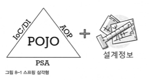

# Chapter 8. 스프링이란 무엇인가?

## 1. 스프링의 정의

- 스프링을 그때그때 필요한 API 사용 방법 위주로만 공부하면 스프링을 오해하거나 그 가치를 충분히 누리지 못할 수 있다.
    - 한 번쯤은 스프링의 정의를 통해 스프링이 어떤 것인지 큰 그림으로 이해해보려고 노력할 필요가 있다.
- 스프링에 대해 가장 잘 알려진 정의
    
    <aside>
    💡 자바 엔터프라이즈 개발을 편하게 해주는 오픈소스 경량급 애플리케이션 프레임워크
    
    </aside>
    

### 스프링의 특징

---

- 애플리케이션 프레임워크
    - 특정 계층, 기술, 업무 분야에 국한되지 않고 애플리케이션 전 영역을 포괄하는 범용적인 프레임워크
    - 스프링은 처음부터 독자적인 프레임워크로 개발된 것이 아니다.(기원은 로드 존슨 책 예제 프레임워크)
    - 스프링의 오해
        - 오해: 스프링은 MVC 프레임워크, JDBC/ORM 지원 프레임워크, IoC/DI 프레임워크, AOP 툴이다.
            
            👉  이렇게 보는 이유는 스프링이 제공하는 핵심 기술에만 주목했기 때문
            
    - 스프링의 일차적인 존재 목적: 핵심 기술에 담긴 프로그래밍 모델을 일관되게 적용해서 엔터프라이즈 애플리케이션 전 계층과 전 영역에 전략과 기능을 제공해줌으로써 애플리케이션을 편리하게 개발하게 해주는 애플리케이션 프레임워크
- 경량급
    - 스프링이 경량급이라는 건 스프링 자체가 아주 가볍다거나 작은 규모의 코드로 이뤄졌다는 뜻은 아니다. 오히려 스프링은 수십만 라인에 달하는 코드를 가진 매우 복잡하고 방대한 규모의 프레임워크다.
    - 불필요하게 무겁지 않다는 의미
        - 당시 EJB 는 기술에 대한 과도한 욕심으로 인해 개발환경과 운용 서버, 개발과 빌드, 테스트 과정, 작성된 코드 모두를 매우 무겁고 복잡하게 만들었다. EJB 가 동작하려면 고가의 느리고 무거운 자바 서버(WAS)가 필요했다. 그로 인해 고가의 제품으로 구성된 제대로 된 개발 환경을 갖추지 않고는 개발하기가 힘들었다.
        - 그에 반해 스프링은 가장 단순한 서버 환경인 톰캣이나 제티에서도 완벽하게 동작한다. 서블릿 컨테이너만으로 충분하니 EJB 컨테이너를 비롯해 복잡한 기능이 잔뜩 포함된 고급 WAS 를 굳이 사용하지 않아도 된다. 코드는 더 단순하고 개발 과정은 편리하면서도 EJB 에서조차 불편했던 고급 기능을 세련된 방식으로 적용할 수 있다.
    
    👉  만들어진 코드가 지원하는 기술 수준은 비슷하더라도 그것을 훨씬 빠르고 간편하게 작성하게 해줌으로써 생산성과 품질 면에서 유리하다는 것
    
- 자바 엔터프라이즈 개발을 편하게
    - 편리한 애플리케이션 개발: 개발자가 복잡하고 실수하기 쉬운 로우레벨 기술에 많은 신경을 안쓰면서 비즈니스 로직을 빠르고 효과적으로 구현하는 것
    - 엔터프라이즈 개발에서 필연적으로 요구되는 기술적인 요구를 충족 하면서도 개발을 복잡하게 만들지 않는다는 점이 스프링의 뛰어난 면이다.
        - EJB 는 고민과 부담을 덜어주었지만 이 과정에서 다른 차원의 더 큰 복잡함을 끌고 들어왔다.
- 오픈소스
    - 스프링은 오픈소스 프로젝트 방식으로 개발돼왔다.
    - 오픈소스의 장점
        - 공개된 커뮤니티의 공간 안에서 투명한 방식으로 다양한 참여를 통해 개발되기 때문에 매우 빠르고 유연한 개발이 가능하다.
        - 다양한 환경에서 개발하는 개발자가 자신이 경험한 문제점이나 발견한 버그 등을 그때마다 커뮤니티를 통해 개발팀에게 전달하기 때문에 잠재적인 버그와 문제점이 빠르게 발견되고 해결될 수 있다.
    - 언제 지원이 중단될지 알 수 없는 오픈소스의 단점을 극복하기 위해 전문기업을 만들었다.
    - VMWare 에서 스프링소스를 인수(현재 스프링은 VMWare 산하 Pivotal 에서 운영)


## 2. 스프링의 목적

- 스프링의 개발 철학과 궁극적인 목표가 무엇인지를 생각해보자.
    - 스프링을 제대로 사용하는 건 생각보다 쉽지 않다. 레퍼런스 매뉴얼을 착실히 읽고 관련 서적을 여러 권 공부한다고 해도 스프링을 사용해 어떻게 개발해야 할지 막막할 수도 있다.
- 스프링의 목적을 바로 이해하고, 그 목적을 이루는 도구로 스프링을 잘 활용해야만 스프링으로부터 제대로 된 가치를 얻을 수 있다.

### 2-1. 엔터프라이즈 개발의 복잡함

---

- 복잡함의 근본적인 이유
    - 기술적인 제약조건과 요구사항이 늘어가기 때문이다.
        - 엔터프라이즈 시스템을 개발하는 데는 순수한 비즈니스 로직을 구현하는 것 외에도 기술적으로 고려할 사항이 많다.
            - 엔터프라이즈 시스템은 많은 사용자의 요청을 동시에 처리해야 하기 때문에 서버의 자원을 효율적으로 공유하고 분배해서 사용할 수 있어야 한다.
            - 따라서 뛰어난 성능과 서비스의 안전성이 요구되고 그런 점을 고려한 개발 기술이 필요하다.
            - 엔터프라이즈 시스템의 기술적인 요구사항은 단순히 고가의 애플리케이션 서버나 툴을 사용한다고 충족될 수 있는게 아니다.
        - 따라서 이런 종류의 기술적인 문제를 고려하면서 애플리케이션을 개발해야 하는 부담을 안게 된다.
    - 엔터프라이즈 애플리케이션이 구현해야 할 핵심기능인 비즈니스 로직의 복잡함이 증가하기 때문이다.
        - 갈수록 엔터프라이즈 시스템이 기업의 핵심업무 처리를 담당하는 비중이 늘어갔다.
        - 수시로 업무 프로세스를 변경하고 조종하는 것을 상시화할 만큼 변화의 속도가 빨라졌다.
            - 엔터프라이즈 시스템의 변경을 요구할 수밖에 없다.
- 복잡함을 가중시키는 원인
    - 세부 요소가 이해하기 힘든 방식으로 얽혀 있고, 그 때문에 쉽게 다루기 어렵다.
    - 자바 엔터프라이즈 시스템 개발이 어려운 가장 큰 이유
        - 근본적인 비즈니스 로직과 엔터프라이즈 기술이라는 두 가지 복잡함이 한데 얽혀 있다.
        
        → 문제는 이를 유지보수하는 일이다.
        

### 2-2. 복잡함을 해결하려는 도전

---

- 제거될 수 없는 근본적인 복잡함
    - 비즈니스 로직의 적용범위를 줄이고 기술적인 요구조건을 일부 생략하는 것은 해결 방법이 아니다.
    - 비즈니스 로직의 복잡함과 기술적인 복잡함은 처리하는 방법이 다르다.
    - 둘을 분리해내야 변화에 잘 대응할 수 있다.
- 실패한 해결책: EJB
    - EJB 의 기본 전략도 위 두 가지 종류의 복잡함을 분리하는 것이었다.
    - 일부 기술적인 복잡함을 덜어주려다가 오히려 EJB 라는 환경과 스펙에 종속되는 코드로 만들어져야 하는 더 큰 복잡함을 추가하는 실수를 해버렸다.
    - 발전 주기도 너무 느려서 엔터프라이즈 개발 기술의 발전을 따라잡지 못하는 것도 문제점이다.
- 비침투적인 방식을 통한 효과적인 해결책: 스프링
    - 스프링은 EJB의 실패를 교훈으로 삼아서 출발했다. → 비침투적인 기술 전략 채택
    - 침투적(invasive)인 기술: 어떤 기술을 적용했을 때 그 기술과 관련된 코드나 규약 등이 코드에 등장하는 경우
    - 비침투적인 기술: 기술의 적용 사실이 코드에 직접 반영되지 않는다.
        - 어딘가에는 기술의 적용에 따라 필요한 작업을 해줘야 하겠지만, 애플리케이션 코드 여기저기에 불쑥 등장하거나, 코드의 설계와 구현 방식을 제한하지 않는다.

### 2-3. 복잡함을 상대하는 스프링의 전략

---

- 기술적 복잡함을 상대하는 전략
    - 문제 1. 기술에 대한 접근 방식이 일관성이 없고, 특정 환경에 종속적이다.
        - 환경, 서버, 적용되는 조건에 따라 기술이 달라지고 그에 따라 코드도 바뀐다는 건 심각한 문제다.
        
        👉  일관성 없는 기술과 서버환경의 변화에 대한 스프링의 공략 방법: 서비스 추상화
        
    - 문제2. 기술적인 처리를 담당하는 코드가 성격이 다른 코드에 섞여서 등장한다.
        - 기술과 비즈니스 로직의 혼재로 발생하는 복잡함 (트랜잭션, 보안, 로깅, 감사 기능 등)
        
        👉  이를 해결하기 위한 스프링의 접근 방법: AOP
        
        - AOP
            - 최후까지 애플리케이션 로직을 담당하는 코드에 남아 있는 기술 관련 코드를 깔끔하게 분리해서 별도의 모듈로 관리하게 해주는 강력한 기술이다.
            - 기술을 다루는 코드로 복잡함이 기술 그 자체 이상으로 불필요하게 증대되지 않도록 도와주는 가장 강력한 수단이다.
- 비즈니스와 애플리케이션 로직의 복잡함을 상대하는 전략
    - 엔터프라이즈 시스템 개발의 흐름은 점차 비즈니스 로직은 애플리케이션 안에서 처리하도록 만드는 추세다.
        - 가장 확장하기 힘들고 확장하더라도 많은 비용이 드는 공유 자원인 DB 에 커다란 부담을 주는 것도 문제고, 데이터 액세스 중심으로 로직을 다루면 개발, 유지보수, 테스트가 매우 어렵다.
    - 비침투적인 기술인 스프링은 핵심 로직을 다루는 코드에는 스프링의 흔적조차 찾을 수 없을 만큼 자신을 드러내지 않는다.
        - 다만 뒤에서 비즈니스 로직을 담당하는 오브젝트들에게 적절한 엔터프라이즈 기술 서비스가 제공되도록 은밀히 도와줄 뿐이다.
    
    👉  복잡한 비즈니스 로직을 상대하는 전략은 자바라는 객체지향 기술 그 자체
    
    - 스프링은 단지 객체지향 언어의 장점을 제대로 살리지 못하게 방해했던 요소를 제거하도록 도와줄 뿐
- 핵심 도구: 객체지향과 DI
    - 객체지향: 기술과 비즈니스 로직의 복잡함을 해결하는 데 스프링이 공통적으로 사용하는 도구
    - 스프링의 모토: 기본으로 돌아가자
        - 스프링 개발자는 자바 엔터프라이즈 기술의 가장 큰 장점은 바로 객체지향 설계와 프로그래밍을 가능하게 해주는 자바 언어라고 생각했다.
            - EJB 가 자바 언어의 객체지향 프로그래밍의 장점을 취하지 못하게 하면서, 특정 기술 스펙에 종속된 설계 방식을 강요했다는 점에 불만을 가졌다.
        - 스프링의 기본 전략: 자바의 기본인 객체 지향에 충실한 설계가 가능하도록 단순한 오브젝트로 개발할 수 있고, 객체 지향의 설계 기법을 잘 적용할 수 있는 구조를 만들기 위해 DI 같은 유용한 기술을 편하게 적용하도록 도와주는 것
    - 기술적인 복잡함을 효과적으로 다루게 해주는 기법은 모두 DI 를 바탕으로 하고 있다.
        - 서비스 추상화, 템플릿/콜백, AOP 같은 스프링의 기술
    - 객체지향 언어를 사용한다고 해서 자연스럽게 객체지향 설계가 되고 객체지향 프로그래밍을 할 수 있는 것은 아니다.
        - 이런 면에서 DI 는 객체지향적인 설계와 개발을 이끌어주는 좋은 동반자이다.
    - 틀에 박힌 구조의 빈만 정의하고 나머지 코드에는 DI 를 적용해볼 생각조차 안한다면 DI 를 잘못 사용하고 있는 것이다.
    
    👉  객체지향적인 특정을 잘 살린 설계는 상속과 다형성, 위임을 포함해서 많은 객체지향 디자인 패턴과 설계 기법이 잘 녹아들어 갈 수 있다.
    

## 3. POJO 프로그래밍

- 스프링의 가장 강력한 특징과 목표
    - 분리됐지만 반드시 필요한 엔터프라이즈 서비스 기술을 POJO 방식으로 개발된 애플리케이션 핵심 로직을 담은 코드에 제공한다.

### 3-1. 스프링의 핵심: POJO

---



- 스프링 애플리케이션 구분
    - POJO 를 이용해서 만든 애플리케이션 코드
    - POJO 가 어떻게 관계를 맺고 동작하는지를 정의해놓은 설계정보
- 스프링의 주요 기술: 애플리케이션을 POJO 로 개발할 수 있게 해주는 가능기술
    - IoC/DI
    - AOP
    - PSA

### 3-2. POJO 란 무엇인가?

---

- POJO: Plain Old Java Object
    - 마틴 파울러는 EJB 처럼 복잡하고 제한이 많은 기술을 사용하는 것보다는 자바의 단순한 오브젝트를 이용해 애플리케이션의 비즈니스 로직을 구현하는 편이 낫다고 생각했다.

### 3-3. POJO 의 조건

---

- 특정 규약에 종속되지 않는다.
    - 자바 언어와 꼭 필요한 API 외에는 종속되지 않아야 한다.
    - 별다른 가치를 주지도 못하는 규약에 종속되지 않아야 하고, 객체지향 설계의 자유로운 적용이 가능한 객체여야만 POJO 라고 불릴 수 있다.
        - EJB 2는 비즈니스 컴포넌트가 `EntityBean` 클래스를 상속해야만 한다.
    - 특정 규약을 따라 만들게 하는 경우
        - 대부분 규약에서 제시하는 특정 클래스를 상속하도록 요구한다.
            - 그럴 경우 자바의 단일 상속 제한 때문에 더 이상 해당 클래스에 객체지향적인 설계 기법을 적용하기가 어려워지는 문제가 생긴다.
        - 규약이 적용된 환경에 종속적이 되기 때문에 다른 환경으로 이전이 힘들다는 문제점이 있다.
- 특정 환경에 종속되지 않는다.
    - 순수한 애플리케이션 로직을 담고 있는 오브젝트 코드가 특정 환경에 종속되게 만드는 경우라면 그것 역시 POJO 라고 할 수 없다.
        - 특정 환경에 종속적이어야만 동작하는 오브젝트
            - EJB 3는 규약에 따라 오브젝트를 만들어야 한다는 단점은 극복했지만 여전히 JNDI 라는 서버 서비스를 필요로 한다. 빈의 의존 오브젝트 정보는 JNDI 를 통해 가져와야 하기 때문.
            
            👉  JNDI 와 같은 특정 환경이 의존 대상 검색 방식에 종속적이라면 POJO 라고 할 수 없다.
            
        - 특정 벤더의 서버나 특정 기업의 프레임워크 안에서만 동작 가능한 코드로 작성되거나 환경에 종속적인 클래스나 API 를 직접 쓴 경우
            - WebLogic 서버에서만 사용 가능한 API 를 직접 쓴 코드를 갖고 있거나
            - 특정 OS 에서 제공하는 기능을 직접 호출하도록 만들어진 오브젝트 등
    - POJO 는 환경에 독립적이어야 한다.
        - 특히 비즈니스 로직을 담고 있는 POJO 클래스는 웹이라는 환경정보나 웹 기술을 담고 있는 클래스나 인터페이스를 사용해서는 안된다.
            
            → 웹 외의 클라이언트가 사용하지 못하게 된다.
            
            - ex> 비즈니스 로직을 담은 코드에 `HttpServletRequest`나 `HttpSession`, 캐시와 관련된 API 가 등장하거나 웹 프레임워크의 클래스를 직접 이용하는 부분이 있다면 진정한 POJO 라 볼 수 없다.
        - 애노테이션이 단지 코드로 표현하기는 적절치 않은 부가적인 정보를 담고 있고, 그 때문에 환경에 종속되지만 않는다면 여전히 POJO 라고 할 수 있다.
            - 하지만 애노테이션이나 엘리먼트 값에 특정 기술과 환경에 종속적인 정보를 담고 있다면 그때는 POJO 로서의 가치를 잃어버린다.
- 객체지향적인 자바 언어의 기본에 충실하게 만들어져야 한다.
    - 특정 기술과 환경에 종속적이지 않다고 해서 POJO 라고 부르기 힘든 경우
        - 책임과 역할이 각기 다른 코드를 한 클래스에 몰아넣어 덩치 큰 만능 클래스로 만드는 경우
        - 재사용이 불가능할 정도로 다른 레이어/영역의 코드와 강한 결합을 가지고 만들어지는 경우
        - 상속과 다형성으로 처리하면 깔끔한 것을 `if`/`switch`로 가득 찬 긴 메소드로 작성해놓은 경우
        
        👉  객체지향적인 자바오브젝트라고 할 수 없다.
        
    - 진정한 POJO 란 객체지향적인 원리에 충실하면서, 환경과 기술에 종속되지 않고 필요에 따라 재활용될 수 있는 방식으로 설계된 오브젝트를 말한다.

### 3-4. POJO 의 장점

---

- 특정한 기술과 환경에 종속되지 않는 오브젝트는 그만큼 깔끔한 코드가 될 수 있다.
- POJO 로 개발된 코드는 자동화된 테스트에 매우 유리하다.
    - 환경의 제약은 코드의 자동화된 테스트를 어렵게 한다.
- 객체지향적인 설계를 자유롭게 적용할 수 있다.
    - 로드 존슨은 특정 기술과 규약, 환경보다 자바 언어와 객체지향 기술이 더 중요하다는 사실을 끊임없이 강조했다.
        
        → 대규모 자바 엔터프라이즈 시스템을 개발해온 수많은 경험을 통해 자바 언어의 객체지향적인 설계와 구현 방식이야말로 그 어떤 새로운 기술과 환경, 툴보다 더 실제 프로젝트를 성공시키는 데 중요한 요소임을 알고 있기 때문이다.
        

### 3-5. POJO 프레임워크

---

- 스프링은 POJO 프레임워크이다.
    - POJO 프로그래밍이 가능하도록 기술적 기반을 제공하는 프레임워크이기 때문
        - 하이버네이트: 주로 DB 이용 기술에 POJO 를 적용하는 것이 목적
        - 스프링: 엔터프라이즈 애플리케이션 개발의 모든 영역과 계층에서 POJO 방식의 구현이 가능하게 하려는 목적
- 애플리케이션의 핵심 로직(비즈니스 로직)을 객체지향적인 POJO 를 기반으로 깔끔하게 구현하고, 엔터프라이즈 환경의 각종 서비스와 기술적인 필요를 POJO 방식으로 만들어진 코드에 적용할 수 있다.
- 좋은 코드와 좋은 프레임워크의 특징
    - 그것을 사용해서 만들어지는 코드가 나쁜코드가 되기 어렵다.


## 4. 스프링의 기술

- 스프링의 세 가지 가능 기술: POJO 프로그래밍을 손쉽게 할 수 있도록 지원
    - IoC/DI
    - AOP
    - PSA
- 스프링의 기술들은 스프링 프레임워크가 만들어진 진정한 목표인 POJO 기반의 엔터프라이즈 개발을 편리하게 해주는 도구일 뿐이다.

### 4-1. 제어의 역전(IoC) / 의존관계 주입(DI)

---

- IoC/DI 는 스프링의 가장 기본이 되는 기술이자 스프링의 핵심 개발 원칙
- DI 는 OCP 라는 객체지향 설계 원칙으로 잘 설명될 수 있다.
    - 변경에는 닫혀있고 확장에는 열려있기 때문
    - 폐쇄 관점에서 볼 때 장점: 재사용이 가능하다.

- DI 의 활용 방법
    - 핵심기능의 변경
        - 의존 대상의 구현을 바꾸는 것
        - ex> DAO 구현을 JDBC 에서 JPA 로 변경한다.
    - 핵심기능의 동적인 변경
        - 조건에 따라 의존대상을 동적으로 변경할 수 있다.
        - ex> 등급에 따라 다른 `DataSource`를 사용하게 만든다.
    - 부가기능의 추가
        - 핵심기능은 그대로 둔 채로 부가기능을 추가하는 것
        - ex> 데코레이터 패턴
            - 인터페이스를 두고 사용하게 하고, 실제 사용할 오브젝트는 외부에서 주입하는 DI 를 적용한다.
    - 인터페이스의 변경
        - 인터페이스가 일치하지 않는 호출이 필요한 경우
        - ex> 어댑터 패턴
    - 프록시
        - ex> 프록시 패턴
            - lazy loading 등
    - 템플릿과 콜백
        - 콜백을 템플릿에 주입하는 방식의 동작하게 하는 것
        - ex> UserDao
            
            ```java
            @Repository
            public class UserDao {
            
                private final JdbcTemplate jdbcTemplate;
            
                public UserDao(JdbcTemplate jdbcTemplate) {
                    this.jdbcTemplate = jdbcTemplate;
                }
            
                public void add (User user) {
                    jdbcTemplate.update(new PreparedStatementCreator() {
                        @Override
                        public PreparedStatement createPreparedStatement(Connection con) throws SQLException {
                            PreparedStatement ps = con.prepareStatement("insert into user(id, name, password) values(?, ?, ?)");
            
                            ps.setString(1, user.getId());
                            ps.setString(2, user.getName());
                            ps.setString(3, user.getPassword());
            
                            return ps;
                        }
                    });
                }
            }
            ```
            
    - 싱글톤과 오브젝트 스코프
        - DI 할 객체의 생명주기 제어할 수 있다.
        - ex> 싱글톤, 다양한 스코프를 갖는 오브젝트를 만들어 DI 에 사용
    - 테스트
        - 스텁 또는 목 오브젝트 같은 테스트 대역에 활용

### 4-2. 애스펙트 지향 프로그래밍(AOP)

---

- AOP 를 사용하면 그 결과로 OOP 를 더욱 OOP 답게 만들 수 있다.
- AOP 적용 기법
    - 스프링과 같이 다이내믹 프록시를 사용하는 방법이다.
        - 기존 코드에 영향을 주지 않고 부가기능을 적용하게 해주는 데코레이터 패턴을 응용한 것
        - 엔터프라이즈 개발에서 필요로 하는 AOP 는 대부분 다이내믹 프록시를 이용하는(기본적인 구현 방법) 방식의 AOP 면 된다.
    - 자바 언어의 한계를 넘어서는 언어의 확장을 이용하는 방법이다.
        - 프록시 방식의 AOP 에서는 불가능한 다양한 조인 포인트를 제공한다.
        - 사용하기 까다롭고 번잡하다.
- AOP 의 적용 단계
    - 제대로 적용하려면 충분한 시간과 노력이 필요하다.
    - 적용 1단계: 미리 준비된 AOP 이용
        - 스프링의 트랜잭션
        - AspectJ를 이용한 `@Configurable`
    - 적용 2단계: 전담팀을 통한 정책 AOP 적용
        - 애플리케이션 전체적으로 이용 가능한 것을 소수의 AOP 담당자 관리하에 적용해볼 수 있다.
            - ex> 보안, 로깅, 트레이싱, 실시간 성능 모니터링 같은 정책적으로 적용할만한 기능들
        - 개발 가이드라인이나 표준을 따라서 코드가 작성되어 있는지를 검증하는 작업
            - ex> 개발 정책을 위반한 경우 예외를 던지도록 AOP 모듈을 만들 수 있다.
    - 적용 3단계: AOP 의 자유로운 이용

### 4-3. 포터블 서비스 추상화(PSA)

---

- PSA 는 환경과 세부 기술의 변화에 관계없이 일관된 방식으로 기술에 접근할 수 있게 해준다.
- 스프링이 제공하는 대표적인 기술이 바로 일관성 있는 서비스 추상화 기술
    - 스프링에서는 다양한 기술에 대한 서비스 추상화 기능을 제공한다.
        - 대부분 직접적으로 서비스를 이용할 필요 없이 설정만 해주면 된다.
    - 필요하다면 직접 추상 레이어를 도입하고 일관성 있는 API 를 정의해서 사용하면 된다.
- DI 를 적극 활용해서 개발한다면 서비스 추상화는 자연스럽게 만들어 쓸 수 있다.

- 참고
    - [https://dotheright.tistory.com/352](https://dotheright.tistory.com/352)
    - [https://incheol-jung.gitbook.io/docs/study/tobys-spring/undefined/8#pojo-1](https://incheol-jung.gitbook.io/docs/study/tobys-spring/undefined/8#pojo-1)
