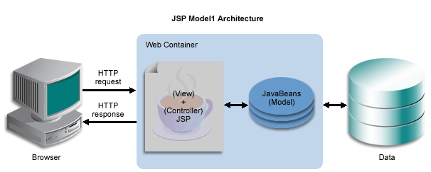

# Chapter 12. 스프링 웹 기술과 스프링 MVC

## 1. 스프링의 웹 프레젠테이션 계층 기술

---

- 스프링은 의도적으로 서블릿 웹 애플리케이션의 컨텍스트를 두 가지로 분리해놓았다.
    - 루트 애플리케이션 컨텍스트
        - 웹 기술에서 완전히 독립적인 비즈니스 서비스 계층과 데이터 액세스 계층을 담고 있다.
    - 서블릿 애플리케이션 컨텍스트
        - 스프링 웹 기술을 기반으로 동작하는 웹 관련 빈을 담고 있다.

→ 이렇게 스프링 컨텍스트를 두 가지로 분리해둔 이유는 스프링 웹 서블릿 컨텍스트를 통째로 다른 기술로 대체할 수 있도록 하기 위해서다.

### 1-1. 스프링에서 사용되는 웹 프레임워크의 종류

---

- 스프링 웹 프레임워크
    - 스프링 서블릿/스프링 MVC
        - 스프링이 직접 제공하는 서블릿 기반의 MVC 프레임워크
        - 프론트 컨트롤러 역할을 하는 `DispatcherServlet`을 핵심 엔진으로 사용한다.
        - 스프링 서블릿의 모든 컴포넌트는 스프링의 서블릿 애플리케이션 컨텍스트의 빈으로 등록되어 동작한다 → 간단히 루트 컨텍스트에 존재하는 서비스 계층의 빈을 사용할 수 있다.
    - 스프링 포틀릿
        - 스프링이 제공하는 포틀릿 MVC 프레임워크
        - 서블릿과 유사한 포틀릿 컨테이너에서 동작하며 포틀릿이라는 자유로운 조합이 가능한 작은 단위의 프레젠테이션 컴포넌트를 포틀릿을 지원하는 포탈 서버에 배치해서 사용한다.
        - 스프링 포틀릿은 스프링 서블릿 MVC 프레임워크와 거의 동일한 기능을 제공한다.
- 스프링 포트폴리오 웹 프레임워크
    - 스프링 서블릿을 기반으로 하는 고급 웹 프레임워크의 종류: [https://spring.io/projects](https://spring.io/projects)
    - 스프링 스스로 확장시켜 만든 `@MVC`같은 전용 프레임워크 외에 스프링의 포트폴리오 프로젝트나 서드파티 업체를 통해 개발된 프레임워크를 말한다.
        - Spring Web Flow(SWF)
            - 스프링 서블릿을 기반으로 해서 상태 유지(stateful) 스타일의 웹 애플리케이션을 작성하게 해주는 프레임워크
            - 컨트롤러를 직접 코드로 작성하지 않아도, DSL을 이용해 웹 페이지의 흐름과 규칙을 지정해주면 상태정보를 유지하는 고급 웹 애플리케이션을 손쉽게 개발할 수 있다.
        - Spring JavaScript
            - 자바스크립트 툴킷인 Dojo 를 추상화한 것으로, 스프링 서블릿과 스프링 웹 플로우에 연동해서 손쉽게 Ajax 기능을 구축할 수 있도록 만들어졌다.
            - SWF 에 포함되어 있다.
        - Spring Faces
            - JSF 를 스프링 MVC 와 스프링 SWF 의 뷰로 손쉽게 사용할 수 있게 해주는 프레임워크
        - Spring Web Service
            - 스프링 MVC와 유사한 방식으로 SOAP 기반의 웹 서비스 개발을 가능하게 해주는 프레임워크
            - 강력한 오브젝트 매핑 기능과 XML 마샬링 기능을 제공하고 있으며 spring security 를 비롯한 각종 스프링의 기능을 활용할 수 있다.
            - 스프링 포트폴리오 프로젝트의 하나다.
        - Spring BlazeDs Integration
            - 플레스의 BlazeDS와 스프링을 통합해서 빠르고 쉽게 플렉스를 지원하는 스프링 어플리케이션을 개발할 수 있도록 해주는 연동 프레임워크
            - Spring flex 에 포함되어 있다.
- 스프링을 기반으로 두지 않는 웹 프레임워크
    - 스프링 서블릿/MVC 대신 사용할 수 있는 웹 기술이나 웹 프레임워크
    - JSP/Servlet
        - 기존에 만들어뒀던 모델 1 방식의 JSP 나 서블릿을 스프링 애플리케이션의 웹 프레젠테이션 계층으로 사용할 수 있다.
            - 모델 1: 뷰와 로직을 모두 JSP 페이지 하나에서 처리하는 구조
            
            
            
    - Struts1
        - 한때 표준 웹 프레임워크라 불릴 만큼 큰 인기를 누렸던 MVC 프레임워크
    - Struts2
        - 스트럿츠 1과는 기원이 전혀 다른 프레임워크
        - 기존의 스트럿츠 개발 커뮤니티에 통합되면서 스트럿츠 2라는 이름을 갖게 됐고, 이후 많은 개발자와 커뮤니티의 전폭적인 지원에 힘입어 빠르게 성장하고 있는 웹 프레임워크다.
    - Tapestry 3, 4
    - JSF/Sean

👉 효과적으로 개발할 수 있는 방법은 역시 스프링이 직접 제공하는 웹 프레임워크를 사용하는 것이다.

- 스프링 MVC 를 권장한다.

### 1-2. 스프링 MVC 와 `DispatcherServlet` 전략

---

- 프레임워크 기술은 두 가지 방향으로 발전하고 있다.
    1. 유연성과 확장성에 중점을 둔 범용적 프레임워크 (ex> spring)
    2. 자기 주장이 강하고 기술 선호도가 분명한, 제한적인 기술만을 사용하도록 강제하는 고속개발 프레임워크(ex> Ruby on Rails, Django)
- 1번과 같은 프레임워크는
    - 계층과 기술이 서로의 내부를 잘 알고 강하게 결합되는 것을 극도로 꺼린다.
    - 이런 프레임워크는 유연한 아키텍처를 가지고 장기적으로 많은 인원이 큰 규모의 시스템을 개발할 때 적합하다.
- 2번과 같은 프레임워크는
    - 전 계층이 매우 긴밀하게 연동하고 있기 때문에 계층 간의 느슨한 연결을 유지해야 하는 부담이 없고 강하게 결합된 최적화된 코드를 만들 수 있다.
    - 그만큼 계층과 구조가 단순하고 각 기술의 장점을 극대화할 수 있으면서 미리 정해진 관례에 따라 개발만 하면 되기 때문에 많은 코드와 설정을 생략하고 빠르게 개발할 수 있다.
- 스프링을 잘 사용하는 비결은 이러한 스프링의 유연한 확장성을 최대한 활용하면서 두 번째 스타일의 프레임워크를 지향하는 것이다.
    - 스프링이 제공하는 유연하고 확장성이 뛰어난 구조를 이용하면서 각 프로젝트에 맞는 최적화된 구조를 만들어내고, 관례를 따라 빠르게 개발 가능한 스프링 기반의 프레임워크를 만들어서 사용해야 한다는 의미다.
    - 스프링은 특정 기술이나 방식에 매이지 않으면서 웹 프레젠테이션 계층의 각종 기술을 조합, 확장해서 사용할 수 있는 매우 유연한 웹 애플리케이션 개발의 기본 틀을 제공해준다.
    - 이 틀이 제공하는 다양한 전략의 확장 포인트를 이용하여 스프링 스스로 기본적인 MVC 프레임워크를 만들어뒀다. 스프링을 사용하는 개발자라면 스프링이 제공해준 MVC 프레임워크 위에 필요한 전략을 추가해서 사용할 수 있어야 한다.

👉 스프링 MVC 프레임워크를 이미 완성된 고정적인 프레임워크로 보지 말고, 진행하려는 프로젝트의 특성에 맞게 빠르고 편리한 개발이 가능하도록 자신만의 웹 프레임워크를 만드는데 쓸 수 있는 도구라고 생각해야 한다.

- `DispatcherServlet`과 MVC 아키텍처
    - `DispatcherServlet`은 스프링의 웹 기술 핵심
        - 스프링의 웹 기술을 구성하는 다양한 전략을 DI 로 구성해서 확장하도록 만들어진 스프링 서블릿/MVC 의 엔진과 같은 역할을 한다.
    - 스프링 웹 기술의 근간이 되는 MVC 아키텍처는 보통 프론트 컨트롤러 패턴과 함께 사용된다.
        - 프론트 컨트롤러 패턴: 중앙집중형 컨트롤러를 프레젠테이션 계층의 제일 앞에 둬서 서버로 들어오는 모든 요청을 먼저 받아서 처리한다.
    - 프론트 컨트롤러: 클라이언트가 보낸 요청을 받아서 공통적인 작업을 먼저 수행한 후에 적절한 세부 컨트롤러로 작업을 위임해주고, 클라이언트에게 보낼 뷰를 선택해서 최종 결과를 생성하는 등의 작업을 수행한다.

- 스프링 서블릿/MVC 의 핵심: `DispatcherServlet`이라는 프론트 컨트롤러다.
    
    
    
- 1. `DispatcherServlet`의 HTTP 요청 접수
    - 자바 서버의 서블릿 컨테이너는 HTTP 프로토콜을 통해 들어오는 요청이 스프링의 `DispatcherServlet`에 할당된 것이라면 HTTP 요청정보를 `DispatcherServlet`에 전달해준다.
        
        ```xml
        <servlet-mapping>
        	<servlet-name>Spring MVC Dispatcher Servlet</servlet-name>
        	<url-pattern>/app/*</url-pattern>
        </servlet-mapping>
        ```
        
        - 스프링 부트는 `DispacherServlet`을 서블릿으로 자동으로 등록하면서 모든 경로(`urlPatterns="/"`)에 대해서 매핑한다. 참고> 더 자세한 경로가 우선순위가 높다. 그래서 기존에 등록한 서블릿도 함께 동작한다.
        - 위는 /app 으로 시작하는 모든 요청을 스프링의 프론트 컨트롤러인 `DispatcherServlet`으로 할당한다.
    - `DispatcherServlet`은 모든 요청에 대해 공통적으로 전행해야 하는 전처리 작업이 등록된 것이 있다면 이를 먼저 수행한다. 공통적으로 이용 가능한 보안이나 파라미터 조작, 한글 디코딩과 같은 작업이 적용된다.
- 2. `DispatcherServlet`에서 컨트롤러로 HTTP 요청 위임
    - `DispatcherServlet`은 URL이나 파라미터 정보, HTTP 명령 등을 참고로 해서 어떤 컨트롤러에게 작업을 위임할 지 결정한다.
    - 컨트롤러를 선정하는 것은 `DispatcherServlet`의 핸들러 매핑 전략을 이용한다. 이 핸들러 매핑 전략은 `DispatcherServlet`의 수정 없이도 DI 를 통해 얼마든지 확장 가능하다.
    - 어떤 컨트롤러가 요청을 처리하게 할지를 결정했다면 다음은 해당 컨트롤러의 메소드를 호출해서 실제로 웹 요청을 처리하는 작업을 위임한다.
        - 그렇다면 `DispatcherServlet`이 어떤 컨트롤러 오브젝트의 메소드를 호출해야 하는지 어떻게 알 수 있을까 → 어댑터를 이용하여 해결한다.
    - 전형적인 오브젝트 어댑터 패턴을 사용해서 특정 컨트롤러를 호출해야 할 때는 해당 컨트롤러 타입을 지원하는 어댑터를 중간에 껴서 호출한다. 그러면 `DispatcherServlet`은 항상 일정한 방식으로 컨트롤러를 호출하고 결과를 받을 수 있다.
        
        
        
    - `DispatcherServlet`은 컨트롤러가 어떤 메소드를 가졌고 어떤 인터페이스를 구현했는지 전혀 알지 못한다. 대신 컨트롤러의 종류에 따라 적절한 어댑터를 사용한다. 각 어댑터는 자신이 담당하는 컨트롤러에 맞는 호출 방법을 이용해서 컨트롤러에 작업 요청을 보내고 결과를 돌려받아서 `DispatcherServlet`에게 다시 돌려준다. 이렇게 하면 하나의 `DispatcherServlet`이 동시에 여러 가지 타입의 컨트롤러를 사용할 수 있다.
    - `DispatcherServlet`이 핸들러 어댑터에 웹 요청을 전달할 때는 모든 웹 요청 정보가 담긴 `HttpServletRequest` 타입의 오브젝트를 전달해준다. 이를 어댑터가 적절히 변환해서 컨트롤러의 메소드가 받을 수 있는 파라미터로 변환해서 전달해주는 것이다. `HttpServletResponse`도 함께 전달해준다.
- 3. 컨트롤러의 모델 생성과 정보 등록
    - MVC 패턴의 장점은 정보를 담고 있는 모델과 정보를 어떻게 뿌려줄지를 알고 있는 뷰가 분리된다는 점이다.
        - 즉, 같은 모델이지만 뷰에 따라 다른 방식으로 모델의 정보가 출력되게 할 수 있다.
    - 컨트롤러의 작업은 먼저 사용자 요청을 해석하는 것, 그에 따라 실제 비즈니스 로직을 수행하도록 서비스 계층 오브젝트에게 작업을 위임하는 것, 결과를 받아서 모델을 생성하는 것, 마지막으로 어떤 뷰를 사용할 지 결정하는 것, 네 가지로 분류할 수 있다.
    - 모델을 생성하고 모델에 정보를 넣어주는 게 컨트롤러가 해야 할 마지막 중요한 두 가지 작업 중 하나다. 컨트롤러가 어떤 식으로든 다시 `DispatcherServlet`에 돌려줘야 할 두 가지 정보가 있는데 바로 모델과 뷰이다.
    - 모델은 보통 맵에 담긴 정보라고 보면 된다.
- 4. 컨트롤러의 결과 리턴: 모델과 뷰
    - 모델이 준비됐으면 다음은 뷰를 결정할 차례다. 뷰도 하나의 오브젝트기 때문에 컨트롤러가 뷰 오브젝트를 직접 리턴할 수도 있지만, 보통은 뷰의 논리적인 이름을 리턴해주면 `DispatcherServlet`의 전략인 뷰 리졸버가 이를 이용해 뷰 오브젝트를 생성해준다. 대표적으로 사용되는 뷰는 JSP/JSTL 뷰다.
    - 결국 컨트롤러가 리턴해주는 정보는 모델과 뷰 두가지로, 스프링에는 `ModelAndView`라는 이름의 오브젝트가 있는데 이 `ModelAndView`가 `DispatcherServlet`이 최종적으로 어댑터를 통해 컨트롤러로부터 돌려받는 오브젝트다. 이름 그대로 모델과 뷰, 두 가지 정보를 담고 있다.
    - 모델과 뷰를 넘기는 것으로 컨트롤러의 책임은 끝이다.
- 5. DispatcherServlet의 뷰 호출과 6. 모델 참조
    - `DispatcherServlet`이 컨트롤러로부터 모델과 뷰를 받은 뒤에 진행하는 작업은 뷰 오브젝트에게 모델을 전달해주고 클라이언트에게 돌려줄 최종 결과물을 생성해달라고 요청하는 것이다. 보통 HTML을 생성하는 일이 가장 흔한 뷰의 작업이다.
    - JSP 를 이용해서 결과물을 만들어주는 `JstlView`는 컨트롤러가 돌려준 JSP 뷰 템플릿의 이름을 가져다 HTML 을 생성하는데 그 중 동적으로 생성되도록 표시된 부분은 모델의 내용을 참고로 해서 채운다.기술적으로 보자면 뷰 작업을 통한 최종 결과물은 `HttpServletResponse` 오브젝트 안에 담긴다.
- 7. HTTP 응답 돌려주기
    - 뷰 생성까지의 모든 작업을 마쳤으면 `DispatcherServlet`은 등록된 후처리기가 있는지 확인하고, 있다면 후처리기에서 후속 작업을 진행한 뒤에 뷰가 만들어준 `HttpServletResponse`에 담긴 최종 결과를 서블릿 컨테이너에게 돌려준다. 서블릿 컨테이너는 `HttpServletResponse`에 담긴 정보를 HTTP 응답으로 만들어 사용자의 브라우저나 클라이언트에게 전송하고 작업을 종료한다.

- `DispatcherServlet`의 DI 가능한 전략
    - `DispatcherServlet`은 다양한 방식으로 동작방식과 기능을 확장, 변경할 수 있도록 준비된 전략이 존재한다.
        - 가장 먼저 맨처음 요청이 들어올때 초기화되는 부분을 먼저 살펴보면 다음과 같은 리스트가 있다.
        
        ```java
        package org.springframework.web.servlet;
        
        public class DispatcherServlet extends FrameworkServlet {
        
        	protected void initStrategies(ApplicationContext context) {
        		initMultipartResolver(context);
        		initLocaleResolver(context);
        		initThemeResolver(context);
        		initHandlerMappings(context);
        		initHandlerAdapters(context);
        		initHandlerExceptionResolvers(context);
        		initRequestToViewNameTranslator(context);
        		initViewResolvers(context);
        		initFlashMapManager(context);
        	}
        	...
        }
        ```
        
    - `HandlerMapping`
        
        ```java
        public interface HandlerMapping {
        	@Nullable
        	HandlerExecutionChain getHandler(HttpServletRequest request) throws Exception;
        }
        ```
        
        - URL과 요청 정보를 기준으로 어떤 컨트롤러 오브젝트를 사용할 것인지를 결정하는 로직을 담당한다. `HandlerMapping` 인터페이스를 구현해서 만들 수 있다.
        - 디폴트로는 `BeanNameUrlHandlerMapping`, `DefaultAnnotationHandlerMapping` 2가지가 설정돼있으며 디폴트 핸들러 매핑으로 충분하다면 추가 등록하지 않아도 된다.
        - 스프링 부트의 `HandlerMapping`
            - `RequestMappingHandlerMapping`
                - 3.1 이후부터 `DefaultAnnotationHandlerMapping`가 deprecated 되고 대신 나왔다.
            - `BeanNameUrlHandlerMapping`
            - `SimpleUrlHandlerMapping`
            - `WelcomePageHandlerMapping`
    - `HandlerAdapter`
        
        ```java
        public interface HandlerAdapter {
        	boolean supports(Object handler);
        
        	@Nullable
        	ModelAndView handle(HttpServletRequest request, HttpServletResponse response, Object handler) throws Exception;
        
        	long getLastModified(HttpServletRequest request, Object handler);
        }
        ```
        
        - 핸들러 매핑으로 선택한 컨트롤러를 `DispatcherServlet`이 호출할 때 사용하는 어댑터다.
        - 디폴트로 등록되어 있는 어댑터는 `HttpRequestHandlerAdapter`, `SimpleControllerHandlerAdapter`, `AnnotationMethodHandlerAdapter` 3가지다.
            - ex> `@RequestMapping`과 `@Controller` 어노테이션을 통해 정의되는 컨트롤러의 경우 `DefaultAnnotationHandlerMapping`에 의해 컨트롤러가 결정되고 그에 대응되는 `AnnotationMethodHandlerAdapter`에 의해 호출이 일어난다.
        - 스프링 부트의 `HandlerAdapter`
            - `RequestMappingHandlerAdater`
                - 3.1부터 `AnnotationMethodHandlerAdapter`는 deprecated 되었고, 대신 사용한다.
            - `HttpRequestHandlerAdapter`
            - `SimpleControllerHandlerAdatper`
    - `HandlerExceptionResolver`
        
        ```java
        public interface HandlerExceptionResolver {
        	@Nullable
        	ModelAndView resolveException(HttpServletRequest request, HttpServletResponse response, @Nullable Object handler, Exception ex);
        }
        ```
        
        - 예외가 발생했을 때, 이를 처리하는 로직을 갖고 있다. 예외가 발생했을 때 예외의 종류에 따라 에러 페이지를 표시한다거나, 관리자에게 통보해주는 등의 작업은 개발 컨트롤러가 아니라 프론트 컨트롤러인 `DispatcherServlet`을 통해 처리돼야 한다.
        - `DispatcherServlet`은 등록된 `HandlerExceptionResolver` 중에서 발생한 예외에 적합한 것을 찾아서 예외처리를 위임한다.
        - 디폴트 전략은 `AnnotationMethodHandlerExceptionResolver`, `ResponseStatusExceptionResolver`, `DefaultHandlerExceptionResolver` 3가지다.
        - 스프링 부트의 `HandlerExceptionResolver`
            - `DefaultHandlerExceptionResolver`: 기본적으로 사용되는 exception 들을 공통 처리해주기 위해 제공되는 resolver
            - `ResponseStatusExceptionResolver`: `ResponseStatusException`이 throw 되거나 `@ResponseStatus`를 설정한 지점에서 발생한 에러를 처리
            - `ExceptionHandlerExceptionResolver`: `@Controller` 또는 `@ControllerAdvice`에 선언된 `@ExceptionHandler`을 통해 에러를 처리
                - 3.1부터는 `AnnotationMethodHandlerExceptionResolver` 대신, `ExceptionHandlerExceptionResolver`를 사용한다.
    - `ViewResolver`
        
        ```java
        public interface ViewResolver {
        	@Nullable
        	View resolveViewName(String viewName, Locale locale) throws Exception;
        }
        ```
        
        - 컨트롤러가 리턴한 뷰 이름을 참고해서 적절한 뷰 오브젝트를 찾아주는 로직을 가진 전략 오브젝트다.
        - 디폴트로 등록된 `InternalResourceViewResolver`는 JSP 나 서블릿 같이 `RequestDispatcher`에 의해 포워딩될 수 있는 리소스를 뷰로 사용하게 해준다.
    - `LocaleResolver`
        
        ```java
        public interface LocaleResolver {
        	Locale resolveLocale(HttpServletRequest request);
        
        	void setLocale(HttpServletRequest request, @Nullable HttpServletResponse response, @Nullable Locale locale);
        }
        ```
        
        - 지역(locale)정보를 결정해주는 전략이다.
            
            
            
        - 디폴트인 `AcceptHeaderLocaleResolver`는 HTTP 헤더의 정보를 보고 지역정보를 설정해준다.
    - `ThemeResolver`
        - 테마를 가지고 이를 변경해서 사이트를 구성할 경우 쓸 수 있는 테마 정보를 결정해주는 전략이다.
    - `RequestToViewNameTranslator`
        - 컨트롤러에서 뷰 이름이나 뷰 오브젝트를 제공해주지 않았을 경우 URL과 같은 요청정보를 참고해서 자동으로 뷰 이름을 생성해주는 전략이다.
        - 디폴트는 `DefaultRequestToViewNameTrannslator`다.

👉 `DispatcherServlet`은 내부에 서블릿 웹 애플리케이션 컨텍스트를 갖고 있고, 내부 컨텍스트로부터 개발자가 추가하거나 설정을 수정한 전략이 담긴 빈 오브젝트가 있는지 찾아보고, 있다면 이를 가져와서 디폴트 전략을 대신해서 사용한다.


## 2. 스프링 웹 애플리케이션 환경 구성

### 2-1. 간단한 스프링 웹 프로젝트 생성

---

- 루트 웹 애플리케이션 컨텍스트
    - web.xml 에 리스너를 등록해서 루트 컨텍스트가 생성되게 만든다.
    - 웹 환경과 직접 관련이 없는 모든 빈은 여기에 등록해둘 것이다.
    - 루트 웹 애플리케이션 컨텍스트의 디폴트 설정파일은 /WEB-INF/applicationContext.xml 이다. 리스너를 이용해 등록
    
    ```xml
    <listener>
    	<display-name>ContextLoader</display-name>
    	<listner-class>org.springframework.web.context.ContextLoaderListener</listenr-class>
    </listener>
    ```
    
- 서블릿 웹 애플리케이션 컨텍스트
    - 웹 프레젠테이션 계층의 빈을 등록해둘 서블릿 컨텍스트
    - 서블릿 컨텍스트의 등록 방법은 web.xml 에 `DispatcherServlet` 서블릿을 추가해주면 된다.
    
    ```xml
    <servlet>
    	<servlet-name>sevletname</servlet-name>
    	<servlet-class>org.springframework.web.servlet.DispatcherServlet</servlet-class>
    	<load-on-startup>1</load-on-startup>
    	//url 패턴도 지정 가능
    </servlet>
    ```
    
    - `DispatcherServlet` 의 URL 패턴 지정 방법
        1. 확장자로 구분하는 방법
        2. 특정 URL 폴더를 기준으로 매핑하는 방법
        3. URL 매핑을 /* 로 해서 웹 애플리케이션의 모든 요청을 다 처리하게 만들기 (드물다)
- 스프링 웹 프로젝트 검증
    - 핸들러 어댑터: SimpleControllerHandlerAdapter
    - 핸들러 매핑: BeanNameUrlHandlerMapping
    - 뷰 리졸버: InternalResourceViewResolver

### 2-2. 스프링 웹 학습 테스트

---

- 서블릿이 서버 밖에서 테스트하기가 쉽지 않은 이유: 서블릿 컨테이너와 유사한 환경정보를 담은 오브젝트들을 구성해야 하고, `HttpServletRequest` 와 결과를 저장할 `HttpServletResponse` 도 필요하기 때문. HTTP 세션, `ServletContext`, HTTP 쿠키, HTTP 헤더 등의 정보도 오브젝트 형태로 구성해서 전달해줘야 한다.
- 스프링 테스트 모듈: `MockHttpServletRequest`, `MockHttpServletResponse`, `MockHttpSession`, `MockServletContext`, `MockServletConfig` 등을 함께 사용해서 서블릿이 동작하는 환경을 세밀하게 구성할 수 있다.

- 서블릿 테스트용 목 오브젝트
    
    ```java
    MockHttpServletRequest req = new mockHttpServletRequest("GET", "/hello");
    req.addParameter("name","Spring");
    SimpleGetServlet servlet = new SimpleGetServlet();
    servlet.service(req, res);
    ```
    
    - `MockHttpServletRequest`
        - 서블릿에 전달할 `HttpServletRequest` 타입의 요청정보
    - `MockHttpServletResponse`
    - `MockHttpSession`
    - `MockServletConfig`, `MockServletContext`
    - MockMvc 의 `perform()`
        
        ```java
        @RunWith(SpringRunner.class)
        @SpringBootTest(webEnvironment = SpringBootTest.WebEnvironment.MOCK)
        @AutoConfigureMockMvc
        public class SampleSpringBootTest {
        
            @Autowired
            MockMvc mockMvc;
        
            @Test
            public void hello() throws Exception {
                mockMvc.perform(get("/hello"))
                        .andExpect(status().isOk())
                        .andExpect(content().string("hello Spring"))
                        .andDo(print());
            }
        }
        ```
        
        - `MockHttpServletRequest`, `MockHttpServletResponse`, Handler 등의 실행결과를 출력한다.
        - `andDo(print())` 결과로그
            
            ```java
            **MockHttpServletRequest**:
            HTTP Method = GET
            Request URI = /hello
            Parameters = {}
            Headers = {}
            Body = null
            Session Attrs = {}
            
            Handler:
            Type = com.tutorial.springboot.controller.SampleController
            Method = public java.lang.String com.tutorial.springboot.controller.SampleController.hello()
            
            Async:
            Async started = false
            Async result = null
            
            Resolved Exception:
            Type = null
            
            ModelAndView:
            View name = null
            View = null
            Model = null
            
            FlashMap:
            Attributes = null
            
            **MockHttpServletResponse**:
            Status = 200
            Error message = null
            Headers = {Content-Type=[text/plain;charset=UTF-8], Content-Length=[13]}
            Content type = text/plain;charset=UTF-8
            Body = hello SPRING
            Forwarded URL = null
            Redirected URL = null
            Cookies = []
            2021-12-01 14:06:16.853  INFO 6284 --- [       Thread-2] o.s.s.c.ThreadPoolTaskExecutor           : Shutting down ExecutorService 'applicationTaskExecutor'
            ```
            
- 테스트를 위한 `DispatcherServlet` 확장
    - 테스트 환경에서 `DispatcherServlet`이 만드는 서블릿 컨텍스트를 자유롭게 설정할 수 있다.
    - XML 설정파일의 위치를 임의로 지정할 수도 있고, 빈 클래스를 직접 등록할 수도 있다.
    - 컨트롤러가 돌려주는 `ModelAndView`를 저장해뒀다가 이를 테스트에서 참조할 수 있게 해준다.
    - ConfigurableDispatcherServlet: 커스텀 서블릿
        
        ```java
        public class ConfigurableDispatcherServlet extends DispatcherServlet{
               private Class<?>[] classes;
               private String[] locations;
        
               private ModelAndView modelAndView;
               public ConfigurableDispatcherServlet() {
               }
               public ConfigurableDispatcherServlet(String[] locations) {
                      this.locations = locations;
               }
               public ConfigurableDispatcherServlet(Class<?>[] classes) {
                      this.classes = classes;
               }
               public void setLocations(String ...locations) {
                      this.locations = locations;
               }
        
               public void setRelativeLocations(Class clazz, String ...relativeLocations) {
                      String[] locations=new String[relativeLocations.length];
                      String currentPath=ClassUtils.classPackageAsResourcePath(clazz)+"/";
        
                      for(int i=0;i<relativeLocations.length;i++) {
                             locations[i]=currentPath+relativeLocations[i];
        
                      }
                      this.setLocations(locations);
               }
               public void setClasses(Class<?>[] classes) {
                      this.classes = classes;
               }
        
               @Override
               public void service(ServletRequest req, ServletResponse res) throws ServletException, IOException {
                      modelAndView=null;
                      super.service(req, res);
               }
        
               @Override
               protected WebApplicationContext createWebApplicationContext(ApplicationContext parent) {
                      AbstractRefreshableWebApplicationContext wac=new AbstractRefreshableWebApplicationContext() {
        
                             @Override
                             protected void loadBeanDefinitions(DefaultListableBeanFactory beanFactory) throws BeansException, IOException {
                                   if(locations!=null) {
                                          XmlBeanDefinitionReader xmlReader=new XmlBeanDefinitionReader(beanFactory);
                                          xmlReader.loadBeanDefinitions(locations);
                                   }
                                   if(classes !=null) {
                                          AnnotatedBeanDefinitionReader reader=new AnnotatedBeanDefinitionReader(beanFactory);
                                          reader.register(classes);
                                   }
                             }
        
                      };
        
                      wac.setServletContext(getServletContext());
                      wac.setServletConfig(getServletConfig());
                      wac.refresh();
        
                      return wac;
               }
               @Override
               protected void render(ModelAndView mv, HttpServletRequest request, HttpServletResponse response) throws Exception {
                      this.modelAndView=mv;
                      super.render(mv, request, response);
               }
               public ModelAndView getModelAndView() {
                      return modelAndView;
               }
        }
        ```
        
- ConfigurableDispatcherServlet 을 이용한 스프링 MVC 테스트
    
    ```java
    @RunWith(SpringJUnit4ClassRunner.class)
    @WebAppConfiguration
    @ContextConfiguration(locations = { "classpath:config/*-context.xml",
                  "file:src/main/webapp/WEB-INF/spring/appServlet/servlet-context.xml" })
    public class HomeControllerTest {
           @Test
           public void test() throws ServletException, IOException {
                  ConfigurableDispatcherServlet servlet = new ConfigurableDispatcherServlet();
                  servlet.setLocations("classpath:config/*-context.xml",
                                "file:src/main/webapp/WEB-INF/spring/appServlet/servlet-context.xml");
                  servlet.init(new MockServletConfig("appServlet"));
    
                  MockHttpServletRequest req = new MockHttpServletRequest("GET", "/sample");
                  req.addParameter("id", "1");
                  MockHttpServletResponse res = new MockHttpServletResponse();
                  servlet.service(req, res);
                  ModelAndView mav = servlet.getModelAndView();
                  String name= (User) mav.getModel().get("name");
                  assertThat(name, is("Jenny"));
           }
    }
    ```
    
- 편리한 `DispatcherServlet` 테스트를 위한 AfterDispatcherServletTest
    - 편리한 헬퍼 메소드를 이용해서 간결한 테스트 코드를 빠르게 만들 수 있다.
    - 컨텍스트 설정과 웹 요청정보를 지정한 후에 runService() 메소드를 호출하면 요청정보를 생성해서 `DispatcherServlet`을 실행해준다.
    - runService()의 리턴 (p.394)
        - `String getContentAsString()`
        - `ModelAndView getModelAndView()`
        - `AfterRunService assertViewName(String viewname), AfterRunService assertModel(String name, Object value)`
        - `WebApplicationContext getContext()`: 서블릿 컨텍스트를 가져온다.
        - `<T> getBean(Class<T> beanType)`


## 3. 컨트롤러

- 서블릿이 넘겨주는 HTTP 요청은 `HttpServletRequest` 오브젝트에 담겨 있다.
- `DispatcherServlet`의 전략 패턴을 통한 유연함의 가치가 가장 잘 드러나는 영역은 컨트롤러다.

### 3-1. 컨트롤러의 종류와 핸들러 어댑터

---

- 스프링 MVC가 지원하는 컨트롤러의 종류는 네 가지다. 각 컨트롤러를 `DispatcherServlet`에 연결해주는 핸들러 어댑터가 하나씩 있어야 하므로, 핸들러 어댑터도 4개다.
    - `Servlet`과 `SimpleServletHandlerAdapter`
        - 컨트롤러 타입: 표준 서블릿. 표준 서블릿 인터페이스인 `javax.servlet.Servlet`을 구현한 서블릿 클래스를 스프링 MVC 의 컨트롤러로 사용할 수 있다.
        - 서블릿을 컨트롤러로 사용했을 때 장점은 서블릿 클래스 코드를 그대로 유지하면서 스프링 빈으로 등록된다. 이러면 스프링 애플리케이션에 맞게 포팅할 수 있다는 점이다.
        - 단, 서블릿이 컨트롤러 빈으로 등록된 경우에는 자동으로 `init()`, `destroy()` 같은 생명주기 메소드가 호출되지 않는다.
        - 리스트 12-21
            
            ```java
            setClasses(SimpleServletHandlerAdpter.class, HelloServlet.class); //핸들러 어댑터와 컨트롤러를 빈으로 등록해준다.
            ```
            
        - 핸들러 어댑터가 빈으로 등록되어 있으면 `DispatcherServlet`은 이를 자동으로 감지해 디폴트 핸들러 어댑터를 대신해서 사용한다.
            
            ```java
            <bean class=“org.springframework.web.servlet.handler.SimpleServletHandlerAdapter” />
            ```
            
            - 여러 개의 핸들러 어댑터를 사용하기도 한다. 핸들러 매핑에 의해 사용할 컨트롤러를 찾아주면 그에 맞는 핸들러 어댑터를 이용해 컨트롤러를 호출해주는 것이다.
        - `Servlet` 타입의 컨트롤러는 모델과 뷰를 리턴하지 않는다.
            - 그래서 결과는 서블릿에서 `HttpServletResponse`에 넣어준 정보를 확인하는 방법을 사용한다.
    - `HttpRequestHandler`와 `HttpRequestHandlerAdapter`(default)
        - `HttpRequestHandler`는 서블릿처럼 동작하는 컨트롤러를 만들기 위해 사용한다. 전형적인 서블릿 스펙을 준수할 필요 없이 HTTP 프로토콜을 기반으로 한 전용 서비스를 만들려고 할 때 사용할 수 있다.
        - 스프링은 `HttpRequestHandler`를 이용해서 자바의 RMI 를 대체할 수 있는 HTTP 기반의 가벼운 원격 호출 서비스인 HTTP Invoker 를 제공한다. 모델과 뷰 개념이 없는 HTTP 기반의 RMI 같은 로우레벨 서비스를 개발할 때 이용할 수 있다.
    - `Controller`와 `SimpleControllerHandlerAdapter`(default)
        - 어노테이션과 관례를 이용한 컨트롤러가 나오기 전까지 스프링 MVC 컨트롤러라고 하면 이를 의미했다.
            - `synchronizeOnSession`: HTTP 세션에 대한 동기화 여부 결정하는 프로퍼티. 사용자가 자신의 HTTP 세션에 동시에 접근하는 것을 막아준다.
            - `supportedMethods`: 컨트롤러가 허용하는 HTTP 메소드를 지정할 수 있다. 디폴트는 모든 종류의 HTTP 메소드를 다 허용한다. 그 외의 HTTP 메소드로 접근할 때는 자동으로 예외를 발생시켜준다.
            - `useExpiresHeader`, `useCacheControlHeader`, `useCacheControlNoStore`, `cacheSeconds`: HTTP 1.0/1.1 의 Expires, Cache-Control, HTTP 헤더를 이용해서 브라우저의 캐시 설정 정보를 보내줄 것인지를 결정한다. 기본 설정은 캐시를 사용하지 않도록 모두 "no-cache" 값을 보내주도록 되어 있다. 캐시 사용을 하용하려면 `cacheSeconds` 값을 0 이상으로 주면 된다.
        - 코드
            
            ```java
            public class HelloController extends SimpeController {
            	public HelloController() {
            		this.setRequiredParams(new String[] {"name"});
            		this.setViewName("/WEB-INF/view/hello.jsp");
            	}
            
              public void control(Map<String, String> params, Map<String, Object> model) throws Exception {
                model.put("message", "Hello " + params.get("name"))
              }
            }
            
            public abstract class SimpleController implements Controller {
            	private String[] requiredParams;
            	private String viewName;
            	// setRequiredParams
            	//setViewName
            	final public ModelAndView handleRequest(HttpServletRequest req, HttpServletResponse res) throws Exception {
                if (viewName == null) throw new IllegalStateException();
            
                Map<String, String> params = new HashMap<String, String>();
            		for (String param : requiredParams) {
                  String value = req.getParameter(param);
                  if (value == null) throw new IllegalStateException();
                  params.put(param, value);
                }
            
                Map<String, Object> model = new HashMap<String, Object>();
            
                this.control(params, model);
                return new ModelAndView(this.viewName, model);
            	}
            	**public abstract void control(Map<String, String> params, Map<String, Object> model) throws Exception;**
            }
            ```
            
    - `AnnotationMethodHandlerAdapter`(v3.1: `RequestMappingHandlerAdater`)(default)
        - 지원하는 컨트롤러의 타입이 정해져있지 않다 → 다른 핸들러 어댑터와는 다른 독특한 특징
            - 다른 핸들러 어댑터는 특정 인터페이스를 구현한 컨트롤러만 지원한다.
            - 대신 클래스나 메소드에 붙은 애노테이션의 정보와 메소드 이름, 파라미터, 리턴 타입에 대한 규칙을 분석해서 컨트롤러를 선별하고 호출 방식을 결정한다.
        - 컨트롤러 하나가 1개 이상의 URL 에 매핑될 수 있다.
        - `DefaultAnnotationHandlerMapping`과 함께 사용해야한다.(v3.1: `RequestMappingHandlerMapping`)

### 3-2. 핸들러 매핑

---

- HTTP 요청정보를 이용해서 이를 처리할 핸들러 오브젝트, 즉 컨트롤러를 찾아주는 기능을 가진 `DispatcherServlet`의 전략
    - 디폴트는 `BeanNameUrlHandlerMapping`, `DefaultAnnotationHandlerMapping`
        - 3.1 부터는 `RequestMappingHandlerMapping`, `BeanNameUrlHandlerMapping`, `SimpleUrlHandlerMapping`, `WelcomePageHandlerMapping`
    - 그 외의 핸들러 매핑을 사용하려면 핸들러 매핑 클래스를 빈으로 등록해줘야 한다.
    
    
    
- 스프링이 제공하는 5가지 핸들러 매핑 전략
    - `BeanNameUrlHandlerMapping`(디폴트)
        - 빈의 이름에 들어있는 URL 을 HTTP 요청의 URL 과 비교해서 일치하는 빈을 찾아준다.
        - 예제
            
            ```java
            <bean name="/root/**/sub" class="xxController">
            ```
            
            - /root/sub, /root/a/sub 와 같은 URL 에 매핑된다.
    - `ControllerBeanNameHandlerMapping`
        - 빈의 아이디나 빈 이름을 이용해 매핑해준다. 빈 이름에 `prefix`, `suffix`를 지정할 수 있다.
        - 이런 특정 전략 클래스를 빈으로 등록한 경우에는 디폴트 전략이 모두 무시된다. ex> `BeanNameUrlHandlerMapping`, `DefaultAnnotationHandlerMapping`
        - 예제
            
            ```java
            <bean id="hello" class="MyController">
            
            @Component("hello")
            public class MyController implements Controller {
              ...
            }
            ```
            
    - `ControllerClassNameHandlerMapping`
        - 빈 이름 대신 클래스 이름을 URL 에 매핑해준다.
        - 기본적으로는 클래스 이름 모두 URL 로 사용하지만 Controller 로 끝날 때는 Controller 를 뺀 나머지 이름을 URL 에 매핑해준다.
            
            ```java
            public class HelloController implements Controller { ... }
            ```
            
    - `SimpleUrlHandlerMapping`(3.1부터 디폴트)
        - URL 과 컨트롤러의 매핑정보를 한곳에 모아놓을 수 있는 전략. 매핑정보는 `SimpleUrlHandlerMapping`빈의 프로퍼티에 넣어준다.
        - 예제
            
            ```java
            <bean id="handler" class="org.springframework.web.servlet.handler.SimpleUrlHandlerMapping">
              <property name="mappings">
                <props>
                    <prop key="/hello">helloController</prop>                  
                </props>
              </property>
            </bean>
            ```
            
    - `DefaultAnnotationHandlerMapping`(디폴트)
        - `@RequestMapping`을 컨트롤러 클래스나 메소드에 직접 부여하고 이를 이용해 매핑하는 전략
        - URL 뿐 아니라 HTTP 메소드, 심지어는 파라미터와 HTTP 헤더정보까지 매핑에 활용할 수 있다.
    - 기타 공통 설정정보
        - 매핑 방식을 세밀하게 제어할 수 있는 다양한 프로퍼티를 제공한다.
        - `order`: 2개 이상의 핸들러 매핑을 적용했을 때 URL 매핑정보가 중복되는 경우를 위해 지정하는 우선순위. 프로퍼티 설정하려면 빈으로 등록해줘야 한다.
        - `defaultHandler`: URL 을 매핑할 대상을 찾지 못했을 경우 자동으로 디폴트 핸들러를 선택해준다.
            - 404 대신 디폴트 핸들러로 넘겨서 친절한 안내 메시지를 뿌려주는 것이 좋다.
        - `alwaysUseFullPath`: Full path 로 사용하고 싶을 때 사용
            - URL 매핑은 기본적으로 웹 애플리케이션의 context-path, 서블릿 path 를 제외한 상대경로만 사용한다.
        - `detectHandlersInAncestorContexts`: 핸들러 매핑 클래스는 기본적으로 서블릿 컨텍스트 안에서만 매핑할 컨트롤러를 찾는다. 이 프로퍼티는 절대 사용하지 말자.
        
        ```java
        //handlerMapping
        @Bean
        @Override
        public RequestMappingHandlerMapping requestMappingHandlerMapping() {
          RequestMappingHandlerMapping handlerMapping = super.requestMappingHandlerMapping();
          handlerMapping.setUseSuffixPatternMatch(true);
          handlerMapping.setAlwaysUseFullPath(true);
          handlerMapping.setOrder(0);
          handlerMapping.setInterceptors(securityRulesInterceptor());
          return handlerMapping;
        }
        ```
        

### 3-3. 핸들러 인터셉터

---

- 핸들러 인터셉터는 `DispatcherServlet`이 컨트롤러를 호출하기 전과 후에 요청과 응답을 참조하거나 가공할 수 있는 일종의 필터다.
    - 서블릿 필터와 유사한 개념이다.
- 핸들러 매핑은 `DispatcherServlet`으로 부터 매핑 작업을 요청받으면 그 결과로 핸들러 실행 체인(`HandlerExecutionChain`) 을 돌려준다. 이 핸들러 실행 체인은 하나 이상의 핸들러 인터셉터를 거쳐서 컨트롤러가 실행될 수 있도록 구성되어 있다.

- 핸들러 인터셉터는 `HandlerInterceptor` 인터페이스를 구현해서 만든다.
    - 인터페이스 내 3개의 메소드
        
        ```java
        public interface HandlerInterceptor {
            boolean preHandle(HttpServletRequest request, HttpServletResponse response, Object handler) throws Exception; 
            void postHandle(HttpServletRequest request, HttpServletResponse response, Object handler, ModelAndView modelAndView) throws Exception;
            void afterCompletion(HttpServletRequest request, HttpServletResponse response, Object handler, Exception ex) throws Exception;
        }
        ```
        
        - `preHandle`: 컨트롤러가 호출되기 전에 실행
            - 컨트롤러 실행 이전에 처리해야 할 작업이 있다거나, 요청정보를 가공하거나 추가하는 경우에 사용할 수 있다. 요청에 대한 로그를 남기기 위해 사용하기도 한다.
        - `postHandle`: 컨트롤러를 실행하고 난 후 호출
            - 컨트롤러가 돌려준 `ModelAndView` 타입의 정보가 제공되서 컨트롤러 작업 결과를 참조하거나 조작할 수 있다.
        - `afterCompletion`: 모든 뷰에서 최종 결과를 생성하는 일을 포함한 모든 작업이 완료된 후 실행
            - 요청 처리 중 사용한 리소스를 반환해주기 적당한 메소드다.
- 핸들러 인터셉터 적용
    - 핸들러 인터셉터를 사용하려면 먼저 핸들러 매핑 클래스를 빈으로 등록해야 한다.
    - 핸들러 매핑 빈의 `interceptors` 프로퍼티를 이용해 핸들러 인터셉터 빈의 레퍼런스를 넣어주면 된다.
        
        ```java
        <bean class="org.springframework.web.servlet.handler.BeanNameUrlHandlerMapping">
            <property name="interceptors">
                <list>
                    <ref bean="simpleInterceptor"/>
                    <ref bean="eventInterceptor"/>
                </list>
            </property>
        </bean>
        ```
        
        - 핸들러 인터셉터는 기본적으로 핸들러 매핑 빈 단위로 등록된다
            
            → 한 인터셉터를 하나 이상의 핸들러 매핑 빈에 모두 적용하려면 핸들러 매핑 빈마다 반복적으로 등록해 줘야 한다.
            
            → 스프링 3.0 에서는 핸들러 인터셉터를 URL 패턴을 이용해서 모든 핸들러 매핑 빈에 일괄 적용하는 기능이 추가됐다.
            
    - 핸들러 인터셉터 대신 컨트롤러에 AOP 를 적용하는 건? 👉  AOP를 이용해 컨트롤러에 일괄 적용할 부가 기능을 어드바이스로 만들어서 적용할 수는 있지만 컨트롤러 호출과정에 적용되는 부가 기능은 핸들러 인터셉터를 사용하는 편이 낫다.

### 3-4. 컨트롤러 확장

---

- 핸들러 어댑터는 `HandlerAdapter` 인터페이스를 구현해야 한다.
    
    ```java
    package org.springframework.web.servlet;
    
    public interface HandlerAdapter {
        boolean supports(Object handler);
    	  ModelAndView handle(HttpServletRequest request, HttpServletResponse response, Object handler) throws Exception;
        long getLastModified(HttpServletRequest request, Object handler);
    }
    ```
    
    - `supports`: 이 핸들러 어댑터가 지원하는 핸들러(컨트롤러) 타입인지 확인한다.
    - `handle`: `DispatcherServlet`의 요청을 받아 컨트롤러를 실행해주는 메소드
    - `getLastModified`: `HttpServlet`의 `getLastModified()`를 지원해주는 메소드
        - 컨트롤러에서 구현하도록 만들 생각이 아니라면 핸들러 어댑터에서 그냥 -1 리턴해도 된다.


## 4. 뷰

### 4-1. 뷰

---

- `DispatcherServlet`이 사용하는 뷰 오브젝트는 `View` 인터페이스를 구현해야 한다.
    
    ```java
    package org.springframework.web.servlet;
     
    import java.util.Map;
     
    import javax.servlet.http.HttpServletRequest;
    import javax.servlet.http.HttpServletResponse;
     
    public interface View {
     
        String getContentType();
     
        void render(Map<String, ?> model, HttpServletRequest request, HttpServletResponse response) throws Exception;
    }
    ```
    
    - `getContentType()`:뷰 오브젝트가 생성하는 콘텐트의 타입 정보를 제공
    - `render()`: 모델을 전달받아 클라이언트에 돌려줄 결과물을 만들어 줌
- 뷰 사용하는 방법 2가지
    - 스프링이 제공하는 기반 뷰 클래스를 확장해서 코드로 뷰를 만드는 방법
        - `View` 인터페이스를 직접 구현해서 뷰를 만들어야 할 필요는 없다. 스프링이 웹에서 자주 사용되는 타입의 콘텐트를 생성해주는 다양한 뷰를 이미 구현해놓았기 때문이다.
        - 엑셀이나 PDF, RSS 피드와 같은 뷰는 콘텐트를 생성하는 API 를 사용해서 뷰 로직을 작성한다.
    - 스프링이 제공하는 뷰를 활용하되 뷰 클래스 자체를 상속하거나 코드를 작성하지는 않고, JSP 나 프리마커 같은 템플릿 파일을 사용하거나 모델을 자동으로 뷰로 전환하는 로직을 사용하는 방법

- `InternalResourceView`와 `JstlView` → 디폴트이며 가장 많이 사용된다.
    - `InternalResourceView`: `RequestDispatcher`의 `forward()`나 `include()`를 이용하는 뷰
        - `forward()`나 `include()`는 다른 서블릿을 실행해서 그 결과를 현재 서블릿의 결과로 사용하거나 추가하는 방식이다. 순수 서블릿을 `forward()` 용도로 사용하는 일은 드물기 때문에 주로 JSP 서블릿을 통해 JSP 뷰를 적용할 때 사용한다.
            
            ```java
            req.setAttribute("message", message);
            req.getRequestDispatcher("/WEB-INF/view/hello.jsp").forward(req, res);
            ```
            
            - `InternalResourceView` 가 동작하는 방식은 위 코드와 동일하다고 보면 된다. 컨트롤러가 돌려준 뷰 이름을 포워딩할 JSP 의 이름으로 사용하고 모델 정보를 요청 애트리뷰트에 넣어 주는 작업을 `InternalResourceView`와 `DispatcherServlet` 이 대신 해주는 것뿐이다.
        - 스프링 MVC 의 컨트롤러에서라면 아래와 같이 `InternalResourceView`를 만들어 `ModelAndView`에 넣어서 `DispatcherServlet`으로 넘겨 주면 JSP 로 포워딩하는 기능을 가진 뷰를 사용할 수 있다.
            
            ```java
            public class HelloController implements Controller {
             
                @Override
                public ModelAndView handleRequest(HttpServletRequest request, HttpServletResponse response) throws Exception {
                    Map<String, Object> model = new HashMap<String, Object>();
                    model.put("message", message);
             
                    View view = new InternalResourceView("/WEB-INF/view/hello.jsp");
             
                    return new ModelAndView(view, model);
                }
            }
            ```
            
    - `JstlView`: `InternalResourceView`의 서브 클래스. JSP 를 뷰 템플릿으로 사용할 때 여러 추가 기능을 활용할 수 있어서 편리하다.
        - `JstlView`는 지역정보에 따라 달라지는 지역화 메시지를 JSP 뷰에 사용할 수 있게 해준다. 아래와 같이 지역화를 적용할 수 있는 메시지 번들 소스를 등록해 두면 JSP/JSTL 의 태그를 통해 현재 지역에 해당하는 메시지 파일의 내용을 사용할 수 있다.
            
            ```java
            <bean id="messageSource"
                class="org.springframework.context.support.ResourceBundleMessageSource">
                <property name="basename" value="messages"/>
            </bean>
            ```
            
        - 기본은 messages.properties 파일의 메시지를 JSTL 의 fmt 에서 사용하게 해주지만, 만약 지역정보가 현재 한국(ko)으로 설정되어 있고 messages_ko.properties 파일이 존재한다면 messages_ko.properties 파일의 내용을 JSTL의 `<fmt:message>` 태그를 이용해 출력할 수 있다. 이렇게 메시지의 지역화 기능을 사용하려면 `InternalResourceView` 를 확장한 `JstlView` 를 사용해야 한다.
    - `InternalResourceView`나 `JstlView`를 사용하려면 이전 예제처럼 `InternalResourceView` 객체를 생성하여 `ModelAndView` 에 넘겨주는 것보다 뷰 리졸버를 이용하는게 훨씬 편리하다. 뷰 리졸버를 사용한다면 컨트롤러에서는 아래와 같이 JSP 파일의 위치를 나타내는 논리적인 뷰 이름만 넘겨주면 된다.
        
        ```java
        return new ModelAndView("/WEB-INF/view/hello.jsp", model);
        ```
        
        - 뷰 오브젝트 대신 뷰 이름이 `ModelAndView`에 담겨서 돌아오면, `DispatcherServlet`은 디폴트 뷰 리졸버로 등록된 `InternalResourceViewResolver`를 통해 `InternalViewResource`를 가져와 사용할 것이다. 뷰 리졸버는 보통 뷰 오브젝트를 캐싱하기 때문에 같은 URL 의 뷰가 반복적으로 만들어지지 않게 해서 성능 면에서도 유리하다.
- `RedirectView`
    - `HttpServletResponse`의 `sendRedirect()`를 호출해주는 기능을 가진 뷰. 실제 뷰가 생성되는 것이 아니라 URL 만 만들어져 다른 페이지로 리다이렉트된다. 모델정보가 있다면 URL 뒤에 파라미터로 추가된다.
        - 컨트롤러가 `RedirectView`를 직접 만들어서 리턴해도 되지만, 그 보다는 뷰 리졸버가 인식할 수 있도록 `redirect:` 로 시작하는 뷰 이름을 사용하면 편리하다.
        - 리다이렉트에서 쓰는 URL 은 http:// 로 시작할 수도 있고, /로 시작할 수도 있다. /로 시작하는 경우는 서버의 루트 URL 부터 시작되야 한다. 웹 애플리케이션 루트 패스가 /가 아니라면, 이때는 생성자나 프로퍼티를 통해 `contextRelative`를 `true`로 바꿔주는 것이 편하다. 그러면 웹 애플리케이션의 컨텍스트 패스를 제외한 나머지 경로만 지정해도 된다.
        - ex> 웹 애플리케이션이 /subsystem 이라는 컨텍스트 패스로 배치되어 있다면, 리다이렉트 URL 을 작성할 때 /subsystem/main 과 같이 모든 경로를 다 작성해야 한다. 하지만 `contextRelative`를 `true`로 바꿔주면 다음과 같이 상대 경로를 사용할 수 있다. 단, 서블릿 패스는 자동으로 추가되지 않는다.
            
            ```java
            new RedirectView("/main", true);
            ```
            
- `VelocityView`, `FreeMarkerView`
    - `VelocityView`와 `FreeMarkerView`는 모두 Velocity 와 FreeMarker 라는 두 개의 대표적인 자바 템플릿 엔진을 뷰로 사용하게 해준다. 이 두가지 뷰도 JSP 와 마찬가지로 컨트롤러에서 직접 뷰 오브젝트를 만드는 대신 `VelocityViewResolver`와 `FreeMarkerViewResolve`를 통해 자동으로 뷰가 만들어져 상용되게 하는 편이 낫다.
- `MarshallingView`
    - 스프링 3.0에서 새롭게 등장한 OXM(Object-XML Mapping) 추상화 기능을 활용해서 application/xml 타입의 XML 콘텐트를 작성하게 해주는 편리한 뷰
    - 미리 준비해둔 마살러 빈을 지정하고 모델에서 변환에 사용할 오브젝트를 지정해 주면, OXM 마샬러를 통해 모델 오브젝트를 XML로 변환해서 뷰의 결과로 사용할 수 있다.
    - 자동으로 자바 오브젝트를 XML 로 변환해주는 Castor 라이브러리를 이용한 예제
        - 본격적으로 OXM을 사용하려면 꼼꼼하게 매핑파일을 만드는 것을 권장한다.
        - XML 로 매핑할 모델로 아래와 같이 Info 클래스 하나를 만들어 사용하자.
            
            ```java
            package com.happyhouse.rednics.study.spring.mvc.view.marshalling;
             
            public class Info {
             
                private String message;
             
                public Info(String message) {
                    this.message = message;
                }
             
                public String getMessage() {
                    return message;
                }
            }
            ```
            
            - Castor 에게 Info 타입의 오브젝트를 넘기면 매핑정보 없이도 일정한 규칙을 이용해서 XML 엘리먼트를 변환해 준다.
        - 스프링의 Marshaller 인터페이스로 추상화된 Castor 마샬러 빈으로 등록해 준다.
            - 물론 Castor 라이브러리 파일도 추가해줘야 한다.
            - CastorMarshaller 는 OXM 추상화가 적용된 것이니 OXM 엔진과 매핑정보는 자유롭게 변경할 수 있다.
            
            ```java
            <bean id="marshaller" class="org.springframework.oxm.castor.CastorMarshaller" />
            ```
            
        - 이제 marshaller 빈을 사용해서 Info 오브젝트를 XML 로 변환해줄 뷰인 `MarshallingView`를 빈으로 등록한다.
            
            ```java
            <bean id="helloMarshallingView" class="org.springframework.web.servlet.view.xml.MarshallingView">
                <property name="marshaller" ref="marshaller" />
                    <!-- 컨트롤러가 리턴한 모델에서 어떤 이름의 오브젝트에 마샬러를 적용할 것인지 지정해 준다. -->
                <property name="modelKey" value="info" />
            </bean>
            ```
            
        - 이제 컨트롤러에서 info 오브젝트가 포함된 모델과 마샬링 뷰를 리턴하게 해주면 된다. 마샬링 뷰는 빈으로 등록했으니 다음과 같이 컨트롤러에서 직접 DI 받아서 사용할 수 있다.
            
            ```java
            public class CastorMarshallingController implements Controller {
             
                // 같은 타입의 뷰가 여러 개 존재할 수 있으므로 빈 이름으로 매핑하도록 @Resource 를 사용한다.
                @Resource MarshallingView marshallingView;
             
                @Override
                public ModelAndView handleRequest(HttpServletRequest request, HttpServletResponse response) throws Exception {
             
                    Map<String, Object> model = new HashMap<String, Object>();
                    model.put("info", new Info("Hello " + request.getParameter("name")));
             
                    return new ModelAndView(marshallingView, model);
                }
            }
            ```
            
        - 컨트롤러에서 준비한 모델은 `DispatcherServlet`에 의해 `infoMarshallingView`로 전달될 것이다. infoMarshallingView 오브젝트는 모델에서 info 오브젝트를 꺼내서 DI 받은 마샬러로 XML 을 생성해 준다.
        - 만들어진 XML 은 application/xml 콘텐트 타입으로 설정돼서 클라이언트로 보내질 것이다. Castor 마샬러를 거쳐서 최종 완성된 뷰의 결과는 다음과 같다.
            
            ```java
            <?xml version="1.0" encoding="UTF-8"?>
            <info><message>Hello Spring</message></info>
            ```
            
        - 마샬링 뷰를 컨트롤러에서 직접 DI 받는 대신 뷰 리졸버를 이용해서 선택할 수도 있다. 이 때는 컨트롤러에서 뷰 이름만 리턴하고, 뷰 이름과 infoMarshallingView 빈을 연결해주는 정보를 별도의 설정파일이나 XML 문서를 통해 지정해주는 방법을 사용한다. 컨트롤러를 특정 뷰에 종속시키지 않으려면 뷰 리졸버를 사용하는 편이 낫다.
        - OXM 기술을 적용해서 XML 콘텐트를 만드는 방법은 한 가지가 더 있는데, 애노테이션 기반의 MVC 컨트롤러를 이용해 마샬링 뷰 대신 메시지 컨버터를 사용하는 방법이다.
        - 같은 컨트롤러에서 조건에 따라 두 종류 이상의 뷰를 사용할 수도 있다. 예를 들어 아래와 같이 `type=XML` 이라는 조건이 붙을 때만 XML로 마샬링해서 보내주고, 그 외의 경우는 JSP 뷰를 이용하게 할 수도 있다.
            
            ```java
            if("xml".equals(request.getParameter("type"))) {
                return new ModelAndView(infoMarshallingView, model);
            } else {
                return new ModelAndView("/WEB-INF/view/hello.jsp", model);
            }
            ```
            
            - 위 코드에서 볼 수 있듯이 적용할 뷰의 종류를 선택하는 일도 컨트롤러의 역할이다.
        - 스프링 MVC 는 뷰 리졸버를 이용하면 뷰 선택 로직을 컨트롤러에서 분리할 수도 있다. 확장자를 기준으로 뷰 리졸버에서 뷰 타입을 결정하도록 만드는 방법도 가능하다.
- `AbstractExcelView`, `AbstractJExcelView`, `AbstractPdfView`
    - 엑셀과 PDF 문서를 만들어 주는 뷰. 상속을 해서 코드를 구현해야 하는 뷰
    - `AbstractExcelView`: 아파치 POI 라이브러리를 이용해 엑셀뷰를 만들어 준다.
    - `AbstractJExcelView`: 요즘 새로 떠오르는 엑셀지원 API 인 JExcelAPI 를 사용해 엑셀 문서를 만들어 준다.
    - `AbstractPdfView`는 iText 프레임워크 API 로 PDF 문서를 생성해준다.
        
        ```java
        public class SpringPdfView extends AbstractPdfView {
            @Override
            protected void buildPdfDocument(Map<String, Object> model,
                    Document document, PdfWriter writer, HttpServletRequest request,
                    HttpServletResponse response) throws Exception {
         
                    Chapter chapter = new Chapter(new Paragraph("Spring Message"), 1);
                    chapter.add(new Paragraph((String)model.get("message")));
         
                    document.add(chapter);
            }
        }
        
        public class PdfViewController implements Controller {
            @Autowired SpringPdfView springPdfView;
         
            @Override
            public ModelAndView handleRequest(HttpServletRequest request, HttpServletResponse response) throws Exception {
                ...
                return new ModelAndView(springPdfView, model);
            }
        }
        ```
        
    - 이 세개의 뷰를 상속해서 개별적인 뷰를 만든다. 템플릿 패턴이 적용되어 있기 때문에 적절한 hook 메소드를 오버라이드해주는 방법으로 문서 생성코드를 추가할 수 있다.
        - ex> `AbstractExcelView`라면 `buildExcelDocument` 메소드를 오버라이드하고 파라미터로 제공되는 `model` 맵으로부터 모델정보를 가져와 HSSFWorkbook API 를 이용해서 엑셀 문서를 작성해주는 코드를 만들어 주면 된다.
- `AbstractAtomFeedView`, `AbstractRssFeedView`
    - 각각 application/atom+xml, application/rss+xml 타입의 피드 문서를 생성해주는 뷰
    - 상속을 통해 피드 정보를 생성하는 메소드를 직접 구현해줘야 한다.
        - `AbstractAtomFeedView`의 경우 buildFeedEntries 메소드를 오버라이드해서 `com.sun.syndication.feed.atom.Entry`타입의 리스트로 피드 정보를 작성한 후 돌려주면 된다.
        - `AbstractRssFeedView`를 사용한다면 buildFeedItems 메소드를 오버라이드해서 `com.sun.syndication.feed.rss.Item`타입의 리스트로 피드 정보를 돌려주도록 만들면 된다.
- `XsltView`, `TilesView`, `AbstractJasperReportsView`
    - `XsltView`: XSLT 변환을 이용해 뷰를 생성해준다. `javax.xml.transform.TransformerFactory` 타입의 팩토리 클래스와 적용할 모델 오브젝트를 지정해주면 된다.
    - `TilesView`: Tiles 1, 2 를 이용해 뷰를 생성할 수 있다.
    - `AbstractJasperReportsView`: 리포트 작성용 프레임워크인 JasperReports 를 이용해 CSV, HTML, PDF, Excel 형태의 리포트를 작성해 준다.
        - `JasperReportsCsvView`, `JasperReportsHtmlView`, `JasperReportsPdfView`, `JasperReportsXlsView`를 사용할 수 있다.
- `MappingJacksonJsonView`
    - AJAX 에서 많이 사용되는 JSON 타입의 콘텐트를 작성해 주는 뷰
    - 기본적으로 모델의 모든 오브젝트를 JSON 으로 변환해 준다. `Set<String>` 타입인 `renderedAttributes` 프로퍼티를 지정해서 일부 모델 오브젝트만 JSON 변환에 사용할 수 있다. 변환 작업은 Jackson JSON 프로세서를 사용한다.
    - HTTP 응답의 콘텐트 타입은 application/json 으로 지정된다.
    - Controller 가 돌려주는 모델을 `MappingJacksonJsonView`에서 처리하면 다음과 같은 JSON 포멧의 콘텐트가 생성된다.
        
        ```java
        {"messages":"Hello Spring"}
        ```
        
    - XML 과 마찬가지로 JSON 도 뷰를 직접 사용하는 대신 메시지 컨버터를 사용해 생성하는 방법이 있다.

### 4-2. 뷰 리졸버

---

- 뷰 리졸버는 핸들러 매핑이 URL 로 부터 컨트롤러를 찾아주는 것처럼, 뷰 이름으로부터 사용할 뷰 오브젝트를 찾아준다. `ViewResolver` 인터페이스를 구현해야 한다.
    - 뷰 리졸버를 빈으로 등록하지 않는다면 `DispatcherServlet`은 디폴트 뷰 리졸버인 `InternalResourceViewResolver`가 사용된다.

- `InternalResourceViewResolver`
    - 뷰 리졸버를 지정하지 않았을 때 자동등록되는 디폴트 뷰 리졸버
    - 주로 JSP 를 뷰로 사용하고자 할 때 쓰인다.
    
    ```java
    <bean class=“org.springframework.web.servlet.view.InternalResourceViewResolver”>
    	<property name=“prefix” value=“/WEB-INF/view” />
    	<property name=“suffix” value=“.jsp”/>
    </bean>
    ```
    
- `VelocityViewResolver`, `FreeMarkerViewResolver`
    - 템플릿 엔진 기반의 뷰인 `VelocityView`와 `FreeMarkerView`를 사용하게 해주는 뷰 리졸버
- `ResourceBundleViewResolver`, `XmlViewResolver`, `BeanNameViewResolver`
    - 컨트롤러마다 뷰의 종류가 달라질 수 있다면 한 가지 뷰만을 지원하는 뷰 리졸버를 사용할 수 없다. 이런 경우에 외부 리소스 파일에 각 뷰 이름에 해당하는 뷰 클래스와 설정을 담아두고, 이를 참조하는 `ResourceBundleViewResolver`와 `XmlViewResolver`를 사용하면 된다.
    - `BeanNameViewResolver`: 뷰 이름과 동일한 빈 이름을 가진 빈을 찾아서 뷰로 사용하게 해준다. 서블릿 컨텍스트의 빈을 사용한다.
    
    ```java
    //다중 뷰 리졸버 설정
    <bean class=“org.springframework.web.servlet.view.ResourceBundleViewResolver”>
    	<property name=“order value=“0”/>
    </bean>
    <bean class=“org.springframework.web.servlet.view.InternalResourceViewResolver” />
    ```
    
- `ContentNegotiaingViewResolver`
    - 직접 뷰 이름으로부터 뷰 오브젝트를 찾아주지 않는다. 미디어 타입 정보를 활용해서 다른 뷰 리졸버에게 뷰를 찾도록 위임한 후에 가장 적절한 뷰를 선정해서 돌려준다.
    - `ContentNegotiatingViewResolver`가 뷰를 결정하는 과정
        - 미디어 타입 결정 : HTTP 의 콘텐트 타입에 대응대는 값을 추출
            1. URL 확장자를 사용해서 미디어 타입 결정
            2. 포맷을 지정하는 파라미터로부터 미디어타입 추출
            3. Accept 헤더 설정 이용해서 추출
            4. `defaultContentType` 프로퍼티에 설정해준 디폴트 미디어 타입 사용
        - 뷰 리졸버 위임을 통한 후보 뷰 선정
        - 미디어 타입 비교를 통한 최종 뷰 선정

- 스프링 부트에서 `ViewResolver`
    - `ContentNegotiatingViewResolver`
    - `BeanNameViewResolver`
        - 뷰의 이름과 동일한 이름 가지는 빈을 view 로 사용. 사용자 정의 View객체를 사용하는 경우 사용
        - ex>
            
            ```java
            //1. 컨트롤러에서 CommonFile 클래스의 getDownLoadView 메소드 호출
            return CommonFile.getDownloadView(file, fileName); 
            
            //2. commonFile클래스에서 ModelAndView 리턴
            public static ModelAndView getDownloadView(File file, String fileName) { CommonFile downloadFile = new CommonFile(); downloadFile.setFile(file); //파일경로
                downloadFile.setFileName(fileName); //파일이름 
                ModelAndView mav = new ModelAndView(); //모델엔뷰 객체생성
                mav.setViewName("download"); // 응답할 view이름 설정"download"  mav.addObject("downloadFile", downloadFile); // view에 전달할 값 
                return mav; // modelAndView return 
            }
            
            //3. applicaitonContext.xml BeanNameViewResolver 설정
            <bean class="org.springframework.web.servlet.view.BeanNameViewResolver">         <property name="order" value="0" /> //우선순위 0. </bean>
            
            //4. View객체로 사용할 bean 설정
            <!-- 다운로드 View -->
            <bean id="download" class="com.imoxion.sensmail.web.common.DownloadView"/>
            ```
            
    - `ThymeleafViewResolver`
    - `ViewResolverComposite`
    - `InternalResourceViewResolver`
        
        ```java
        @Bean
        public InternalResourceViewResolver viewResolver() {
            InternalResourceViewResolver viewResolver = new InternalResourceViewResolver();
            viewResolver.setPrefix("/templates/");
            viewResolver.setSuffix(".mustache");
            viewResolver.setViewClass(MustacheView.class);
            return viewResolver;
        }
        ```
        
        - 이렇게 일일이 뷰 리졸버를 커스텀할 필요 없이 사용하고자 하는 뷰 템플릿의 의존 라이브러리를 등록하면 자동으로 그에 맞는 뷰 리졸버를 등록한다.
            
            ```java
            implementation 'org.springframework.boot:spring-boot-starter-mustache'
            ```
            
        
        
        

## 5. 기타 전략


- `*`이 붙은 인터페이스는 여러개의 빈들을 순회한다.

### 5-1. 핸들러 예외 리졸버

---

- `HandlerExceptionResolver`: 컨트롤러의 작업 중에 발생한 예외를 어떻게 처리할지 결정하는 전략
    - 컨트롤러나 그 뒤의 계층에서 던져진 예외는 `DispatcherServlet`이 일단 전달받은 뒤에 다시 서블릿 밖으로 뎐져서 서블릿 컨테이너가 처리하게 될 것이다.
    - 핸들러 예외 리졸버가 등록되어 있다면 `DispatcherServlet`은 먼저 핸들러 예외 리졸버에게 해당 예외를 처리할 수 있는지 확인한다.
- 핸들러 예외 리졸버는 `HandlerExceptionResovler` 인터페이스를 구현한다.
    
    ```java
    package org.springframework.web.servlet;
     
    import javax.servlet.http.HttpServletRequest;
    import javax.servlet.http.HttpServletResponse;
     
    public interface HandlerExceptionResolver {
        ModelAndView resolveException(HttpServletRequest request, HttpServletResponse response, Object handler, Exception ex);
    }
    ```
    
    - `resolveException()`: 예외에 따라서 사용할 뷰와 그 안에 들어갈 내용을 담은 모델을 돌려주도록 되어 있다. 만약 처리 불가능한 예외라면 `null`을 리턴한다.
- 스프링은 총 4개의 `HandlerExceptionResolver` 구현 전략을 제공하고, 3개는 디폴트로 등록되도록 설정되어 있다.

- `AnnotationMethodHandlerExceptionResolver`(디폴트)
    - 예외가 발생한 컨트롤러 내의 메소드 중에서 `@ExceptionHandler`가 붙은 메소드를 찾아 예외처리를 맡겨주는 핸들러 예외 리졸버 (스프링 3.0 에 추가된 디폴트 핸들러 예외 리졸버)
    
    ```java
    import org.springframework.dao.DataAccessException;
    import org.springframework.stereotype.Controller;
    import org.springframework.web.bind.annotation.ExceptionHandler;
    import org.springframework.web.bind.annotation.RequestMapping;
    import org.springframework.web.servlet.ModelAndView;
     
    @Controller
    public class HelloController {
     
        @RequestMapping("/hello")
        public void hello() {
            ... // DAO 작업 중 예외 발생 가능성이 있다.
        }
         
        @ExceptionHandler(DataAccessException.class)
        public ModelAndView dataAccessExceptionHandler(DataAccessException e) {
            return new ModelAndView("dataexception").addObject("msg", ex.getMessage();
        }
    }
    ```
    
- `ResponseStatusExceptionResolver`(디폴트)
    - 예외를 특정 HTTP 응답 상태 코드로 전환해주는 것이다.
    - 예외 클래스에 `@ResponseStatus`를 붙이고, `HttpStatus` 에 정의되어 있는 HTTP 응답 상태 값을 `value` 엘리먼트에 지정한다. 필요하면 `reason` 에 자세한 설명을 넣을 수도 있다.
    - ex> 애노테이션을 이용해 HTTP 503 응답 상태를 지정해둔 예외클래스
        
        ```java
        @ResponseStatus(value=HttpStatus.SERVICE_UNAVAILABLE, reason="서비스 일시 중지"
        public class NotInServiceException extends RuntimeException {
          ...
        }
        ```
        
    - 단점은 적접 `@ResponseStatus`를 붙여줄 수 있는 예외 클래스를 만들어 사용해야 한다는 것이다. 따라서 기존에 정의된 예외 클래스에는 바로 적용할 수 없다.
    - 만약 `@ResponseStatus`를 직접 부여할 수 없는 기존의 예외가 발생했을 때 HTTP 응답 상태를 지정해 주려면 `@ExceptionHandler` 방식의 핸들러 메소드를 사용하면 된다.
- `DefaultHandlerExceptionResolver`(디폴트)
    - 스프링에서 내부적으로 발생하는 주요 예외를 처리해주는 표준 예외처리 로직을 담고 있다.
        - ex> 컨트롤러 메소드를 찾을 수 없는 경우에는
            - `NoSuchRequestHandlingMethodException` 예외가 발생. 이 예외에 대해서는 HTTP 404 - Not Found 로 응답 상태를 지정해준다.
        - ex> 요청 파라미터를 파싱하다가 타입이 일치하지 않을 때 발생하는
            - `TypeMismatchException` 은 HTTP 400 - Bad Request 응답 상태로 돌려주는 식
    - 스프링 MVC 내부에서 발생하는 예외를 다루는 것이므로 이 예외 리졸버에 대해서는 신경쓰지 않아도 된다.
    - 대신 다른 핸들러 예외 리졸버를 빈으로 등록해서 디폴트 예외 리졸버가 자동으로 적용되지 않은 경우에는 `DefaultHandlerExceptionResolver`를 함께 등록해 주는게 좋다.
- `SimpleMappingExceptionResolver`
    - web.xml 의 `<error-page>`와 비슷하게 예외를 처리할 뷰를 지정할 수 있게 해준다.
        
        ```java
        <bean class="org.springframework.web.servlet.handler.SimpleMappingExceptionResolver">
            <property name="mappedHandlers">
                <props>
                    <prop key="DataAccessException">error/dao</prop>
                    <prop key="BusinessLogicException">error/login</prop>
                </props>
            </property>
            <property name="defaultErrorView">error/default</property>
        </bean>
        ```
        

- 스프링 부트에서 `HandlerExceptionResolver`
    - `ExceptionHandlerExceptionResolver`: `@ExceptionHandler` 어노테이션에 대한 Resolver 클래스
        - `AnnotationMethodHandlerExceptionResolver` Deprecated 대신 등장
    - `ResponseStatusExceptionResolver`
        
        ```java
        //@ExceptionHandler 어노테이션과 함께 사용할 수 있다.
        //구체적인 응답 코드를 줄 뿐 아니라, 간단한 사유도 전달 할 수 있다.
        @ResponseStatus(value = HttpStatus.FORBIDDEN, reason = "Permission Denied")
        @ExceptionHandler(value=DemoException.class)
        public String handleDemoException(DemoException e) {
            log.error(e.getMessage());
            return "/error/403";
        }
        ```
        
    - `DefaultHandlerExceptionResolver`: 마지막으로 예외처리 해주는 곳
        - 각 상황에 걸맞는 응답 코드를 리턴해 주는 역할을 한다.
            - Request URL에 맞는 Controller를 못찾는 경우 → 404 Not Found
            - Controller 메소드 실행 중 예외가 발생하는 경우 → 500 Internal Server error
            - Controller의 파라미터 형식이 잘못된 경우 → 400 Bad Request
    - 순서로 Resolver가 실행된다.
    
    
    

### 5-2. 지역정보 리졸버

---

- `LocaleResolver`: 애플리케이션에서 사용하는 지역정보를 결정하는 전략
    - 디폴트로 사용되는 `AcceptHeaderLocaleResolver`: HTTP 헤더의 지역정보를 그대로 사용한다.
- HTTP 헤더의 지역정보는 보통 브라우저의 기본 설정에 따라 보내진다.
- 브라우저의 설정을 따르지 않고 사용자가 직접 변경하도록 만들려면 `SessionLocaleResolver`나 `CookieLocaleResolver`를 사용하는 것이 편리하다. HTTP 세션이나 쿠키에 들어 있는 값을 확인해서 애플리케이션의 지역정보를 결정한다.
    
    ```java
    @Bean
    public LocaleResolver localeResolver(){
    	SessionLocaleResolver localeResolver = new SessionLocaleResolver();
    	localeResolver.setDefaultLocale(Locale.US); //default는 Locale.US
    	return localeResolver;
    }
    
    @Bean
    public ResourceBundleMessageSource messageSource(){
    	ResourceBundleMessageSource messageSource = new ResourceBundleMessageSource();
    	messageSource.setBasename("messages");
    	return messageSource;
    }
    
    @Bean
    public LocaleChangeInterceptor localeChangeInterceptor() {
      LocaleChangeInterceptor lci = new LocaleChangeInterceptor();
      lci.setParamName("lang");
      return lci;
    }
    
    @Configuration
    public class WebConfig implements WebMvcConfigurer {
      @Override
      public void addInterceptors(InterceptorRegistry registry) {
        registry.addInterceptor(localeChangeInterceptor());
      }
    }
    ```
    

### 5-3. 멀티파트 리졸버

---

- 파일 업로드와 같이 멀티파트 포멧의 요청정보를 처리하는 전략을 설정
- 멀티파트 처리를 담당하는 다양한 구현으로 바꿀 수 있도록 설계되어 있지만, 현재는 아파치 Commons 의 FileUpload 라이브러리를 사용하는 `CommonsMultipartResolver` 한 가지만 지원된다.
- 멀티파트 리졸버 전략은 디폴트로 등록되는 것이 없다. 따라서 적용하려면 아래와 같이 빈을 등록해줘야 한다.
    
    ```java
    <bean name="multipartResolver" class="org.springframework.web.multipart.commons.CommonsMultipartResolver">
      <property name="maxUploadSize" value="100000" />
    </bean>
    ```
    
- `DispatcherServlet`은 클라이언트로부터 멀티파트 요청을 받으면 멀티파트 리졸버에게 요청해서 `HttpServletRequest`의 확장 타입인 `MultipartHttpServletRequest`로 전환한다.
    - `MultipartHttpServletRequest`에는 멀티파트를 디코딩한 내용과 이를 참조하거나 조작할 수 있는 기능이 추가되어 있다.
- `HttpServletRequest`를 파라미터로 받은 컨트롤러에서는 전달받은 오브젝트를 `MultipartHttpServletRequest`로 캐스팅한 후에 멀티파트 정보를 가진 `MultipartFile`을 가져와 사용할 수 있다.
    
    ```java
    public ModelAndView handleRequest(HttpServletRequest request, HttpServletResponse response) {
        MultipartHttpServletRequest multipartRequest = (MultipartHttpServletRequest)request;
        MultipartFile multipartFile = multipartRequest.getFile("image");
        ....
    }
    ```
    
- 애노테이션 방식의 유연한 컨트롤러 메소드를 이용하면 처음부터 `MultipartFile` 타입의 파라미터로 전달받거나 변환기를 이용해서 아예 바이트 배열이나 파일 정보를 담은 오브젝트로 가져올 수도 있다.

- `RequestToViewNameTranslator`
    - 컨트롤러에서 뷰 이름이나 뷰 오브젝트를 돌려주지 않았을 경우 HTTP 요청정보를 참고해서 뷰 이름을 생성해주는 로직을 담고 있다.

- 스프링 부트의 `MultipartResolver`
    - `StandardServletMultipartResolver`를 자동 등록시켜준다.

- 참고
    - [https://github.com/Masssidev/toby-vol2/blob/master/3. 스프링 웹 기술과 스프링 MVC.md](https://github.com/Masssidev/toby-vol2/blob/master/3.%20%EC%8A%A4%ED%94%84%EB%A7%81%20%EC%9B%B9%20%EA%B8%B0%EC%88%A0%EA%B3%BC%20%EC%8A%A4%ED%94%84%EB%A7%81%20MVC.md)
    - [https://github.com/goyanglee/tobi_spring_study/blob/4d885479382df6614c4e310e029c446dc64c33a6/Vol. 2 스프링의 기술과 선택/3장. 스프링 웹 기술과 스프링 MVC/3장_ks.md](https://github.com/goyanglee/tobi_spring_study/blob/4d885479382df6614c4e310e029c446dc64c33a6/Vol.%202%20%EC%8A%A4%ED%94%84%EB%A7%81%EC%9D%98%20%EA%B8%B0%EC%88%A0%EA%B3%BC%20%EC%84%A0%ED%83%9D/3%EC%9E%A5.%20%EC%8A%A4%ED%94%84%EB%A7%81%20%EC%9B%B9%20%EA%B8%B0%EC%88%A0%EA%B3%BC%20%EC%8A%A4%ED%94%84%EB%A7%81%20MVC/3%EC%9E%A5_ks.md)
    - [https://oingdaddy.tistory.com/228](https://oingdaddy.tistory.com/228)
    - [https://web-km.tistory.com/49](https://web-km.tistory.com/49)
    - [https://springsource.tistory.com/7?category=465780](https://springsource.tistory.com/7?category=465780)
    - [https://rkaehdaos.github.io/dev/Spring/Spring-Framework/spring-mvc-1/](https://rkaehdaos.github.io/dev/Spring/Spring-Framework/spring-mvc-1/)
