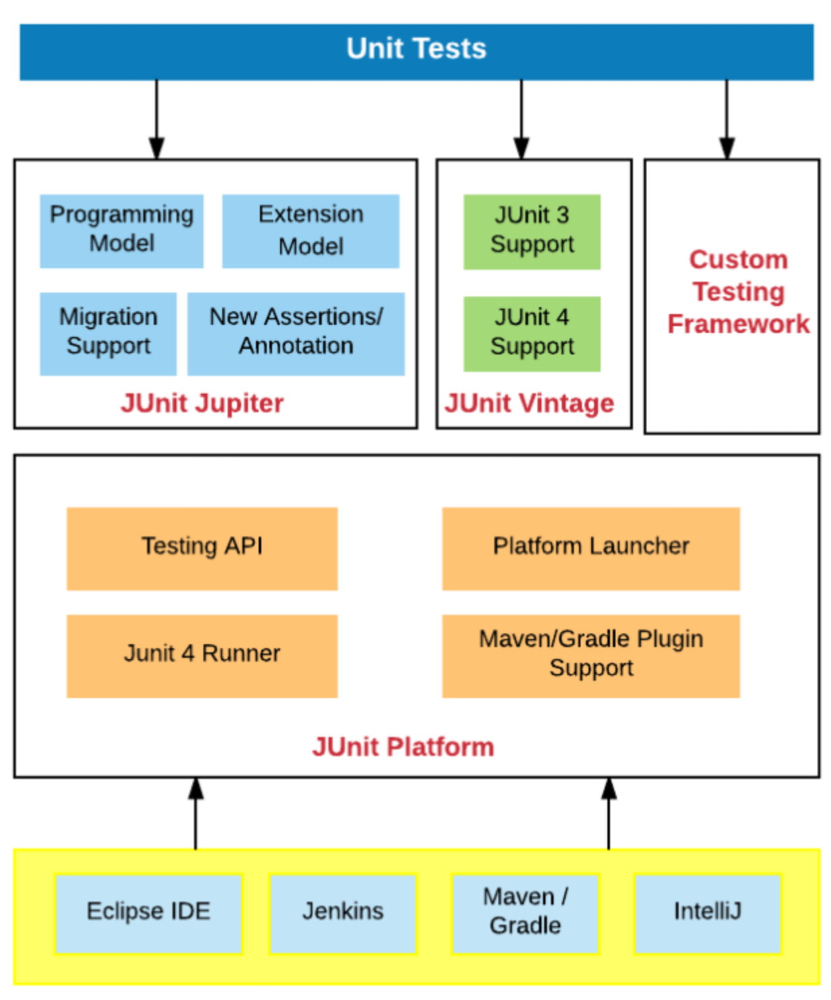
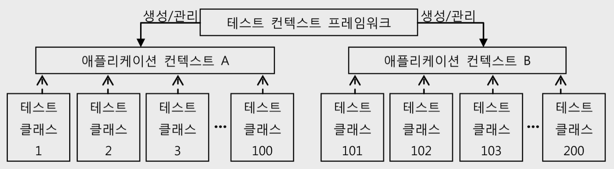

# 06. 테스트 컨텍스트 프레임워크

## 1. 테스트 컨텍스트 프레임워크

---

- 스프링은 테스트에 사용되는 애플리케이션 컨텍스트를 생성하고 관리하고 테스트에 적용해주는 기능을 가진 테스트 프레임워크를 제공한다
→ 이를 테스트 컨텍스트 프레임워크라고 한다
- 자바에서 가장 많이 사용되는 테스트 프레임워크로는 JUnit과 TestNG가 있다
- JUnit vs TestNG
    - TestNG와 Junit은 모두 단위 테스팅에 사용되는 테스팅 프레임워크
    - TestNG는 JUnit과 NUnit에서 영감을 받은 테스트 프레임워크 → 따라서 TestNG는 JUnit과 유사하다
    - JUnit과 TestNG는 모두 주석을 사용하며 거의 모든 주석이 비슷하다
    - JUnit4 VS TestNG
        
        [https://www.softwaretestinghelp.com/junit-vs-testng/](https://www.softwaretestinghelp.com/junit-vs-testng/)
        

### Junit

- 자바 프로그래밍 유닛 테스트 프레임워크
- 사실상 표준이라고 할만큼 널리 사용된다

**사용법**

```java
class Junit4Test {
    @Test
    void test() {
				:
    }
}
```

**JUnit4와 스프링 테스트**

- 테스트에 테스트 컨텍스트 프레임워크를 적용하려면 테스트 클래스에 두 가지 어노테이션을 부여해줘야 한다
    - `@RunWith`
        - 테스트 러너를 설정하는 방법이다
        - 설정하지 않으면, 기본 러너인 `BlockJUnit4ClassRunner`로 동작한다
        - JUnit 테스트를 실행하는 러너를 스프링이 제공하는 것으로 변경한다
    - `@ContextConfiguration` : 컨텍스트의 설정파일을 지정한다
- 컨텍스트 설정을 상속할 수 있다
    - 테스트 클래스를 구성할 때 상속구조를 사용할 수 있다
        - Junit3
            - 규칙 1. TestCase를 상속받는다
            - 규칙 2. 테스트 메소드의 이름은 test로 시작해야 한다
    - 서브클래스의 컨텍스트 파일정보는 슈퍼클래스에서 정의된 것까지 포함한다
    - 만약 슈퍼클래스의 컨넥스트 파일 설정을 무시하고 새롭게 정의하고 싶다면, @ContextConfiguration의 inheritLocations를 false로 바꿔주면 된다

```java
@RunWith(SpringJUnit4ClassRunner.class)
@ContextConfiguration("applicationContext.xml")
class SpringJunit4Test {
    @Test
    void test() {
				:
    }
}
```

**JUnit4 vs JUnit5**

- Supported Java Version
    - JUnit4 : Java 5 이상
    - JUnit5 : Java 8 이상
- Architecture
    - JUnit5는 이전 버전과는 다르게 세 개의 서브 프로젝트로 이루어져 있다
        
        
        
        - JUnit Platform
            - JVM에서 테스트 프레임워크를 실행하기 위한 기반 역할을 한다
            - 또한 플랫폼에서 실행되는 테스트 프레임워크를 개발하기 위한 TestEngine API도 정의한다
        - JUnit Jupiter
            - JUnit 5에서 테스트를 작성하기 위한 새로운 프로그래밍 모델과 확장 모델의 조합이다
            - Jupiter 하위 프로젝트는 Jupiter 기반 테스트를 실행하기 위한 TestEngine을 제공한다
            - 테스트 작성을 위한 api 모듈과 실행을 위한 api가 분리되어있다
                - junit-jupiter-api : 테스트 코드 작성을 위함
                - junit-jupiter-engine : 테스트 실행을 위함
        - JUnit Vintage
            - 플랫폼에서 JUnit 3 및 JUnit 4 기반 테스트를 실행하기 위한 TestEngine을 제공합니다
- Annotation의 변화
    - @Before → @BeforeEach
    - @After → @AfterEach
    - @BeforeClass → @BeforeAll
    - @AfterClass → @AfterAll
    - @FixMethodOrder → @TestMethodOrder
    - @Category → @Tag
- 새로운 Annotation
    - @TestFactory : 동적 테스트를 지원한다 [https://www.baeldung.com/junit5-dynamic-tests](https://www.baeldung.com/junit5-dynamic-tests)
    - @RepeatedTest :  일정 횟수동안 테스트 메소드의 반복 실행을 지원한다
    - @DisplayName : 표시 목적 이름. 테스트 메소드나 클래스에 지정할 수 있다
    - @TestInstance(LifeCycle) : 테스트 라이프사이클 구성을 지원한다
- No access modifier
    - JUnit4에서는 @Test 메소드가 public으로 선언되어야 한다
    - 하지만 JUnit5에서는 기본적으로 public으로 간주하므로, public 없이도 가능하다

**JUnit5와 스프링 테스트**

- JUnit5부터는 좀 더 강력한 확장 어노테이션인 @ExtendWith를 사용한다
- @RunWith와의 차이
    - 메타 어노테이션 지원
        - 스프링 부트에서는, @SpringBootTest가 @ExtendWith({SpringExtension.class})를 가지고 있다
        - 따라서 스프링 부트에서는 @ExtendWith를 작성해주지 않고 @SpringBootTest를 사용할 수 있다
    - 여러 Extension 중복 사용 가능
        - Extension Registration Order : @ExtendWith를 통해 선언적으로 등록된 Extension은 소스 코드에 선언된 순서대로 실행된다

```java
@SpringBootTest
class SpringBootJunit5Test {
    @Test
    void test() {
				:
    }
}
```

**스프링의 어플리케이션 컨텍스트 캐싱**

- JUnit은 테스트 메소드를 실행할 때마다 매번 테스트 클래스의 새로운 오브젝트를 만든다
- 따라서 모든 테스트는 서로 영향을 주지 않으며 독립적으로 실행됨을 보장한다
- 문제는 테스트가 독립적이라고 해서 매번 컨테이너를 새로 만드는 건 매우 비효율적이다
- 따라서 스프링은 테스트가 사용하는 컨텍스트를 캐싱해서 여러 테스트에서 하나의 컨텍스트를 공유할 수 있는 방법을 제공한다

**어플리케이션 컨텍스트의 공유**

- 테스트가 동일한 테스트용 컨텍스트 구성을 갖는다면 테스트가 수천개라고 하더라도 단 하나의 어플리케이션 컨텍스트만 만들어서 사용할 수 있다
    
    
    

### 테스트 컨텍스트 활용

**테스트 컨텍스트로부터 DI받기**

- 테스트 클래스는 테스트 컨텍스트로부터 어플리케이션 컨텍스트와 그에 담긴 빈을 제공받아 테스트 코드에서 사용한다
- 테스트 클래스에서도 다음 선언으로 테스트 클래스에 할당된 테스트용 어플리케이션 컨텍스트를 전달받을 수 있다
    
    ```java
    @Autowired ApplicationContext context;
    ```
    
- 테스트 클래스에서 사용할 수 있는 DI용 어노테이션은 @Autowired, @Resource외에도 @Qualifier, @Inject, @Named, @Provider, @Required 등이 있다
- JPA를 사용하는 경우라면 @PersistenceContext와 @PersistenceUnit도 테스트에서 사용이 가능하다

**공유 컨텍스트의 장/단점**

- 장점 : 캐싱 기법을 통해서 하나의 컨텍스트를 여러 테스트가 공유할 수 있다
- 단점 : 구성이나 내부 정보를 가능하면 어떤 변경도 못하도록 해야한다
- 테스트코드를 만들 때 주의할 점 : **테스트의 상호독립성**
    - 테스트는 그 실행 순서와 환경에 영향을 받지 말아야 한다
    - 앞의 테스트가 성공하면 자신도 성공하지만, 앞의 테스트가 실패했을 때 같이 실패한다면, 잘못만든 테스트
    - 테스트는 모두 고립되어서 동작해야 한다
    - 테스트 결과도 자신이 검증하는 코드가 바뀌지 않은 한 항상 일정해야 한다

**@DirtiesContext**

- 어쩔 수 없이 컨텍스트의 빈 오브젝트를 조작하고 수정하는 작업이 꼭 필요한 테스트가 있을 수 있다
- 이런 경우에는 테스트 메소드에 @DirtiesContext 어노테이션을 붙여주면 된다
- @DirtiesContext 어노테이션이 붙은 테스트가 수행되고 나면 스프링은 현 테스트 컨텍스트를 강제로 제거한다
- 테스트를 통해 더럽혀진 컨텍스트이므로 더 이상 공유하지 못하도록 만드는 것이다
- 이후에 설정파일이 같은 컨텍스트를 사용하는 테스트가 진행된다면, 이때는 새로운 컨텍스트가 만들어진다
- 클래스 계층 구조내에서 클래스 수준 주석과 메서드 수준 수적으로 모두 사용할 수 있다
    - 클래스 레벨
        - @DirtiesContext : 모든 메소드의 테스트가 끝난 후에 컨텍스트가 제거된다
        - @DirtiesContext(classMode = BEFORE_CLASS) : 클래스 테스트 시작 전에 컨텍스트를 재생성한다
        - @DirtiesContext(classMode = AFTER_EACH_TEST_METHOD|*BEFORE_EACH_TEST_METHOD*) : 모든 테스트 메소드에 @DirtiesContext를 적용한 것처럼 동작하고 싶을 때 설정한다
    - 메소드 레벨
        - @DirtiesContext : 테스트 케이스 시작 이후에 컨텍스트가 재생성된다
        - @DirtiesContext(classMode = BEFORE_METHOD) : 테스트 케이스를 시작하기 전에 컨텍스트를 재생성한다

## 2. 트랜잭션 지원 테스트

---

### 테스트의 트랜잭션 지원의 필요성

테스트에서 트랜잭션 지원이 필요한 대표적 이유 2가지

- DAO 단독테스트
- 롤백 테스트

**DAO 단독테스트**

- 직접 DAO만 테스트해야 할 때가 있다
- 문제는 스프링의 데이터 액세스 기술로 만든 DAO는 기본적으로 트랜잭션 동기화를 필요로 한다
- 따라서 트랜잭션을 시작해주는 AOP가 있는 서비스 계층을 통해 접근하지 않으면 DAO 실행이 안되는 문제가 발생한다
- JDBC의 경우 문제가 되지 않지만, JPA나 하이버네이트 등으로 만든 DAO는 트랜잭션이 시작되지 않은 채로 엔티티 매니저나 세션을 사용하면 예외가 발생한다
- 테스트에서 직접 DAO의 메소드를 호출하면 javax.persistence.TransactionRequiredException 예외가 발생한다

**롤백 테스트**

- 스프링 컨텍스트를 공유해서 테스트할 때 컨텍스트를 처음 상태로 계속 유지해야 하는 것처럼,
DB가 참여하는 테스트도 계속 초기 테스트 데이터가 유지되도록 만들어야 한다
- 따라서, 테스트에서 진행되는 모든 DB작업을 하나의 트랜잭션으로 묶어서 진행하고, 테스트를 마칠 때 트랜잭션을 모두 롤백시켜야 한다
- 어차피 롤백될 것이므로 테스트 내에서는 어떤 식으로든 DB를 조작해도 상관없다

### 트랜잭션 지원 테스트의 작성 방법

테스트에서 트랜잭션을 지원하는 방법 2가지

- 트랜잭션 매니저
- @Trasactional

**트랜잭션 매니저**

- 스프링의 모든 트랜잭션은 트랜잭션 매니저를 이용해 만들어지고 관리된다
- 따라서 트랜잭션 매니저를 이용할 수 있다면 트랜잭션도 제어할 수 있다
    
    ```java
    @Autowired JpaDao dao;
    
    @Test
    public void txTest() {
    		new TransactionTemplate(trasactionManager).execute(
    				new TransactionCallback<Object>() {
    						public Object doInTrasanction(TransactionStatus stauts) {
    								**status.setRollbackOnly();**
    								dao.deleteAll();
    								dao.add(...);
    								assertTat(dao.count(), is(1);
    								return null;
    						}
    				}
    		);
    }
    ```
    
- TransactionStatus 오브젝트의 setRollbackOnly() 메소드
- 이 메소드를 실행하면 해당 트랜잭션은 무조건 롤백된다
- 트랜잭션의 속성을 디폴트와 다르게 하려면 트랜잭션 템플릿을 만들 때 트랜잭션 매니저와 함께 TransactionDefinition 타입 오브젝트를 생성자에 전달해주면 된다

**@Trasactional**

- 테스트에 @Trasactional를 사용하면 기본적으로 trasactionManager라는 이름의 트랜잭션 매니저 빈이 등록되어 있다고 간주하고 이를 가져와서 트랜잭션 제어에 사용한다
- 트랜잭션 매니저의 이름이 trasactionManager와 다르다면, @TransactionConfiguration을 이용해서 트랜잭션 매니저 빈의 이름을 지정할 수 있다
- 강제 롤백 옵션
    - 서비스 계층의 코드에 적용된 @Trasactional와 다른 점이다
    - 테스트의 @Trasactional는 강제 롤백 옵션이 설정된 트랜잭션으로 만들어진다
    - @Trasactional를 부여하는 것만으로 TransactionStatus의 setRollbackOnly()가 호출된 것과 동일한 방식으로 동작한다
- 트랜잭션이 시작되기 전이나, 트랜잭션이 완전히 종료된 후에 해야 할 작업은 @BeforeTransaction, @AfterTransaction을 사용한다

**ORM 롤백 트랜잭션 테스트 주의사항**

- ORM의 캐시와 자동플러시 모드로 인해서 실제로 DB에 아무것도 전달되지 않은 채로 테스트가 끝날 수 있다
- 하이버네이트같은 ORM은 일단 엔티티를 하나 추가하면 메모리 캐시에 보관만 해두는데, 테스트가 끝나면 롤백을 하기 때문에 한번도 SQL이 만들어지지 않고 테스트가 종료된다
- 따라서 테스트 코드 내부에서 flush() 메소드를 호출해야 한다

**DBUnit**

- DB가 사용하는 테스트를 만들 때 유용하게 쓸 수 있는 지원 라이브러리
- XML이나 엑셀 파일에 준비해둔 테스트 데이터를 DBUnit 명령을 이용해 DB에 삽입해준다

## 스프링 3.1의 컨텍스트 테스트 프레임워크

---

### @Configuration

- 스프링 3.1부터는 XML 대신 @Configuration 클래스도 사용할 수 있다
- @ContextConfiguration의 classes 엘리먼트로 @Configuration 클래스를 바로 지정해서 사용할 수 있다
- 아무것도 지정하지 않는다면? @Configuration 클래스를 사용할 경우, @Configuration이 붙어있고 스태틱 멤버 클래스인 것을 디폴트 설정정보로 사용한다
- nested 스태틱 클래스로 정의하는 디폴트 설정 클래스들은 private이나 final로 선언되면 안된다

### @ActiveProfiles

- 스프링 3.1은 테스트용 활성 프로파일을 지정할 수 있도록 @ActiveProfiles을 제공한다
    
    ```java
    @RunWith(...)
    @ContextConfiguration(...)
    **@ActiveProfiles("dev")**
    public class WandaTest {
    		:
    }
    ```
    

# 정리

---

- 테스트 컨텍스트의 도움을 받으면 테스트가 어플리케이션 컨텍스트를 공유할 수 있다
(단, 테스트 상호독립성을 유의하자)
- DAO를 단독으로 테스트하거나 테스트 작업이 다른 테스트에 영향을 주지 않기 위해서는 롤백 테스트로 만들어야 한다
- @Transactional은 테스트에서는 롤백 테스트를 만들 때 사용한다
- ORM에 대한 테스트는 ORM의 캐시가 동작하는 특징을 잘 이해하고 사용해야 한다

### Reference

- [https://www.softwaretestinghelp.com/junit-vs-testng/](https://www.softwaretestinghelp.com/junit-vs-testng/)
- [https://jade314.tistory.com/entry/Junit-5](https://jade314.tistory.com/entry/Junit-5)