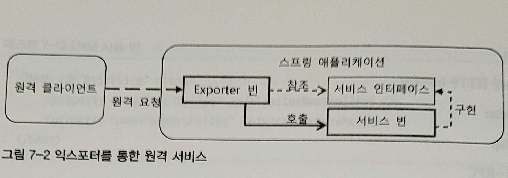

# Chapter 16. 스프링의 기타 기술과 효과적인 학습 방법

## 1. 스프링 기술과 API 를 효과적으로 학습하는 방법

- 스프링은 일관된 방식으로 개발된 프레임워크다. 모든 코드와 API 가 동일한 원리에 기반을 두고 만들어져 있다. 바로 DI 다.

### 1-1. 빈으로 등록되는 스프링 클래스와 DI

---

- 어떤 오브젝트가 빈으로 사용된다의 의미
    1. 다른 빈에 의해 DI 돼서 사용되는 서비스다.
    2. 다른 빈이나 정보에 의존하고 있다.

👉 가장 좋은 스프링 학습 방법: 스프링의 기능을 파악하고 사용하려면 이 2가지 관점으로 스프링이 제공하는 빈 클래스를 살펴보면 된다. 스프링이 DI 를 이용해 모든 기능을 제공하기 때문이다.

- ex> `DataSourceTransactionManager`
    - `JdbcTemplate`을 이용해 DAO 를 만들고 트랜잭션 AOP 를 적용하려면 `DataSourceTransactionManager`를 빈으로 등록해야 한다.
    
    ```java
    <bean id="transactionManager"
          class="org.springframework.jdbc.datasource.DataSourceTransactionManager">
      <property name="dataSource" ref="dataSource"/>
    </bean>
    ```
    
- 구현 인터페이스 분석
    - 구현 인터페이스가 무엇인지 파악하는 방법
        1. 스프링 API 문서에서 `DataSourceTransactionManager` 항목을 찾아본다.
        2. IDE 에서 클래스의 타입 계층구조를 보는 기능을 사용한다.
- 프로퍼티 분석
    - 빈의 클래스의 설정 방법과 확장 방법을 살펴봐야 한다.
    - 빈 클래스의 활용 방법, 확장 방법, 디폴트와 다른 동작을 가능하게 하는 방법에 관한 지식은 대부분 클래스의 프로퍼티를 살펴보면 알 수 있다.
- DI / 확장 포인트 분석
    - `DataSourceTransactionManager`가 `DataSource`라는 인터페이스를 통해 다른 빈을 참조한다는 건 DI 의 모든 기능을 활용할 수 있는 확장 포인트를 갖고 있다고 이해할 수 있다.
    - 스프링이 실제 DB 커넥션을 지원하는 `DataSource`와 `DataSource` 타입의 프로퍼티를 갖는 빈 사이에 데코레이터 패턴이나 프록시 패턴을 이용해 부가기능 또는 접근제어 기능을 제공해주는 빈을 만들려고 할 때 유용한 기반 클래스 `DelegatingDataSource`를 제공해준다.
    - 스프링이 제공하는 `DelegatingDataSource` 기반 다양한 데코레이터 또는 프록시
        - `LazyConnectionDataSourceProxy`
            - 트랜잭션 매니저와 실제 `DataSource` 사이에서 DB 커넥션 생성을 최대한 지연시켜주는 기능을 제공해준다.
            - 적용
                
                ```java
                <bean id="dataSource" class="...LazyConnectionDataSourceProxy">
                        <property name="targetDataSource" ref="realDataSource" />
                </bean>
                <bean id="realDataSource" class="..."> ... </bean>
                ```
                
        - `AbstractRoutingDataSource`
            - 추상 클래스이므로 상속을 통해 기능을 추가하고 사용해야 한다. 스프링은 `AbstractRoutingDataSource`의 서브클래스로 `IsolationLevelDataSourceRouter`를 제공하고 있다.
            - 다중 `DataSource`에 대한 라우팅을 제공하는 프록시다. 여러 개의 `DataSource`가 존재하지만 DAO 나 트랜잭션 매니저에는 하나의 `DataSource`만 존재하는 것처럼 사용하도록 만들어야 할 때 사용한다.
            - 읽기전용 라우팅 `DataSource` 빈 설정
                
                ```java
                public class ReadOnlyRoutingDataSource extends AbstractRoutingDataSource {
                    protected object determineCurrentLookupKey() {
                        boolean readOnly = TransactionSynchronizationManager.isCurrentTransactionReadOnly();
                        return readOnly ? "READAONLY" "READWRITE";
                    }
                }
                
                <bean id="dataSourceRouter" class="... ReadOnlyRoutingDataSource">
                    <property name="targetDataSources">
                        <map>
                            <entry key="READWRITE" value-ref="masterDataSource" />
                            <entry key="READONLY" value-ref="readOnlyDataSource"/>
                        </map>
                    </property>
                    <property name="defaultTargetDataSource" ref="masterDataSource"/>
                </bean>
                <bean id="masterDataSource" class="...">...</bean>
                <bean id="readOnlyDataSource" class="...">...</bean>
                ```
                

## 2. IoC 컨테이너 DI

- `DispatcherServlet`과 마찬가지로 스프링 IoC/DI 컨테이너, 즉 애플리케이션 컨텍스트도 그 자체로는 빈은 아니지만 DI 를 받는다.
    - 직접 `<property>`를 사용해 설정해줄 수는 없지만 애플리케이션 컨텍스트는 자신의 확장 포인트 인터페이스를 구현한 빈을 찾아서 스스로 DI 한다.
    - 엄밀히 말하면 DL 이라고 볼 수 있다.

### 2-1. `BeanPostProcessor`와 `BeanFactoryPostProcessor`

---

- 가장 많이 사용되는 IoC 컨테이너의 확장 포인트: 빈 후처리기, 빈 팩토리 후처리기
- 빈 후처리기는 `BeanPostProcessor` 인터페이스로 정의되어 있고 실제 빈 오브젝트를 생성하는 시점에서 사용된다.
- 빈 팩토리 후처리기는 `BeanFactoryPostProcessor` 인터페이스를 사용하고 빈 설정 메타데이터가 준비된 시점에서 사용된다.

- `BeanPostProcessor`
    
    ```java
    public interface BeanPostProcessor (
        Object postProcessBeforelnitialization(Object bean, String beanName) throws BeansException;
        Object postProcessAfterlnitialization(Object bean, String beanName) throws BeansException;
    }
    ```
    
    - `postProcessBeforelnitialization()` 메소드는 빈 오브젝트가 처음 만들어지고 아직 초기화 메소드가 호출되기 이전에 실행된다.
    - `@Autowired`나 `@Inject`같은 애노테이션을 이용해서 정의된 빈 의존관계를 적용하는 것도 `BeanPostProcessor`를 구현한 빈이 해주는 작업이다.
    - AOP 의 동작원리인 자동 프록시 생성기도 역시 `BeanPostProcessor`를 구현한 빈이다.
        - 자동 프록시 생성기는 새로운 프록시 오브젝트를 만든 뒤 원래 빈 오브젝트를 프록시 안으로 감춘다.
- `BeanFactoryPostProcessor`
    - `BeanFactoryPostProcessor`는 빈 오브젝트가 아니라 빈 팩토리에 대한 후처리를 가능하게 하는 확장 포인트 인터페이스다.
    
    ```java
    public interface BeanFactoryPostProcessor {
        void postProcessBeanFactory(ConfigurableListableBeanFactory beanFactory) throws BeansException;
    }
    ```
    
    - 컨테이너는 빈 팩토리 후처리기가 있으면 `postProcessBeanFactory()`에 빈의 모든 메타정보를 담고 있는 `ConfigurableListableBeanFactory`타입의 오브젝트를 전달해주는데 바로 컨테이너 자신을 보내주는 것이다.
    - 프로퍼티 값을 추가로 설정하는 수준이 아니라, 아예 새로운 빈을 등록할 수도 있다.
    - `ConfigurableListableBeanFactory`가 `@Configuration`과 `@Bean`이 붙은 클래스 정보를 이용해서 새로운 빈을 추가해주는 기능을 담당한다.


## 3. SpEL

- 스프링이 직접 제공하는 표현언어인 스프링 EL 을 SpEL 이라고 한다.
- SpEL 은 다양한 용도로 활용한다.
    - 빈 설정파일이나 애노테이션을 이용해 프로퍼티 값을 지정할때 사용한다.
    - JSP의 `<spring:eval>` 태그를 통해 사용한다.

```java
// 사용자의 조건에 따라서 사용 가능 여부 판별
@SecuredLogic ("user.level == T(com ... UserLevel).GOLD")
public void goldUserOnly() { ... }
// 포인트와 재시도 횟수 기준으로 조건
@SecuredLogic("user.point > 100 && user.retryCount < 5")
public void transferPoint() { ... }
```

### 3-1. SpEL 사용 방법

---

- SpEL을 코드에서 사용하려면 두가지 인터페이스를 활용해야 한다.
    - `ExpressionParser`
        - 표현식을 파싱하는 기능이 정의되어 있는 인터페이스
        - `SpelExpressionParser()`을 주로 사용한다.
        
        ```java
        ExpressionParser parser = new SpelExpressionParser();
        ```
        
        - 빈으로 등록해두고 DI 받는 방법이 낫다.
            - `SpelExpressionParser`는 싱글톤으로 등록하고 공유해서 사용해도 안전한 클래스다.
    - `Expression`
        - 파서에 의해 해석된 표현식 정보를 가진 오브젝트의 타입
        - `ExpressionParser`로부터 파싱을 통해 `Expression`을 만들어두고, `Expression` 오브젝트에서 값을 가져올 수 있다.
        - 고정적 파싱
            
            ```java
            Expression ex = parser.parseExpression("1+2");
            int result = (Integer) ex.getValue();
            ```
            
            - 왜 파서로부터 바로 파싱해서 결과값을 받지 않고, `Expression` 타입으로 만든 후 값을 가져오는 것일까? → `Expression` 오브젝트를 재사용할 수 있기 때문
        - 오브젝트를 직접 전달하는 대신 `EvaluationContext`에 담아 사용하는 방법도 있다.
            
            ```java
            @Test
            public void context() {
              ExpressionParser parser = new SpelExpressionParser();
              Expression exp = parser.parseExpression("name.length() < 10");
            
              EvaluationContext **context** = new StandardEvaluationContext(new Foo("foo"));
              Boolean result = exp.getValue(**context**, Boolean.class);
              assertThat(result).isTrue();
            }
            ```
            
            - 루트 오브젝트 뿐 아니라, 이름을 가진 변수, 메소드, 컨버터 등을 함께 제공할 수 있다.


## 4. OXM

- 스프링 OXM은 서비스 추상화가 적용된 기술이다.
    - 트랜잭션이나 OXM 같은 서비스 추상화는 먼저 스프링이 제공하는 인터페이스의 사용 방법을 익히고, 각 기술별로 제공되는 어댑터 빈의 설정 방법을 살펴봐야 한다.
- 서비스 추상화를 통해 OXM 구현 기술이 바뀌더라도 이를 사용하는 코드에는 영향을 주지 않으므로, 익숙한 구현 기술 하나를 선택해서 집중적으로 분석하고 실제 코드에 적용해보면서 사용 방법을 익히는 것이 중요하다.
- 스프링에서 OXM(Object XML Mapping) 추상화를 적용하는 두가지 방법
    - 코드에서 직접 마샬러 빈을 가져와 `Marshaller`인터페이스를 이용해서 XML과 오브젝트 사이의 변경작업을 수행하는 방법
    - 웹 환경에서 XML 뷰나 XML 메시지 컨버터를 만들때 활용하는 방법

### 4-1. Marshaller/Unmarshaller 인터페이스

---

- `Marshaller`: 오브젝트를 XML 로 변환하는 기능을 추상화한 인터페이스
    
    ```java
    public interface Marshaller {
        boolean supports(Class<?> clazz);
        void marshal(Obiect graph, Result result) throws IOException, XmlMappingException;
    }
    ```
    
- `Unmarshaller`: XML 소스로부터 오브젝트를 변환해주는 기능을 정의한 인터페이스
    
    ```java
    public interface Unmarshaller {
        boolean supports(Class<?> clazz);
        Object unmarshal(Source source) throws IOException, XmlMappingException;
    }
    ```
    

### 4-2. OXM 기술 어댑터 클래스

---

- `Marshaller`와 `Unmarshaller` 추상 인터페이스를 구현해서 각 OXM 기술과 연결해주는 어댑터 클래스
    - 각 기술 이름 뒤에 `Marshaller`를 붙이면 지원 클래스다.
    - `Castor`
    - `JAXB`
    - `XMLBeans`
    - `JiBX`
    - `XStream`
- 하나의 어댑터 클래스가 `Marshaller`와 `Unmarshaller`를 모두 구현하고 있다. 비록 같은 오브젝트이지만 각각 접근하는 인터페이스가 다르고 용도가 다르므로 별개의 프로퍼티로 주입받는 것이 좋다.
    
    ```java
    <bean id="castorMarshaller" class="org.springframework.oxm.castor.CastorMarshaller" />
    
    <bean id="myService" class="...">
        <property name="marshaller" ref="castorMarshaller" />
        <property name="unmarshaller" ref="castorMarshaller" />
    </bean>
    
    <oxm:jaxb2-marshaller id="marshaller" contextPath="com.epril.myproject.xml.user.schema" />
    ```
    

## 5. 리모팅과 웹 서비스, EJB

- 자바 엔터프라이즈에는 다양한 종류의 리모팅 기술이 존재한다. 당연히 스프링에서도 이러한 리모팅 기술을 지원한다.
- 스프링이 지원하는 리모팅 기술
    - `RMI`
    - 스프링 HTTP Invoker
    - `Hessian`
    - `Burlap`
    - `JAX- RPC`
    - `JAX-WS`
    - `JMS`
    - `RESTful`
- 리모팅은 원격 시스템과 스프링 애플리케이션이 연동해서 동작하게 해주는 기술이다.
    - 스프링 애플리케이션이 클라이언트 시스템에게 원격 서비스를 제공하는 것과 다른 원격 시스템의 서비스를 이용하는 것, 2가지로 구분할 수 있다.

### 5-1. 익스포터와 프록시

---

- 스프링 리모팅의 기본 구성은 템플릿 방식의 클라이언트만 제공하는 `RESTful`을 제외하면 거의 동일하다.
- 스프링은 서비스를 제공할 때나 사용할 때나 모두 인터페이스를 이용해야 한다.
    - 원격 서비스를 사용할 때도, 원격 서비스의 내용이 담긴 인터페이스를 통해 접근해야 한다.

- 익스포터
    - 서비스를 제공할 때 원격 요청을 받아서 특정 인터페이스를 구현한 서비스 빈에게 요청을 전달해주는 빈을 이용하는데, 이를 익스포터라고 한다.
        
        
        
    - 보통 익스포터는 원격 요청을 처리하는 서블릿 등을 통해 HTTP요청을 전달받고 이를 해석한 후에 미리 설정을 통해서 등록된 인터페이스를 이용해 서비스 빈을 호출한다.
    - 익스포터 빈
        
        ```java
        <bean name="/remoting/userservice" class="org.springframework.remoting.httpinvoker.HttpInvokerServiceExporter">
            <property name="service" ref="userService"/>
            <property name="serviceInterface" value="com.epril.myproject.service.UserService"/>
        </bean>
        ```
        
- 프록시
    - 원격 시스템에 있는 오브젝트를 대신해서 클라이언트 오브젝트의 호출을 받고, 이를 원격 오브젝트에 전송해서 결과를 가져와 클라이언트 오브젝트에게 돌려주는 역할을 맡은 빈 오브젝트를 프록시라고 부른다.
        - 전형적인 원격 프록시 패턴이 적용된 예라고 볼 수 있다.
    - 프록시는 원격 서비스 내용이 정의된 인터페이스를 구현하고 있어야 한다. 그래서 이를 사용하는 빈 입장에서는 원격 호출이 일어나는지를 신경 쓰지 않고, 같은 컨테이너 안의 빈 오브젝트를 사용하듯 쓰는 것이다. 모든 리모팅 호출의 공통적인 동작원리다.
        
        
        
    - JAX-WS 프록시 빈
        
        ```java
        <bean id="memberWebService" class="org.springframework.remoting.jaxws.JaxWsPortProxyFactoryBean">
            <property name="serviceInterface" value="com.epril.myproject.service.MemberService"/>
            <property name="wsdlDocumentUrl" value="http://ws.remotecompany.com/MemberServiceEndPointWSDL" />
            <property name="namespaceUri" value="http://remote/" />
            <property name="serviceName" value="MemberService"/>
            <property name="portName" value="MemberServiceServiceEndpointPort"/>
        </bean>
        <bean id="myBean" class="...">
            <property name="memberService" ref="memberWebService" />
        </bean>
        ```
        

👉 모든 스프링의 리모팅 지원 기능은 익스포터와 프록시 방식을 사용한다.

### 5-2. RESTful 서비스 템플릿

---

- `RESTful` 클라이언트 기능은 여타 리모팅 기술과 사용 방법이 다르다. `RESTful` 서비스는 스프링 MVC 를 통해 구현하므로, 리모팅에서는 원격 `RESTful` 서비스 사이트를 이용해 결과를 가져오는 클라이언트 기능만 제공한다.
- `RESTful` 서비스를 이용할 때는 서비스 인터페이스 타입의 프록시 대신 템플릿/콜백 방식의 템플릿을 이용한다.
- RESTful 클라이언트는 HTTP 메소드 `GET`, `POST`, `PUT`, `DELETE`, `HEAD`, `OPTIONS`를 모두 지원한다. 결과는 문자열로 그대로 받을 수도 있고， 메시지 컨버터를 이용해 오브젝트로 변환할수도있다.

- 과정
    - `RestTemplate` 오브젝트를 생성한다. 인스턴스 변수로 생성해두거나 빈으로 등록한 후에 DI 받아서 사용해도 상관없다.
        
        ```java
        RestTemplate template = new RestTemplate();
        // 결과를 문자열로 받는다.
        String result = template.getForObject("https://www.notion.so/{userId}", String.class, "jennyuni");
        ```
        
    - 오브젝트로 변환해서 받을 경우, 사용할 메시지 컨버터를 `RestTemplate`의 `messageConverts` 프로퍼티에 등록하고 사용하면 된다.
    - `MappingJacksonHttpMessageConverter`를 템플릿의 메시지 컨버터로 등록해서 결과를 오브젝트로 리턴하게 할 수도 있다.
- `RESTful` 스타일의 서비스는 직렬화를 이용하는 프로토콜이나 복잡한 요청 메시지를 작성하지 않고도 손쉽게 URL 과 파라미터를 이용해 서비스에 접근할 수 있기 때문에 그만큼 사용 방법도 간단한다.

### 5-3. EJB 서비스 이용

---

- EJB 2나 EJB 3로 만들어진 컴포넌트가 있고, EJB 컨테이너에서 서비스되고 있다면 이를 스프링에서 사용할 수 있다.
- 스프링은 EJB도 리모팅의 프록시와 비슷한 방식으로 접근하도록 해준다.
    - 로컬 세션빈과 리모트 세션빈 모두 동일한 방법으로 사용 가능하다.


## 6. 태스크 실행과 스케줄링

### 6-1. TaskExecutor 서비스 추상화

---

- `java.lang.Runnable`은 `run()`이라는 단순한 메소드를 가진 인터페이스로서 독립적인 스레드에 의해 실행되도록 의도된 오브젝트를 만들 때 주로 사용된다.
    - 태스크: 독립적인 스레드 안에서 동작하도록 만들어진 오브젝트를 독립적으로 실행 가능한 작업
    - 태스크 실행기: 태스크를 다양한 방법으로 실행하도록 만들어진 오브젝트 특징을 추상화한 스프링의 인터페이스
        - `Runnable` 타입의 태스크를 받아 실행하는 `execute()`메소드를 갖고 있다.
            - 자바 5의 `Executor`는 `TaskExecutor`과 동일한 목적으로 만들어진 인터페이스다.
            - 스프링이 다시 똑같은 메소드를 가진 `TaskExecutor`를 정의한 이유
                - JDK 의 `Executor`를 구현하지 않은 태스크 실행기에 대한 어댑터를 제공하는 좀 더 폭넓은 서비스 추상화를 위해서다.
                - 스프링에 최적화된 방식으로 태스크 실행기를 확장하고 활용하는 독자적인 태스크 실행 기능을 제공하기 위해서다.
            - 대부분의 `TaskExecutor`가 추상화한 기술은 비동기적으로 독립적인 스레드에서 실행되며, 주로 스레드 풀을 사용하는 방식을 사용한다.
        
        ```java
        public interface TaskExecutor extends Executor {
            void execute(Runnable task);
        }
        ```
        
        - 스프링이 제공하는 주요한 `TaskExecutor` 구현 기술과 클래스
            - `ThreadPoolExecutor`
                - 스프링의 `ThreadPoolExecutor`는 이름이 같은 JDK 의 `ThreadPoolExecutor`에 대한 어댑터 클래스다.
                - `corePoolSize`, `maxPoolSize`, `queueCapacity`같은 속성을 프로퍼티를 이용해 설정할 수 있다.
            - `SimpleThreadPoolTaskExecutor`
                - Quartz 의 `SimpleThreadPool`을 이용해 만들어진 태스크 실행기다. `TaskExecutor` 추상화 인터페이스를 통해 Quartz 스케줄러와 독립적으로 사용되면서 동시에 Quartz 작업에도 활용될 수 있다는 장점이 있다.
            - `WorkManagerTaskExecutor`
                - CommonJ 작업관리자(`WorkManager`)의 태스크 실행기에 대한 어댑터다. CommonJ는 웹로직, 웹스피어 등 여러 WAS 의 JavaEE 환경을 위한 비동기 작업관리자다.
- 스프링 애플리케이션이 동작하는 자바 엔터프라이즈 환경은 제한된 크기의 스레드풀을 사용한다고 하더라도 비동기 작업을 함부로 적용하는 건 위험하다.

### 6-2. TaskScheduler

---

- 자바 엔터프라이즈 환경에서 사용되는 태스크는 일정한 간격 또는 시간 기준에 따라 실행되는 스케줄링 방식으로 동작하는 경우가 대부분이다.
- 스프링은 `TaskExecutor`와 마찬가지로 서비스 추상화 기법을 이용해서 스케줄링 기술에 독립적인 사용이 가능한 추상화 서비스 인터페이스인 `TaskScheduler`를 제공한다.
- `TaskScheduler` 인터페이스는 주어진 태스크를 조건에 따라 실행하거나 반복하는 작업을 수행한다.
    - 태스크의 실행조건은 단순히 특정 시간에 시작되도록 만들 수도 있고, 일정한 간격을 두고 반복되게 할 수도 있다.
    - `Trigger` 인터페이스를 구현해서 좀 더 유연한 실행조건을 만들 수도 있다.
        
        ```java
        @Autowired TaskScheduler scheduler;
        @Resource Runnable specialTask;
        
        // 월~금 4시 30분에 동작하도록 설정
        public void startSpecialTaskScheduler() {
            scheduler.schedule(task, new CronTrigger("0 30 4 * * MON-FRI"));
        }
        ```
        

- `TaskScheduler` 의 주요 구현 클래스와 사용 기술
    - `ThreadPoolTaskScheduler`
        - JDK 의 `ScheduledThreadPoolExecutor` 스케줄러에 대한 어댑터다.
        - 스레드 풀 방식의 태스크 실행기 기능도 함께 갖고 있다.
    - `TimerManagerTaskScheduler`
        - CommonJ 의 `TimerManager`를 `TaskScheduler`로 추상화한 클래스

### 6-3. task 네임스페이스

---

스프링은 task 스키마에 정의된 전용 태그를 통해 태스크 실행기와 스케줄러를 간편하게 등록할 수 있는 방법을 제공한다.

- `<task:executor>`
    - `<task:executor>`는 `ThreadPoolTaskExecutor` 타입의 `TaskExecutor` 빈을 등록해준다.
    - 스레드 풀 크기는 범위로 지정할 수도 있다.
    
    ```java
    <task:executor id="myExecutor" pool-size="5-10" queue-size="30" />
    ```
    
- `<task:scheduler>`
    - `TaskScheduler` 타입의 `ThreadPoolTaskScheduler` 빈을 등록해준다.
    - `pool-size`를 생략하면 기본 값 1이 적용된다.
    
    ```java
    <task:scheduler id="myScheduler" />
    ```
    
- `<task:scheduled-tasks>`와 `<task:scheduled>`
    - 스케줄러를 적용하려면 태스크마다 `Runnable`을 구현한 클래스를 만들어 빈으로 등록해야하고, 스케줄을 등록해주는 코드를 작성하고, 자동으로 스케줄 등록 기능이 실행되도록 만들어야 하는 등의 번거로움이 있다. 스프링에서는 `<task:sheduled-task>` 태그를 이용해 일반 빈의 메소드를 태스크로 활용하는 스케줄을 등록할 수 있다.
    - 스케줄은 `<task:scheduled>` 태그를 이용해 등록한다.
    - 일반 빈을 태스크로 사용하는 스케줄 설정
        
        ```java
        <task:scheduled-tasks scheduler="myScheduler">
            <task:scheduled ref="systemAdminService" method="checkSystem" fixed-rate="5000"/>
            <task:scheduled ref="resourceService" method="clearAll" cron="0 30 6 * * *"/>
        </task:scheduled-tasks>
        ```
        

### 6-4. 애노테이션을 이용한 스케줄링과 비동기 태스크 실행

---

- `@Scheduled`
    - `@Scheduled`는 XML 설정 대신 태스크 역할을 맡을 메소드에 직접 스케줄 정보를 애노테이션을 통해 부여해서 스케줄이 적용되게 해준다.
    - `@Scheduled`는 세 가지 종류의 트리거 설정을 지원한다.
        1. `fixedDelay`
            - 이전 작업이 끝난 시점부터 일정 시간이 지난 후에 동작하도록 설정한다.
            - 시간 단위는 밀리초.
            
            ```java
            @Scheduled(fixedDelay = 3600000) // 1000 * 60 * 60, 1시간마다 실행한다.
            ```
            
        2. `fixedRate`
            - 밀리초로 설정된 일정한 시간 간격으로 메소드가 실행되게 해준다.
            - `fixedDelay`와 다르게 이전 메소드가 호출된 시점으로부터의 시간이다.
                
                
                
            
            ```java
            @Scheduled(fixedRate=5000) // 5초마다 계속 수행된다.
            ```
            
        3. `cron`
            - `cron` 포맷을 사용해 스케줄을 지정할 수 있다. 가장 유연하게 스케줄을 지정할 수 있는 방법이다.
            
            ```java
            @Scheduled(cron = "0 30 23 * * *")
            ```
            
    
    👉 `@Scheduled`가 부여되는 메소드는 파라미터를 가질 수 없으며 반드시 void형의 리턴타입이어야 한다.
    
- `@Async`
    - `@Async`가 부여된 메소드는 자동으로 비동기 방식으로 실행된다.
    - `TaskExecutor`를 코드로 사용하지 않고도 비동기 실행이 가능하게 해준다. 비동기로 동작하기 때문에 메소드 내의 작업이 오랜 시간이 걸리더라도 메소드를 호출하면 바로 리턴된다. 메소드는 별도의 스레드에서 동작하게 된다.
    
    👉 리턴 타입은 `void` 또는 `Future` 타입이어야 한다. 메소드는 다른 코드에 의해 직접 호출되므로 파라미터는 가질 수 있다.
    

## 7. 캐시 추상화(스프링 3.1)

- 스프링 3.1은 빈의 메소드에 캐시 서비스를 적용할 수 있는 기능을 제공한다. 캐시 서비스는 트랜잭션과 마찬가지로 AOP를 이용해 메소드 실행 과정에 투명하게 적용된다. 또한 캐시 서비스 구현 기술에 종속되지 않도록 추상화 서비스를 제공하기 때문에 환경이 바뀌거나 적용할 기술을 변경해서 캐시 서비스의 종류가 달라지더라도 애플리케이션 코드에 영향을 주지 않는다.
    - 캐시는 기본적으로 성능의 향상을 위해 사용한다. 캐시는 임시 저장소라는 뜻이다.
        - 복잡한 계산이나 DB 작업, 원격 요청의 처리 결과 등을 임시 저장소인 캐시에 저장해뒀다가 동일한 요청이 들어오면 복잡한 작업을 수행해서 결과를 만드는 대신 캐시에 보관해뒀던 기존 결과를 바로 돌려주는 방식이다.
    - 캐시는 반복적으로 동일한 결과가 돌아오는 작업에만 이용할 수 있다.
    - 캐시를 사용할 때는 캐시에 저장해둔 내용이 바뀌는 상황을 잘 파악해야 한다.(데이터 불일치 문제)

### 7-1. 애노테이션을 이용한 캐시 속성 부여

---

- 스프링의 캐시 서비스 추상화는 AOP 를 이용한다. 캐시 기능을 담은 어드바이스는 스프링이 제공한다.
- `@Cacheable`
    - 캐시 서비스는 보통 메소드 단위로 지정한다.
        - 캐시에 저장할 내용과 캐시 속성 정보로 메소드의 리턴 값과 메소드 파라미터를 사용하기 때문이다.
    - `@Cacheable` 애노테이션을 붙여준다. 디폴트 엘리먼트는 캐시 이름이다.
        - 캐시에 저장되는 정보를 구분하기 위해 캐시 이름을 사용한다.
        
        ```java
        @Cacheable("product")
        public Product bestProduct(String productNo) {..}
        ```
        
        - 캐시 이름은 product
            - product 라는 이름의 캐시에 Product 타입의 오브젝트를 저장하는 것이다.
    - 하나의 캐시에는 키가 다른 여러 개의 오브젝트를 넣을 수 있다.
        - 위에서는 파라미터인 productNo 가 product 캐시의 키가 된다.
            - 캐시에 오브젝트가 저장될 때는 키 정보도 함께 저장된다.
            - 1.`bestProduct("A-001")`, 2.`bestProduct("A-001")` 같이 호출된다고 하면,
                - 1이 호출되면 AOP 에 의해 캐시 기능을 담당하는 어드바이스가 먼저 실행된다. 오브젝트를 찾지 못했기 때문에 캐시 어드바이스는 bestProduct() 메소드를 실행한다. 그리고 메소드 결과가 리턴되면 리턴 값으로 돌아온 Product 오브젝트를 `A-001` 키 값으로 캐시에 저장한다.
                - 2가 실행될 때는 메소드가 실행되지 않고 캐시에서 바로 리턴한다.
            - AOP 는 메소드의 실행 전과 후에 부가적인 작업을 추가하기도 하지만, 아예 메소드의 실행 여부를 결정할 수도 있다.
                - 캐시 값이 존재한다면 메소드 실행을 아예 생략해버린다.
        - 메소드의 파라미터가 없는 경우는
            - 캐시 서비스의 기본 키 생성 구현 방식에 의해 0이라는 키를 저장한다.
            - 조건 없이 항상 동일한 결과를 리턴하는 메소드라면 파라미터 없는 메소드로 만들면 된다.
        - 메소드 파라미터 값이 여러개인 경우는
            - 모든 파라미터의 `hashCode()`값을 조합해서 키로 만든다.
            - 해시코드 값의 조합이 키로서 의미있는 경우라면 디폴트 키 생성 방식을 그대로 사용하면 되지만, 그렇지 않다면 `@Cacheable` 애노테이션을 이용해 키 값으로 어떤 것을 사용할지 지정해줄 필요가 있다.
            
            ```java
            **@Cacheable(value="product", key="#productNo")**
            Product bestProduct(**String productNo**, User user, Date datetime) {...}
            ```
            
            - key 엘리먼트는 SpEL을 이용해 키 값을 지정한다.
            - 파라미터의 특정 프로퍼티 값을 사용해야 한다면,
                
                ```java
                **@Cacheable(value="product", key="#condition.productNo")**
                Product bestProduct(**SearchCondition condition**) {...}
                ```
                
        - 파라미터 값이 특정 조건을 만족시키는 경우에만 캐시를 적용하고, 그 외의 경우에는 캐시 서비스를 적용하지 않아야 한다면 `condition` 엘리먼트를 이용하면 된다.
            
            ```java
            @Cacheable(value="user", condition="#user.type=='ADMIN'")
            Product bestProduct(User user) {...}
            ```
            
- `@CacheEvict`와 `@CachePut`
    - 캐시는 캐시의 제거에도 캐시 서비스 AOP 기능이 적용된 메소드를 이용한다.
    - `@CacheEvict`: 캐시 이름을 넣어주면 메소드가 실행될 때 해당 캐시의 내용이 제거된다.
        
        ```java
        **@CacheEvict(value="bestProduct")**
        public void refreshBestProducts() {...}
        ```
        
        - `@CacheEvict`는 기본적으로 메소드의 키 값에 해당하는 캐시만 제거한다.
            
            ```java
            **@CacheEvict(value="product", key="#product.productNo")**
            public void updateProducts(Product product) {...}
            ```
            
        - 캐시에 저장된 값을 모두 제거할 필요가 있다면 `allEntries` 엘리먼트를 `true`로 지정해주면 된다.
            
            ```java
            @CacheEvict(value="product", **allEntries=true**)
            ```
            
    - `@CachePut`: 드물지만 메소드를 캐시에 값을 저장하는 용도로만 사용
        - 메소드 실행 결과를 캐시에 저장하지만, 저장된 캐시의 내용을 사용하지는 않고 항상 메소드를 실행한다.
        - 한 번에 캐시에 많은 정보를 저장해두는 작업이나, 다른 사용자가 참고할 정보를 생성하는 용도로만 사용되는 메소드에 이용할 수 있다.
- 애노테이션을 이용한 캐시 기능 설정
    - XML 설정
        - `<cache:annotation-driven />`
    - `@Configuration` 클래스를 사용
        - `@EnableCaching` 애노테이션을 추가해주기만 하면 된다.
            
            ```java
            @Configuration
            **@EnableCaching**
            public Class AppConfig {
            ```
            
    - 캐시 서비스는 AOP 를 이용하므로 `mode`, `proxyTargetClass` 엘리먼트를 사용해 프록시 모드와 클래스 프록시 적용 여부를 지정할 수 있다.

### 7-2. 캐시 매니저

---

- 스프링의 캐시 서비스는 AOP 를 이용해 애플리케이션 코드를 수정하지 않고도 캐시 부가기능을 메소드에 적용할 수 있게 해준다. 동시에 캐시 기술의 종류와 상관없이 추상화된 스프링 캐시 API 를 이용할 수 있게 해주는 서비스 추상화를 제공한다.
- 캐시 추상화에서는 적용할 캐시 기술을 지원하는 캐시 매니저를 빈으로 등록해줘야 한다.
- 캐시 추상화 API 인 캐시 매니저는 `org.springframework.cache` 패키지의 `CacheManager` 인터페이스를 구현해서 만든다. 스프링 3.1은 기본적으로 5가지 `CacheManager` 구현 클래스를 제공한다.
    - `ConcurrentMapCacheManager`
        - `ConcurrentMapCache` 클래스를 캐시로 사용하는 캐시 매니저
            - 자바의 `ConcurrentMap`을 이용해 캐시 기능을 구현한 간단한 캐시.
        - 캐시 정보를 Map 타입으로 메모리에 저장해두기 때문에 속도가 매우 빠르고 별다른 설정이 필요 없지만, 본격적인 캐시로 사용하기에는 기능이 빈약하다.
    - `SimpleCacheManager`
        - 기본적으로 제공하는 캐시가 없다.
        - 프로퍼티를 이용해서 사용할 캐시를 직접 등록해줘야 한다.
    - `EhCacheCacheManager`
        - 자바에서 가장 인기있는 캐시 프레임워크, `EhCache`를 지원한다.
        - `EhCacheCacheManager`를 빈으로 등록하면 된다.
            - `EhCache`의 캐시 매니저를 프로퍼티로 등록해줘야 한다. `net.sf.ehcache.CacheManager`를 등록해줘야 한다. 스프링의 캐시 매니저와 이름이 같아서 혼동에 주의해야 한다.
                - `EhCache` 내부에서 캐시를 관리하는 데 사용되는 특정 캐시 기술의 API 다.
            - 지정할 때 스프링이 제공하는 `EhCacheManagerFactoryBean`을 이용하는 것이 편리하다.
        - 자바 코드를 이용한 `EhCache` 캐시 매니저 설정
            
            ```java
            @Configuration
            @EnableCaching
            public class CacheConfig implements CommandLineRunner {
                private static final Logger log = LoggerFactory.getLogger(CacheConfig.class);
                @Autowired
                private CacheManager cacheManager;
            
                @Bean
                public CacheManager cacheManager() {
                    return new EhCacheCacheManager(ehCacheCacheManager().getObject());
                }
            
                @Bean
                public EhCacheManagerFactoryBean ehCacheCacheManager() {
                    EhCacheManagerFactoryBean cmfb = new EhCacheManagerFactoryBean();
                    cmfb.setConfigLocation(new ClassPathResource("ehcache.xml"));
                    cmfb.setShared(true);
                    return cmfb;
                }
            
                @Override
                public void run(String... args) throws Exception {
                    log.info("=========================================================\n"
                            + "Using cache manager: " + this.cacheManager.getClass().getName() + "\n"
                            + "=========================================================\n\n");
                }
            }
            ```
            
    - `CompositeCacheManager`, `NoOpCacheManager`
        - `CompositeCacheManager`는 하나 이상의 캐시 매니저를 사용하도록 지원해주는 혼합 캐시 매니저
        - `CompositeCacheManager`의 `cacheManagers` 프로퍼티에 적용할 캐시 매니저 빈을 모두 등록해주면 된다.
        - `addNoOpCache` 프로퍼티를 `true`로 해주면 아무런 기능을 갖지 않은 `NoOpCache`를 추가해주기도 한다.
            - 캐시가 지원되지 않는 환경에서 동작할 때 캐시 관련 설정을 제거하지 않아도 에러가 나지 않게 해주는 기능


## 8. `@Enable` 애노테이션을 이용한 빈 설정정보 모듈화

- 모듈화의 가장 큰 이유는 효과적인 재사용이다.
    - 빈 설정정보를 모듈화하는 이유는 반복적으로 사용되는 복잡한 빈 설정을 독립시켜서 편리하게 재사용할 필요가 있기 때문이다.
- 모듈화를 할 때 중요한 것은 모듈이 시스템의 다른 부분과 적절히 분리되어 있는 것이다.
    - 모듈을 추가하고 나서 모듈 외부의 변화가 생겼다고 모듈 내부 코드를 수정해야 한다거나, 반대로 모듈 내부 구현이 수정됐다고 모듈을 사용하는 외부 코드도 같이 수정해야 한다면 모듈화가 잘 된 것이 아니다.
- 모듈은 자기 책임을 명확히 갖고 있고, 간결한 인터페이스를 통해서만 연결돼야 한다.

- 스프링의 XML 전용 태그는 이런 모듈화 조건을 잘 충족한다.
    - 하지만 XML 전용 태그를 만드는 데는 손쉽게 접근하기도 힘들고 상당한 시간을 들여야 한다.
- 자바 코드를 이용한 빈 설정 방식은 재사용 가능한 설정정보 모듈로 만들기가 훨씬 쉽다.
    - 스프링 3.1은 자바 코드 설정을 모듈화하는 데 필요한 다양한 기법을 제공하고, 스프링 스스로도 `@Enable`로 시작하는 다양한 설정용 애노테이션을 만들어서 제공하고 있다.
    - `@Enable` 설정 애노테이션과 자바 코드를 이용한 설정 방법을 이용하면 XML 전용 태그보다 훨씬 간단한 방법으로 설정정보 재사용 모듈을 만들어낼 수가 있다.

### 8-1. `@Import`, `@Configuration` 상속

---

- `@Import`를 이용한 단순 재사용
    - `@Configuration` 클래스로 만든 설정정보를 추가할 때는 `@Import`를 이용하면 된다.
    - 재사용하고 싶은 빈 설정을 `@Configuration` 클래스로 미리 만들어두고 이를 `@Import`로 가져오는 방식이다.
        
        ```java
        @Configuration
        **@Import(HelloConfig.class)**
        public class AppConfig {..}
        ```
        
    - 스프링의 `@Enable`로 시작하는 대부분의 애노테이션은 애트리뷰트나 엘리먼트를 이용해 설정 옵션을 지정할 수 있다.
    - 그런데 @Import를 통해 `@Configuration` 클래스를 그대로 가져와 추가하는 식이라면 설정정보를 바꿀 수가 없다.
- `@Configuration` 클래스 상속과 오버라이딩을 이용한 확장 방법
    - `@Configuration` 클래스의 빈 정보는 `@Bean` 메소드에 담겨 있다. 따라서 `@Bean` 메소드를 상속받으면 슈퍼클래스의 빈 설정정보도 함께 상속받게 된다.
        
        ```java
        @Configuration
        ****public class AppConfig extends HelloConfig {
            **@Override
            Hello hello() {
                Hello hello = super.hello();
                hello.setName("Jenny");
                return hello;
            }**
        }
        ```
        
    - 상속을 이용해 설정정보를 가져왔을 때의 장점은 메소드 오버라이딩을 이용해 슈퍼 클래스의 `@Bean` 메소드를 재정의 할 수 있다는 것이다.
    - 하지만 상속은 한 개의 클래스만 상속할 수 있다는 단점이 있다. 주의할 점도 많다.

### 8-2. `@Enable` 전용 애노테이션과 ImportAware

---

- `@Enable`로 시작하는 애노테이션은 모듈화된 빈 설정정보를 추가하면서 엘리먼트 값을 이용해 옵션 정보를 제공할 수 있게 해준다.
- `@Enable` 애노테이션 적용
    - `@Enable`로 시작하는 애노테이션은 대부분 `@Import`를 메타 애노테이션으로 갖고 있다.
    - `@Enable` 애노테이션도 기본 기능은 `@Import`와 동일하게 다른 `@Configuration` 클래스의 설정정보를 가져오는 것이다. 다만, `@Import`를 직접 노출하는 대신 `@Import`를 메타 애노테이션으로 작성한 애노테이션을 사용하게 해준다.
        
        ```java
        @Target(ElementType.TYPE)
        @Retention(RetentionPolicy.RUNTIME)
        @Import(HelloConfig.class)
        public @interface EnableHello {...}
        
        @Configuration
        **@EnableHello**
        public class AppConfig {...}
        ```
        
    - 애노테이션을 정의할 때는 `@Target`과 `@Retention`을 명시적으로 넣어주면 좋다.
- `ImportAware` 인터페이스를 이용한 옵션 지정
    - `@Configuration` 클래스가 자신을 `@Import`하는 애노테이션의 엘리먼트 값을 참조하려면 애노테이션 정보를 제공받기 위해 `ImportAware` 인터페이스를 구현해야 한다.
        
        ```java
        @Configuration
        public class HelloConfig **implements ImportAware** {
            @Bean
            Hello hello() {
                Hello h = new Hello();
                h.setName("Spring");
                return h;
            }
        
            @Override
            public void setImportMetadata(AnnotationMetadata importMetadata) {
                Map<String, Object> elements = importMetadata.getAnnotationAttributes(EnableHello.class.getName());
                String name = (String) elements.get("name");
                hello().setName(name);
            }
        }
        ```
        
        - `setImportMetadata()`는 `AnnotationMetadata` 타입의 파라미터에 `@Enable` 애노테이션 메타정보를 담아서 전달한다.
    - 이 방법을 이용하면 `@EnableHello`를 이용해 HelloConfig 에 담긴 빈 설정정보를 가져오면서 필요한 설정 항목을 자유롭게 변경할 수 있다. 필요한 추가 설정정보가 있다면 `@EnableHello` 애노테이션에 엘리먼트로 추가해서 사용하면 된다.

### 8-3. 빈 설정자

---

- 재사용하려는 빈 설정정보의 양이 많거나 확장 방법이 다양하고 복잡할 경우에는 애노테이션의 엘리먼트만으로는 충분하지 않을 수 있다.
    - 애노테이션의 엘리먼트에는 고정된 값만 넣을 수 있는데, 때로는 코드를 이용해 복잡한 설정을 추가해야 할 필요가 있다.
- 이럴 때는 `@Enable` 애노테이션과 함께 자바 코드를 이용한 설정정보의 확장 포인트가 필요한데 이를 빈 설정자라고 한다.
- 빈 설정자는 인터페이스로 정의된다.
    - 보통 `@Configuration` 클래스가 빈 설정자를 구현해서 사용한다.
    - 빈 설정자는 `@Configuration` 클래스 상속과 오버라이딩을 통한 확장 방법처럼 자바 코드를 이용해 빈 설정 코드를 추가할 수 있다는 장점이 있다.
    - 반면에 상속과 달리 여러 개의 빈 설정자를 동시에 구현해서 적용할 수 있고, `@Bean` 메소드를 직접 노출하지 않기 때문에 오버라이딩을 잘못 사용해서 설정정보를 엉망으로 만들 위험은 없다.
    
    👉 따라서 자바 코드를 이용한 빈 설정정보 확장이 필요한 경우 `@Configuration` 상속보다는 `@Enable` 애노테이션과 빈 설정자를 활용하는 방법이 낫다.
    
    - HelloConfigurer 빈 설정자
        
        ```java
        public interface HelloConfigurer {
            void configName(Hello hello);
        }
        ```
        
    - HelloConfigurer 를 이용한 빈 설정
        
        ```java
        @Configuration
        public class HelloConfig {
            **@Autowired HelloConfigurer helloConfigurer;**
        
            @Bean
            Hello hello() {
                Hello h = new Hello();
                h.setName("Spring"); // 디폴트 값
                **helloConfigurer.configName(h);** // 추가 설정
                return h;
            }
        }
        ```
        
        - 빈 설정자를 필요에 따라 선택적으로 사용하도록 만들려면 `@Autowired`의 `required` 속성을 `false`로 지정하면 된다.

### 8-4. `ImportSelector` 와 `ImportBeanDefinitionRegistrar`

---

- 옵션에 따라 빈의 종류나 구성이 아예 바뀌어야 한다면 `@Import` 기반의 방법으로는 충분하지 않다.
    - `@Bean` 메소드의 빈 타입을 바꾸거나 빈의 구성을 통째로 변경하는 것은 불가능하다.
    - 자바 코드를 이용해도 이미 존재하는 클래스에 메소드를 넣고 빼거나 리턴 타입을 바꿀 수는 없기 때문.
- `@Enable` 애노테이션은 `@Import`를 기반으로 하고 있고, `@Import`는 가져와 사용할 `@Configuration` 클래스를 직접 지정하고 있기 때문에 `@Configuration` 클래스의 종류가 고정돼야 할 테지만, `@Enable` 애노테이션을 이용해서 옵션에 따라 다른 `@Configuration` 클래스를 사용할 수 있는 이유는 스프링이 `ImportSelector`를 제공하기 때문이다.

- `ImportSelector`는 애노테이션 메타정보를 제공받아서 스트링 배열을 리턴하는 `selectImport()` 메소드를 갖고 있다.
    
    ```java
    public interface ImportSelector {
        String[] selectImports(AnnotationMetadata importingClassMetadata);
    }
    ```
    
- `ImportSelector`: `@Eable` 애노테이션의 메타정보를 이용해 `@Import`에 적용할 `@Configuration` 클래스를 결정해주는 오브젝트
    
    ```java
    public class HelloSelector implements ImportSelector {
        @Override
        public String[] selectImports(AnnotationMetadata importingClassMetadata) {
            String type = (String)importingClassMetadata.getAnnotationAttributes(EnableHello.class.getName()).get("mode");
            if("mode1".equals(mode)) {
                return new String[]{HelloConfig1.class.getName()};
            } 
            if("mode2".equals(mode)) {
                return new String[]{HelloConfig2.class.getName()}; 
            }
            throw new IllegalArgumentException();
        }
    }
    ```
    
- 빈 설정정보를 `@Configuration` 단위로 만들어두고 선택하는 수준을 넘어서 옵션에 따라 복잡한 빈 설정 조합을 만들어내야 하는 경우라면 `ImportBeanDefinitionRegistrar`를 이용할 수 있다. `ImportBeanDefinitionRegistrar`는 XML 전용 태그를 만드는 방법과 비슷하게 빈 메타정보를 생성하는 코드를 직접 작성해야 한다.

- 참고
    - [https://jeong-pro.tistory.com/186](https://jeong-pro.tistory.com/186)
    - [https://tram-devlog.tistory.com/entry/Spring-EhCache-적용하기](https://tram-devlog.tistory.com/entry/Spring-EhCache-%EC%A0%81%EC%9A%A9%ED%95%98%EA%B8%B0)
